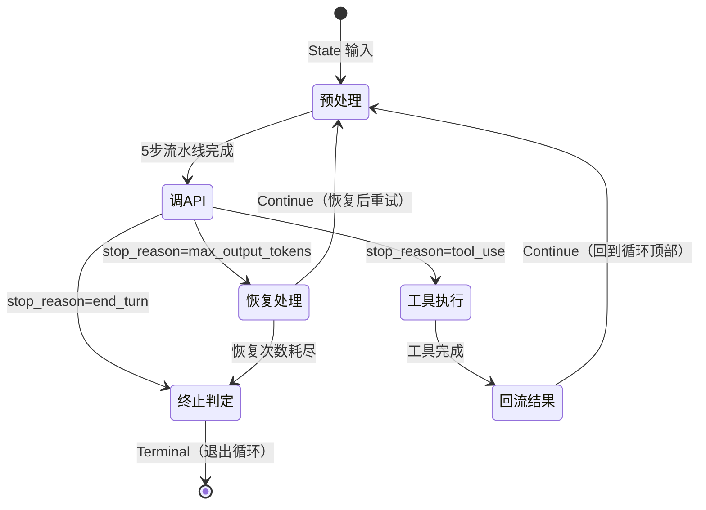

# 06. Agent Loop 机制

## 1. 背景介绍

### 1.1 什么是 Agent Loop

要理解 Agent Loop，最直接的锚点是将它与传统 API 调用做对比——两者都是"模型收到输入、产出输出"，但行为模式有本质区别：

```
传统 API 调用（你问我答）：
  用户提问 ──→ 模型回答 ──→ 结束
  一次请求，一次响应。人是决策者，模型是"回答问题的 oracle"。

Agent Loop（自主执行）：
  用户给任务 ──→ 模型想一步 ──→ 模型决定调工具 ──→ 工具返回结果
                  ↑                                          ↓
                  └────────── 模型再想一步 ←──────────────────┘
                                                ↓
                                         任务完成 → 结束
  多次请求，工具穿插。模型自己决定"下一步做什么"和"什么时候停"。
  模型是"执行任务的 agent"。
```

关键差异一句话说清：**传统模式中，人决定"下一步做什么"；Agent Loop 中，模型自己决定。** 循环不是代码技巧——它是 Agent 自主性的来源。去掉循环，Agent 就退化为一个只会回答一次问题的 chatbot。

这个概念在 ReAct（Reasoning + Acting）论文中被首次系统化，用三个步骤概括全部：**思考 → 行动 → 观察 → 再思考**。Claude Code 的 `queryLoop()` 就是这个骨架在真实工程中的实现——它在架构中的位置已在[第 5 章](../part2/05-QueryEngine全景解析)中标注，是双层架构的内层核心。

### 1.2 极简概念的工程代价

Agent Loop 的概念可以在三句话说清，但 `query.ts` 写了约 900 行。这 900 行不是在"把简单问题复杂化"——每一行都是对真实生产环境倒逼出来的追问的回应：

```
  概念只需要三步：                    工程必须回答的追问：

  ① 调模型 ─────────────────→  调之前消息历史要不要压缩？
                                 如果压缩，用哪种方式？压缩到多少？
                                 工具结果太长要不要先截断？
                                 早期对话要不要裁剪掉？

  ② 如果有工具调用就执行 ────→  多个工具能并行还是必须串行？
                                 执行前要不要弹权限确认？
                                 执行失败了怎么办？
                                 工具结果怎么回流给模型？

  ③ 如果没有工具调用就结束 ──→  模型被 max_output_tokens 截断算不算结束？
                                 上下文超长被 API 拒绝怎么办？
                                 调 API 时遇到 529 过载要不要重试？
                                 速率限制了要等多久？
```

::: tip 关键洞察
伪代码描述的 Agent Loop 是"快乐路径"——模型不出错、上下文不超限、工具不失败。真实环境的 Agent Loop 必须回答"不快乐路径"上的每一个追问。本章的核心任务，就是展示 Claude Code 如何用 **预处理流水线 + 状态机 + 三级恢复路径** 系统性地回答这些问题。后续各节按三条线索展开：
 - **§3.4 预处理流水线** 回答"调 API 前做什么准备"，
 - **§3.7 工具调度** 回答"拿到响应后怎么分支"，
 - **§3.5-§3.6 状态机与恢复路径** 回答"什么时候停下来"。
:::

### 1.3 在双层架构中的位置

在[第 5 章](../part2/05-QueryEngine全景解析)中，我们建立了 QueryEngine 的双层架构——外层 `QueryEngine.submitMessage()` 管会话生命周期，内层 `queryLoop()` 管 Agent Loop 迭代。这里从内层的视角重新审视这个架构：

```
┌──────────────────────────────────────────────────┐
│  外 层：QueryEngine.submitMessage()              │
│                                                  │
│  说的话：SDK 消息格式                            │
│         （"有没有新消息？最终结果是什么？"）     │
│                                                  │
│  做的事：System Prompt 拼接                          │
│         用户输入处理（斜杠命令分拣）                                 │
│         转录持久化                                                │
│         结果成功/失败判定                                          │
│                                                                 │
│  ┌──────────────────────────────────────────────────────────┐   │
│  │  内 层：queryLoop()                                       │   │
│  │                                                          │   │
│  │  说的话：机械信号                                           │   │
│  │         (transition / attachment / tombstone / yield)    │   │
│  │                                                          │   │
│  │  做的事：预处理 → 调 API → 分支判定                          │   │
│  │          压缩 / 恢复 / 工具调度                             │   │
│  │                                                          │   │
│  └──────────────────────────────────────────┘   │
└──────────────────────────────────────────────────┘
```

一层说"人话"，一层说"机话"——这是双层架构存在的根本理由。外层面向 SDK 消费者，产出标准化的 `SDKMessage` 格式——外界不关心循环内部发生了什么，只关心"有没有新消息"和"最终结果是什么"。内层面向 Harness 机制自身说话，产出 `transition`、`attachment`、`tombstone` 等机械信号——这些信号对上层消费者透明，但对循环自身的正确性至关重要。

::: tip 关键洞察
**循环属于 Agent，机制属于 Harness。** 工具系统、技能加载、上下文压缩、子智能体——所有这些 Harness 机制都是在这个循环之上层层叠加的，而不改变循环本身的 `while(true)` 结构。如果把 Agent Loop 看作心跳，Harness 就是血液循环系统——心跳本身是简单的、不变的，但围绕它建立的一整套保障机制才是让有机体存活的关键。
:::

---

## 2. 核心逻辑：为什么长这样

### 2.1 迭代体生命周期模型

`queryLoop` 的一次完整迭代可以抽象为一个 **State In → State Out** 的状态转换模型。以"调 API"为分界线，迭代体内部有 5 个状态节点：



这里有三个值得注意的设计：

**为什么是三个出口，而不是两个？** 直观上工具调用 → Continue、文本输出 → Terminal，两个出口就够了。但真实环境引入了一个灰色的中间地带——模型被 `max_output_tokens` 截断时，它既不是"需要执行工具"（没有 tool_use），也不是"主动结束"（它还想继续说）。把这种状态强行归入前两个出口中的任何一个，都会造成语义扭曲。第三条路径（恢复路径）的存在，本身就是"承认 API 调用可能不完整"的结果。

**为什么 Continue 总是回到预处理，而不是直接跳到调 API？** 因为恢复后的消息历史比恢复前更长——截断恢复追加了被截断的上半句，紧急压缩产出了摘要消息。如果不重新过一遍预算检查（预处理流水线的 token 计算部分），可能刚恢复就因为上下文过长再次被 API 拒绝。

**为什么 Stop Hook 放在终止之前，而不是调用 API 之前？** 因为 Hook 的语义是"模型说完了，你要不要最后看一眼？"——它不应干预模型的推理过程，只应干预"模型输出是否应该展示给用户"。放在终止出口处，Hook 可以修改最终消息、追加日志、甚至阻止终止让循环继续，但它永远看不到未发送给 API 的中间状态。

### 2.2 方案演进路径

Agent Loop 的当前形态不是一次性设计出来的。它经过了五次关键演进，每一次都是被前一个版本在真实环境中暴露的问题倒逼。理解这个演进路径，是理解当前设计意图的最近路径。

#### V1：最简 ReAct——能跑，但脆弱

```
  调模型 → 有工具调用就执行并回流 → 没工具调用就结束 → 回到开头
```

这是 Agent Loop 的"零号版本"——只做三件事，任何人可以在几分钟内写出来。**它已经能工作了。** 如果一次 Agent 会话只跟用户对话 3 轮就结束，V1 足够。

**但这还不够。** 真实对话可能有 50 轮、100 轮。每轮至少产生 2 条消息（assistant + tool_result），100 轮就是 200 条消息。上下文窗口装不下——模型会在某个时刻收到超过限制的消息数组，API 直接拒绝请求。V1 没有应对"上下文膨胀"的任何机制。

#### V2：+ 自动压缩——能撑了，但太贵

```
  调模型前先看 token 数 → 超过阈值就压缩历史 → 用压缩后的历史调模型
```

V2 加入了一个守卫：每次调 API 前检查消息历史的 token 数，超过阈值时用另一个模型调用自动生成摘要，替代完整历史。这解决了"撑爆上下文窗口"的问题。

**但压缩暴露了新问题。** 首先，压缩本身是一次 API 调用——可能也遇到 529 过载、速率限制，V2 没有处理"压缩调用失败"的机制。其次，一个 Bash 命令的输出可能有 10MB——还没压缩就已经把上下文撑满了，需要在压缩之前先截断。最后，压缩是最昂贵的减法操作——每次对话都必然触发压缩，但很多场景其实不需要"全量压缩"，用更轻量的裁剪就能解决。

#### V3：+ 预处理流水线——分级减法

```
  调 API 前，按代价从低到高依次尝试：
  截断工具结果 → 裁剪早期历史 → 合并短消息 → 折叠长段 → 实在不行才压缩
```

V3 的核心洞察是：**不是所有 token 都值一次压缩调用。** 把"减少上下文"这件事拆成 5 步，每一步的代价递增，每一步的输出决定下一步是否执行：

| 步骤 | 操作 | 代价 | 比喻 |
|------|------|------|------|
| ① 截断工具结果 | 超长内容的尾部裁剪 | 几乎为零 | 把太长的纸条剪掉尾巴 |
| ② 裁剪早期历史 | 删掉最老的 N 轮对话 | 极低（移动指针） | 扔掉最早的几页笔记 |
| ③ 微压缩 | 合并短小消息 | 低（本地文本处理） | 把零散的便签合并成一张 |
| ③.5 上下文折叠 | 长段替换为摘要 | 中（本地模型调用） | 把长段落概括成一句话 |
| ④ 自动压缩 | 调用完整 API 生成摘要 | 高（一次 API 调用） | 重新整理整本笔记 |

流水线的顺序不是随意排列的——每一步对 token 数有影响，前一步的输出决定后一步是否需要执行。如果截断就把 token 降到阈值以下，后续 4 步全部跳过。**贴创可贴能治的，不动手术。**

**但新问题出现了。** API 调用本身可能处于"不完整"状态——`max_output_tokens` 截断意味着模型还想继续说，但输出被打断了。V3 把这种状态当作"正常结束"处理，导致用户只能看到说了一半的话。

#### V4：+ 三级恢复路径——让错误可自愈

```
  调 API 拿到响应后，不止两个出口：

  如果 max_output_tokens 截断 → withhold 当前消息 → 自动再调一次 → 让模型从断点继续
  如果上下文超长被拒      → 紧急压缩            → 重新调
  如果以上都失败           → 放弃恢复            → 返回错误
```

V4 在"快乐路径"的两次分支之外引入了第三条路——恢复路径：

| 恢复类型 | 触发条件 | 操作 | 是否调用 API | 最大尝试 |
|---------|---------|------|:---:|:---:|
| 上下文折叠 | 消息中超长段 | 本地折叠为摘要后重试 | ❌ | 1 次 |
| 紧急压缩 | Prompt Too Long / 媒体过大 | 调用压缩模型后重试 | ✅ | 1 次 |
| 截断恢复 | stop_reason = max_output_tokens | 在截断处继续生成 | ✅ | 3 次 |

这三种恢复按**代价从低到高**排列——能本地折叠解决就不发起压缩调用，能压缩解决就不做完整重试。

**为什么截断恢复是 3 次？** 1 次不够——模型可能刚说了几个字又被截断在同一个位置。无限次危险——一个陷入死循环的模型可以无限产出截断，让 `queryLoop` 永远运行。3 次是"给够机会但不无限兜底"的折衷。

**但恢复路径本身引入了新问题。** `queryLoop` 现在有了 7 个不同的"继续"站点——工具执行后继续、压缩后继续、截断恢复后继续、紧急压缩后继续……每个站点都需要更新一组共享的状态变量（消息数组、turn 计数、恢复计数等）。如果状态是散落的多个变量，某个站点遗忘更新其中一个，下一次迭代就会读到脏值。

#### V5：+ 不可变 State + AsyncGenerator——收敛复杂度

```
  所有跨迭代状态打包成一个 State 对象
  每个 continue 站点用 state = { ...state, ... } 整体替换
  每条产出（消息、事件、错误）通过 yield 管道输出
```

V5 不是添加新功能，而是为 V1-V4 增加的复杂度建立秩序：

- **State 不可变更新**：9 个跨迭代字段打包成一个对象，7 个 continue 站点统一通过 spread 替换。TypeScript 编译器检查完整性——遗漏字段当场捕获。`transition` 字段让"为什么继续"成为可查询的状态。
- **AsyncGenerator 管道**：`queryLoop` 的所有产出——assistant 消息、stream_event、tool_result、error——全部通过 `yield` 对外暴露。外层 QueryEngine 通过 `for await` 逐条消费。不同的消费者（REPL、SDK、子代理）可以用不同的方式处理同一条产出流。

#### 演进路径回顾

```
  V1: 最简 ReAct
   │  倒逼：上下文窗口会撑爆
   ▼
  V2: + 自动压缩
   │  倒逼：压缩太贵、工具结果太长、压缩本身也可能失败
   ▼
  V3: + 预处理流水线（分级减法）
   │  倒逼：API 调用可能不完整（截断/过载/超长拒绝）
   ▼
  V4: + 三级恢复路径
   │  倒逼：多站点状态一致性、多消费者适配
   ▼
  V5: + 不可变 State + AsyncGenerator（当前架构）
```

这五个版本不是"最初就想好的"，而是被生产环境一层层倒逼出来的。理解这个演进路径，就理解了 `query.ts` 那 ~900 行代码为什么每一行都有存在的理由。

### 2.3 为什么是 while(true) 而非递归

Agent Loop 是对同一个过程的重复——不断"调模型→看响应→决定继续还是停"。递归是表达"重复"的自然语法。但 `queryLoop` 坚决不走递归，原因有两个。

**第一个原因：调用栈是有限资源。**

用极端假设法推演。假设一次 Agent 会话有 100 轮工具调用：

```
递归方案：
  第 1 轮 → queryLoop(第1轮)
              → 有工具调用 → queryLoop(第2轮)
                                → 有工具调用 → queryLoop(第3轮)
                                                  → ...
                                                     → queryLoop(第100轮)
  调用栈深度 = 100。JavaScript 引擎的调用栈上限通常在 10K-30K，
  但递归不仅消耗栈空间——每一帧还持有局部变量的引用，
  阻止 GC 回收前一轮的消息对象。100 轮每轮数条消息，
  栈上实际锁住了数百 MB 的内存。

while(true) 方案：
  queryLoop() {
    while (true) {
      // 第 1 轮迭代 → State 更新 → 旧 State 可被 GC
      // 第 2 轮迭代 → State 更新 → 旧 State 可被 GC
      // ...
      // 第 100 轮迭代
    }
  }
  调用栈深度始终 = 1。每轮迭代结束，旧 State 离开作用域，GC 可回收。
```

**第二个原因，也是更关键的：恢复路径的语义问题。**

`max_output_tokens` 截断发生后，模型还要继续——这不是"新开了一个对话回合"，而是"上一个回合还没说完"。如果用递归实现恢复：

```
递归方案下，只有两个选择，都有语义缺陷：

  选择 A：在递归调用里处理截断
    queryLoop → 调模型 → 截断 → queryLoop(继续) → ...
    "继续上一次被截断的对话"变成了一个嵌套的子回合。
    外层 QueryEngine 看到的是两个独立的 queryLoop 调用，
    无法区分"工具调用后的正常继续"和"截断恢复"。

  选择 B：每次截断新开一个 queryLoop
    两个独立的调用栈帧，共享外层状态需要显式传参。
    一旦恢复次数达到上限（3次），调用方必须"跳出两层递归"，
    在 JavaScript 中没有任何优雅的方式做到这点。

while(true) 方案：
  while (true) {
    调模型 → 遇到截断 → withhold → 标记 transition.reason
    → 回到 while 顶部 → 用恢复后的参数重新调模型
  }
  恢复只是循环体内的又一次迭代。没有嵌套、没有额外的调用帧。
  "同一次回合的不同尝试"是代码结构直接表达的语义。
```

`while(true)` 不是一个实现细节——它是"Agent Loop 的本质是一个平铺的循环而非一棵嵌套的树"这一事实的直接表达。

### 2.4 预处理流水线的"先减后加"哲学

预处理流水线的 5 步为什么是这个顺序？用反证法——假设顺序被打乱，每种的后果是什么：

**假设 1：先压缩再截断**

```
  压缩调用看到的是 10MB 的工具结果
  → 发起一次昂贵的 API 调用来压缩
  → 压缩完成后，截断步骤检查发现：其实 10MB 中的 9.9MB 是日志噪音
  → 截断掉 9.9MB 之后，压缩阈值根本没达到
  → 浪费了一次 API 调用
```

**假设 2：先注入附件再压缩**

```
  记忆/技能附件被注入到消息历史
  → 附件内容增加了上下文 token
  → 下一次压缩检查时，token 数因为附件注入而超过了阈值
  → 压缩触发，刚注入的附件被摘要替代
  → 模型看不到完整的附件内容
  → 浪费了注入操作，还可能丢失关键上下文
```

**假设 3：折叠放在压缩之后**

```
  压缩已经完成（代价：一次 API 调用），历史被替换为摘要
  → 折叠检查：发现历史中有一个长段需要折叠
  → 但折叠的目标——原来的长段——已经被压缩替换掉了
  → 折叠在摘要上无事可做
  → 两个操作的顺序关系完全失配
```

这些假设场景共同指向一个原则：**先做减法（缩），后做加法（扩）。** 减法的目的是"释放上下文窗口的空间"，加法的目的是"把有用的信息放进刚刚释放的空间"。先加后减 = 刚放进去就被扔掉；先减后加 = 知道剩多少空间，往里装最需要的东西。

减法内部也按代价递增排列（§2.2 V3 中已详述），加法（附件注入）则被放到所有减法之后——它依赖减法释放出的窗口空间来判断"能注入多少"。

### 2.5 恢复路径的分层设计

恢复路径是 §2.2 V4 中引入的，这里从设计权衡的视角展开。

**为什么恢复和重试是两层？** 它们在概念上相似——都是"失败了再来一次"。但根本区别在于"再来一次"的请求是否被修改：

```
  重试层（withRetry）——在 callModel 内部：
    529 Overloaded？→ 等 2 秒，用完全相同的请求再调
    速率限制？    → 等 Retry-After 头指定的时间，用完全相同的请求再调
    网络断开？    → 等退避间隔，用完全相同的请求再调
    "网络层瞬时故障，请求本身没问题。"

  恢复层（queryLoop 内）——在 callModel 外部：
    max_output_tokens？→ withhold 当前消息，把被截断的消息追加到历史，再调
    Prompt Too Long？  → 压缩历史，用压缩后的历史再调
    "请求本身有问题（太长了/输出被截断了），需要修改请求再重试。"
```

两层各司其职：重试层处理"通信故障"，恢复层处理"语义故障"。把 PTL 放进重试层会在重试 N 次后放弃一个可以通过压缩解决的错误；把 529 放进恢复层会触发不必要的开销（紧急压缩而非简单等待重试）。

**恢复计数的选择**：

| 条件 | 取值 | 理由 |
|------|:---:|------|
| 上下文折叠（collapse） | 最多 1 次 | 折叠是本地操作，如果折叠后仍然超长，再折叠也没有额外效果——长段已经被折叠过一次了 |
| 紧急压缩（reactiveCompact） | 最多 1 次 | 压缩已经是最极端的减法操作，压缩后仍然失败意味着上下文有根本性问题（比如单条消息本身就超过了模型上下文限制） |
| 截断恢复（maxOutputTokens） | 最多 3 次 | 不同于前两种——模型可能在 3 次恢复中逐渐推进输出（每次往前多说几句），3 次给了合理的"渐进完成"空间 |

---

## 3. 源码解读

> **前置阅读**：本章的源码分析建立在[第 5 章](../part2/05-QueryEngine全景解析)的架构全景之上。阅读本章前，请先了解 QueryEngine 的双层架构（外层 `QueryEngine` + 内层 `queryLoop`）。

### 3.1 源码地图

在深入具体逻辑之前，先建立一份完整的源码地图。Agent Loop 不是 `query.ts` 一个文件的独角戏，而是一个以 `query.ts` 为根、其余文件为叶子的**星形依赖结构**：

| 文件 | 约行数 | 职责 | 一句话 |
|------|--------|------|--------|
| `src/query.ts` | ~900 | 循环本体 | `query()` 入口 + `queryLoop()` while(true) 迭代体 |
| `src/query/transitions.ts` | ~30 | 状态类型定义 | `Continue` 和 `Terminal` 类型，7 种继续原因 + 2 种终止原因 |
| `src/query/stopHooks.ts` | ~80 | 终止钩子 | 循环退出前最后一道可编程关卡 |
| `src/query/deps.ts` | ~60 | 依赖注入接口 | `callModel` + 两种压缩 + `uuid`，测试可替换 |
| `src/query/config.ts` | ~50 | 不可变配置快照 | 进入循环前冻结的配置（model / thinking / maxTurns / budget） |
| `src/query/tokenBudget.ts` | ~120 | Token 预算追踪 | 实时追踪 token 消耗，驱动压缩决策 |
| `src/services/api/withRetry.ts` | ~200 | 重试策略 | 529 / 速率限制 / 网络错误的分层重试与指数退避 |
| `src/services/compact/` | ~1000+ | 压缩家族 | autoCompact / microCompact / snipCompact / reactiveCompact / contextCollapse |

这些文件围绕 `query.ts` 形成凝聚体——`QueryEngine.ts` 只知道 `query()`，不知道 `queryLoop()`、`transitions`、`stopHooks` 的存在。**内层循环是一个只通过 `query()` 函数签名对外暴露的黑盒。**

### 3.2 完整调用链路

`queryLoop` 内部有 **7 个 Continue 站点**和 **3 个 Terminal 出口**。下面的调用链路图标注了每个分支的位置和去向——这张图是后续 3.3~3.10 各节的索引地图：

```
query(deps, config)
  │
  ├─ 初始化 State
  │   messages / toolUseContext / autoCompactTracking
  │   maxOutputTokensRecoveryCount / hasAttemptedReactiveCompact
  │   stopHookActive / turnCount / transition
  │
  └─ queryLoop(state) ───────────────────────────────────────────────┐
       │                                                              │
       while (true):  ←────────────────────────────────────────┐     │
         │                                                      │     │
         ├─ [入口] 解构 state                                   │     │
         │   let { toolUseContext }  ← 迭代内可变                │     │
         │   const { messages, ... } ← 迭代内只读                │     │
         │                                                      │     │
         ├─ [预处理] 5步流水线 (§3.4)                          │     │
         │   ① applyToolResultBudget  → 截断超长工具结果        │     │
         │   ② snipCompactIfNeeded   → 裁剪早期历史             │     │
         │   ③ microcompactMessages  → 合并短消息               │     │
         │   ③.5 contextCollapse     → 折叠长段为摘要           │     │
         │   ④ autocompact           → 自动压缩（如果触发）     │     │
         │     └─ 触发了 → state = {...state, transition} ──────┘     │
         │                                                      │     │
         ├─ [检查] Blocking Limit                               │     │
         │   压缩后仍超限 → return Terminal  ← 出口 ①          │     │
         │                                                      │     │
         ├─ [注入] 附件（记忆 / 技能 / Hook 注入）              │     │
         │                                                      │     │
         ├─ [★ 核心] deps.callModel() (§3.8)                    │     │
         │   └─ withRetry() 包裹                                │     │
         │       ├─ 529 → 指数退避后重试                        │     │
         │       ├─ 速率限制 → 等待 Retry-After 后重试          │     │
         │       └─ 不可重试错误 → 直接抛出                      │     │
         │                                                      │     │
         ├─ [消费] 流式事件逐条 yield                           │     │
         │   ├─ yield assistant 消息                            │     │
         │   ├─ yield stream_event（可选）                      │     │
         │   ├─ 捕获 tool_use blocks → 记录待执行工具            │     │
         │   └─ 标记 needsFollowUp / withhold                   │     │
         │                                                      │     │
         ├─ [分支：withhold] 被暂存的消息 (§3.6)               │     │
         │   ├─ stop_reason = max_output_tokens                 │     │
         │   │   ├─ count < 3 → state = {...} ──────────────────┘     │
         │   │   └─ count >= 3 → return Terminal  ← 出口 ②     │     │
         │   ├─ media_too_large / prompt_too_long               │     │
         │   │   ├─ collapse → state = {...} ───────────────────┘     │
         │   │   └─ reactiveCompact → state = {...} ────────────┘     │
         │                                                      │     │
         ├─ [分支：needsFollowUp] 有工具要执行 (§3.7)           │     │
         │   ├─ runTools() → 并行/串行执行工具                   │     │
         │   ├─ yield tool_result 消息                          │     │
         │   └─ state = {...state, turnCount+1} ────────────────┘     │
         │                                                      │     │
         ├─ [分支：!needsFollowUp] 无工具调用 (§3.9)            │     │
         │   ├─ handleStopHooks()                               │     │
         │   │   ├─ hook 通过 → return Terminal  ← 出口 ③      │     │
         │   │   └─ hook 拒绝 → state = {...} ──────────────────┘     │
         │                                                      │     │
         └─ [兜底] state = {...state, turnCount+1} ─────────────┘     │
                                                                      │
  共 7 个 Continue 站点（标注 ────┘）                                  │
  共 3 个 Terminal 出口（标注 ← 出口 N）                                │
```

这张图的核心价值在于**定位**——它不是让读者一次理解所有细节，而是让读者知道每个细节在整体中的位置。后续 3.3~3.10 各节依次展开图中的关键节点：

| 小节 | 覆盖图中的 |
|------|-----------|
| §3.3 State 不可变更新 | 入口解构 + 所有 Continue 站点的 spread 更新 |
| §3.4 预处理流水线 | 5 步流水线的触发条件与顺序 |
| §3.5 Continue/Terminal 状态机 | 7 种 Continue 原因 + 2 种 Terminal 原因的类型定义 |
| §3.6 恢复路径 | withhold 分支的三个恢复通道 |
| §3.7 工具执行调度 | `runTools()` 的并行/串行决策 |
| §3.8 重试与容错 | `withRetry()` 的分层重试策略 |
| §3.9 Stop Hook | `handleStopHooks()` 的触发与中断 |
| §3.10 Turn 计数 | `turnCount` 递增时机与 `maxTurns` 检查 |

### 3.3 State 不可变更新模式

进入 query loop 后，核心状态被收集到一个 `State` 对象中，每次迭代通过解构读取、通过 spread 更新：

```typescript
// src/query.ts:204-217
type State = {
  messages: Message[]
  toolUseContext: ToolUseContext
  autoCompactTracking: AutoCompactTrackingState | undefined
  maxOutputTokensRecoveryCount: number
  hasAttemptedReactiveCompact: boolean
  maxOutputTokensOverride: number | undefined
  pendingToolUseSummary: Promise<ToolUseSummaryMessage | null> | undefined
  stopHookActive: boolean | undefined
  turnCount: number
  transition: Continue | undefined
}
```

迭代体顶部，`toolUseContext` 用 `let` 单独解构（因为它在同一次迭代内也会变化），其余字段用 `const`：

```typescript
// src/query.ts:308-321
while (true) {
  let { toolUseContext } = state     // let — 迭代内可能变
  const {
    messages,                         // const — 迭代内只读
    autoCompactTracking,
    maxOutputTokensRecoveryCount,
    // ...
  } = state
```

Continue 站点统一通过整体替换更新：

```typescript
// 统一模式：不修改 state 的单个字段，而是整体替换
state = {
  ...state,
  messages: [...state.messages, ...newMessages],
  toolUseContext: updatedToolUseContext,
  transition: { reason: 'tool_use' },
  // ...
}
```

**为什么这样做？** `queryLoop` 有 **7 个 continue 站点**——分别对应工具调用后继续、压缩后继续、max_output_tokens 恢复后继续、reactiveCompact 恢复后继续等场景。如果状态是分散的 9 个 `let` 变量，每个 continue 站点都需要显式更新每一个可能变化的变量。遗漏任何一个，下一次迭代就会读到脏值。

`state = { ...state, ... }` 模式让每次更新都是**显式的整体替换**。TypeScript 编译器会检查 `State` 类型的完整性——漏了哪个字段都能被 catch 到。`transition` 字段记录"上一次迭代为什么继续"（如 `{ reason: 'tool_use' }`、`{ reason: 'max_output_tokens' }`），让测试可以断言恢复路径是否被触发，而不需要检查消息内容。

设计要点：

- **9 个字段放进一个对象而非 9 个独立变量**：continue 站点越多，分散变量的风险越大。一个对象包裹 + spread 更新消除了不一致的可能性
- **toolUseContext 用 let 单独解构**：它是唯一在同一次迭代内也会被修改的字段（queryTracking、messages、contentReplacementState），单独拿出来让其他字段安心用 const
- **transition 不是冗余信息**：它让"这次迭代为什么会继续"成为可查询的状态，而不是散落在 7 个 continue 站点的代码路径中

### 3.4 5 步预处理流水线的顺序设计

每次 API 调用前，消息历史要经过 5 步预处理。这个流水线的顺序不是随意的——它遵循"先做减法，后做加法"的原则：

```
① applyToolResultBudget  →  截断过长的工具结果
② snipCompactIfNeeded    →  裁剪早期历史（保留最近 N 轮）
③ microcompactMessages   →  微压缩（合并/删除短小消息）
③.5 contextCollapse      →  上下文折叠（把长段内容替换为摘要）
④ autocompact            →  自动压缩（触发完整压缩流程）
⑤ getAttachmentMessages  →  注入新的记忆/技能附件
```

**为什么①最先执行？** 工具结果截断不依赖其他步骤的结果。它只检查每个 `tool_result` block 的内容长度，超出阈值的截断。先执行它可以让后续步骤（尤其是 autocompact）看到的 token 数更准确——如果先压缩再截断，可能会浪费压缩机会在不必要的内容上。

**为什么②③③.5④集中做减法？** 这四个步骤的目标一致：减少上下文 token 数。但它们有渐进式关系：

| 步骤 | 代价 | 效果 |
|---|---|---|
| ② snip | 极低（只移动指针） | 删掉最老的 N 轮对话 |
| ③ microcompact | 低（本地合并短消息） | 释放少量 token |
| ③.5 contextCollapse | 中（本地折叠长段） | 折叠大段内容为摘要 |
| ④ autocompact | 高（调用一次完整 API） | 大幅压缩，产出摘要 |

先做轻量操作，如果不满足再做重量操作——这个顺序避免了"能贴创可贴解决的问题非要做手术"。

**为什么⑤最后做加法？** 附件注入会增加上下文 token，如果放在压缩之前执行，刚注入的附件可能立即被压缩掉。更重要的是，压缩后的上下文窗口释放出了新的空间，此时注入附件才是最安全的。

**一个微妙的细节**：`③.5 contextCollapse` 必须跑在 `④ autocompact` **之前**。如果 collapse 就能把 token 数降到压缩阈值以下，autocompact 看到的是一个已经"够小"的消息数组，直接跳过。这样做的结果是保留了更细粒度的上下文（collapse 只折叠长段，保留消息结构和工具调用链），而不是直接用一个摘要文本替代全部历史。

设计要点：

- **顺序不是"按作者喜好排列"**：每一步对 token 数的计算有影响，前一步的输出决定后一步是否需要执行
- **减法优先于加法**：如果先加附件再减压缩，附件会被无谓地压缩掉
- **同类的渐进式关系**：snip → microcompact → contextCollapse → autocompact，代价递增、效果递增

### 3.5 Continue vs Terminal：状态转换

每次迭代结束后，有两条路：

**Continue**：迭代产生了新的消息（工具结果、压缩结果、恢复结果），需要继续循环：

```typescript
// 伪代码——具体实现在 query.ts 的各个 continue 站点
state = {
  ...state,
  messages: [...state.messages, ...newMessages],
  toolUseContext: updatedContext,
  transition: { reason: 'tool_use' | 'max_output_tokens' | 'reactive_compact' | ... },
  // 可能还会更新 autoCompactTracking、turnCount 等
}
// → 回到 while(true) 顶部
```

**Terminal**：模型没有返回 `tool_use`（`needsFollowUp === false`），循环正常结束：

```typescript
// src/query.ts 的返回逻辑
if (!needsFollowUp) {
  // 执行 Stop Hooks（后处理钩子）
  yield* handleStopHooks(...)
  // 返回终止原因
  return { reason: 'end_turn' | 'stop_hook' | ... }
}
```

Terminal 返回到外层 `QueryEngine.submitMessage()`，由 `isResultSuccessful()` 做最终判定（详见[第 5 章 3.6 节](../part2/05-QueryEngine全景解析#_3-6-外层-终止路径全景)）。

### 3.6 恢复路径：当错误不是终点

queryLoop 中有三条恢复路径，它们让"API 错误"成为可处理的信号而非会话终点：

**max_output_tokens 恢复**。当 `stop_reason === 'max_output_tokens'` 时模型被截断，但这不是终点——模型还想继续说。queryLoop 会 withhold 这条消息（不 yield 给 SDK），然后自动发起一次新的 API 调用，让模型从断点继续。最多尝试 3 次：

```typescript
// src/query.ts:164
const MAX_OUTPUT_TOKENS_RECOVERY_LIMIT = 3
```

每次恢复时 `maxOutputTokensRecoveryCount++`，超过限制后放弃恢复，将截断消息作为最终结果产出。

**reactiveCompact 恢复**。当 prompt 太长（PTL）或媒体尺寸超限时，`reactiveCompact` 会 withhold 错误消息，触发一次紧急压缩，然后用压缩后的消息重新发起 API 调用。恢复循环的入口在流式消费完之后：

```typescript
// 流式消费结束后检查是否有被 withhold 的错误
// 如果有 → 触发 reactiveCompact → state = { ...state, hasAttemptedReactiveCompact: true }
// → 回到 while(true)
```

**contextCollapse 恢复**。与 reactiveCompact 类似，但当 `contextCollapse` 启用时，它会优先尝试折叠上下文中的长段——折叠比压缩更轻量，保留了消息结构。只有当 collapse 不足以恢复时才 fallback 到 reactiveCompact。

这三条恢复路径的优先级是：collapse → reactiveCompact → max_output_tokens recovery。越轻量的恢复越先尝试——collapse 是本地操作，reactiveCompact 可能触发一次 API 调用（用于压缩），max_output_tokens 恢复直接发起一次完整的 API 重试。

---

## 4. 总结

1. **Agent Loop 是 5 行伪代码，但生产级实现的价值在"循环之上的机制"**——预处理流水线、恢复路径、状态管理才是工程血汗所在。

2. **`while(true)` 而非递归**：避免调用栈线性增长，同时让恢复路径的语义清晰——它们是同一次回合的不同尝试，而非嵌套子回合。

3. **State 不可变更新模式**：9 个字段打包成一个对象，7 个 continue 站点统一通过 `state = { ...state }` 更新。避免分散变量在多个 continue 站点间的不一致。

4. **预处理流水线的顺序是精心设计的**：先做减法（截断 → 裁剪 → 微压缩 → 折叠 → 自动压缩），再做加法（附件注入）。同类操作按代价递增排列。

5. **恢复路径让"错误"成为可处理的信号**：max_output_tokens 不是终点，prompt-too-long 不是终点——三种恢复路径让循环有"自愈"能力。

6. **循环结构不变，机制层层叠加**：这是 Harness 设计哲学的核心——压缩、预算、技能发现、记忆附件全部在 `while(true)` 之外定义，循环本身不感知它们的存在。

---

## 5. 边界标注

- 本章聚焦于 Agent Loop 的**微观机制**——一次迭代内的状态变化、预处理步骤、分支判定。架构全景和调用链路见[第 5 章](../part2/05-QueryEngine全景解析)。
- 工具执行机制（`runTools`、权限判定）见 Part 3 工具系统系列。
- 上下文压缩的算法细节见 Part 6 上下文管理系列。
- 流式响应解析与消费见[第 7 章](../part2/07-流式响应与思考模式)。
- Token 计数与预算控制见[第 8 章](../part2/08-Token与成本管理)。

---

## 6. 参考文献

- [ReAct: Synergizing Reasoning and Acting in Language Models](https://arxiv.org/abs/2210.03629)
- Claude Code 源码：
  - `src/query.ts` — queryLoop 核心循环
  - `src/query/transitions.ts` — Continue/Terminal 状态定义
  - `src/query/stopHooks.ts` — Stop Hook 执行
  - `src/services/compact/` — 压缩家族（autoCompact / microCompact / snipCompact / reactiveCompact / contextCollapse）
