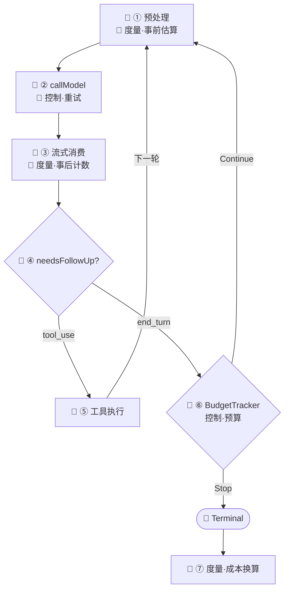
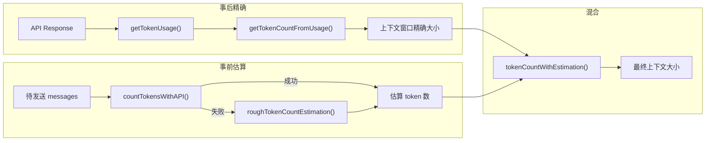
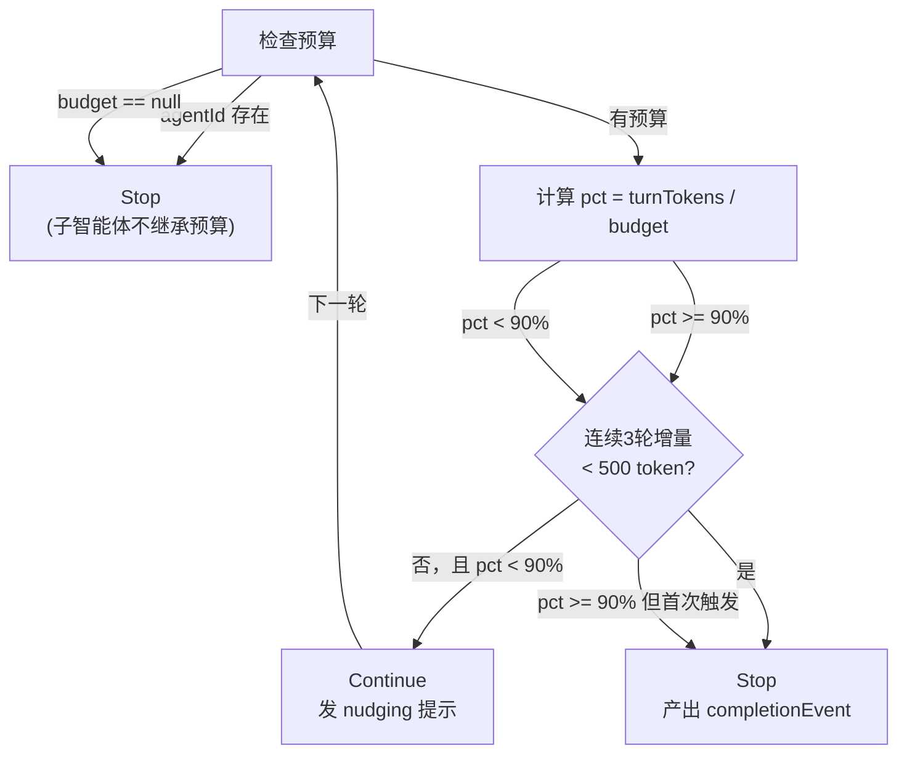
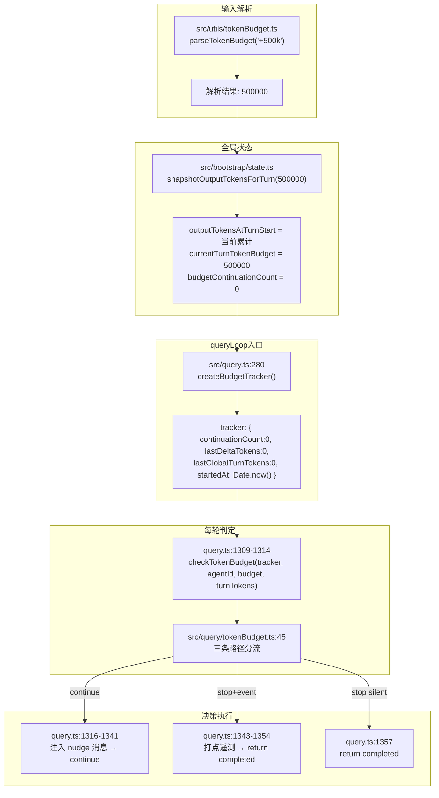

# 07. Token 与成本管理

本章回答 Part 2 核心循环的第三个问题：05 讲架构全貌（WHERE），06 讲循环怎么转（HOW），本章讲循环中流淌的"血液"——Token——如何计量和控制（HOW MUCH）。

## 1. 背景介绍

Token 是双重身份的载体：它既是**上下文容量的度量单位**（上下文窗口能装多少 token），也是 **API 调用的计费依据**（按 input / output token 计费）。Token 与成本管理系统要回答的核心问题是：

> **每个字都有成本，如何让用户在"够用"和"不超支"之间找到平衡？**

### 1.1 一次性计费 vs 累积计费

理解 Agent 系统的成本挑战，最直观的方式是将它与传统 API 调用做对比：

```
传统 API 调用（一次性计费）：
  发请求 → 收响应 → 付一次钱
  成本 = input_tokens + output_tokens，一次算清

Agent 系统（累积计费）：
  发请求 → 收响应 → 调工具 → 回流结果 → 再发请求 → ...
  成本 = Σ(每轮 input + output)
  且上一轮的 output + tool_result 变成下一轮的 input
```

关键差异一句话说清：**传统 API 的计费单元是"一次调用"，Agent 的计费单元是"一次任务"——而任务长度不可预知。** 一次复杂的重构可能跑 20 轮 loop，每轮都把上一轮的工具结果（可能包含数万行代码）重新塞回 input。成本不是线性增长，而是**叠加式膨胀**。

### 1.2 极端假设法框定问题空间

| 极端 | 方案 | 问题 |
|------|------|------|
| 硬限制 | 设死 max_tokens，用完即停 | 任务可能半途而废，用户体验毁灭性 |
| 无限放任 | 不限量，让模型跑到自然结束 | 成本失控风险，一次对话可能消耗数美元甚至数十美元 |

两种极端的折衷方案是 **分级预警 + 收益递减检测 + 可配置硬上限**：让模型在预算内"尽力跑"，但在接近限制时给出提示，在明显空转时果断刹车。这就是本章要讲的完整闭环。

### 1.3 正交分解：两个核心问题

将"Token 与成本管理"正交分解为两个独立维度：

```
                     "每个 token 都有成本"

     度量 (MEASURE)                    控制 (CONTROL)
 ┌──────────────────────────────┐  ┌──────────────────────────────┐
 │ 实际用了多少 token？           │  │ 什么时候该停？                 │
 │ · API usage 精确提取（事后）    │  │ · BudgetTracker 收益递减检测   │
 │ · 跨提供商 token 估算（事前）   │  │ · max_budget_usd / max_turns  │
 │ · 上下文窗口实时大小计算        │  │ · withRetry 分层重试策略       │
 │ · 并行 tool 调用去重估算       │  │ · 分层退出拦截器链定位          │
 │ · usage → USD 成本换算        │  └──────────────────────────────┘
 └──────────────────────────────┘
```

两个模块互相独立又环环相扣：度量提供数据基础——事后精确计数校准基准，事前估算填补 API 调用前的时间窗口；控制基于度量结果做决策——预算超了要刹车，模型空转了要止损。具体每个模块如何嵌入 Agent Loop 的迭代体、各自面临什么设计约束，是第 2 节要回答的问题。

---

## 2. 核心逻辑

### 2.1 总览：二维在 queryLoop 中的挂载点

在深入各维度的设计之前，先将两个子系统标注到[第 6 章](../part2/06-核心循环-下-Agent-Loop迭代机制)建立的 `queryLoop` 迭代体上。🔵 是 06 已建立的循环结构，🔴 是本章子系统的挂载点：



图上 ①~⑦ 中 🔴 标注的 6 个挂载点，按二维归类如下：

| 维度 | 图上位置 | 触发时机 | 核心逻辑 | 消费方 |
|------|---------|----------|---------|--------|
| 度量（事前） | ① 预处理 | 每次 API 调用前 | token 估算 → 判断是否压缩 | 06 §3.4 的 5 步减法流水线 |
| 度量（事后） | ③ 流式消费 | API 返回成功 | 提取 usage + `tokenCountWithEstimation()` | 所有调用点 |
| 度量（成本） | ⑦ 成本换算 | `callModel()` 内部，收到 usage 后立即 | usage 匹配定价 → USD，实时累加 | billing 权限用户 |
| 控制（重试） | ② callModel | API 返回 529/429/网络错误 | withRetry 分层策略 → 重试或放弃 | 06 §3.7 的重试层 |
| 控制（预算） | ⑥ BudgetTracker | 模型无工具调用时 | 收益递减检测 → Continue / Stop | 06 §3.5 状态机 |

::: tip 关键洞察
Token 管理的两个子系统不改变 `while(true)` 的结构——它们作为**观察者和守卫**嵌入在循环相位中。度量是"账房"——事前估算在进门时把关（压缩决策），事后计数在每笔交易后记账（上下文窗口校准），最终在结束时结算（成本换算）。控制是"刹车"——两个层面：withRetry 处理 API 层故障，BudgetTracker 处理预算层终止。
:::

### 2.2 度量层：为什么需要"精确计数 + 粗略估算"双轨制？

先从最朴素的问题开始：**当前上下文用了多少 token？**

这个问题的答案有两个获取路径：

1. **事后精确路径**：API 每次调用返回 `usage` 对象（`input_tokens`、`output_tokens`、`cache_*_tokens`），这是标准答案
2. **事前估算路径**：在 API 调用之前（如压缩决策时），对尚未发送的消息估算 token 数

为什么需要第二条路径？因为[第 6 章](../part2/06-核心循环-下-Agent-Loop迭代机制#_3-4-5-步预处理流水线的顺序设计)的 5 步预处理流水线中，步骤 ②-⑤ 每一步的执行判断都依赖于一个 token 估算值：**当前消息历史有没有超过压缩阈值**。这个判断必须在调用 API **之前**做出——一旦 API 返回 `model_context_window_exceeded` 错误，上下文已经溢出了，用户等了几秒只等来一个错误。

两条路径各自适用不同场景，这就是 Claude Code 度量层的核心设计：



`tokenCountWithEstimation()` 的注释中有一行非常醒目：

> This is the CANONICAL function for measuring context size when checking thresholds (autocompact, session memory init, etc.)

为什么需要一个"权威"函数？因为上下文大小的计算方式不只一种——只算 `output_tokens`？算上 cache？要不要加新消息的估算？如果每个调用点都自己选一种算法，就会出现"压缩阈值在模块 A 是 85%，在模块 B 却是 90%"的混乱。**单点权威 = 行为一致性**。

::: tip 关键洞察
在 Token 管理的设计空间中，"一致性"比"精确性"更重要。上下文窗口是否真的 199k token 不重要，重要的是**每次判断用的都是同一把尺子**。否则会出现"压缩判断认为没到阈值，实际 API 调用却报溢出"的不一致。
:::

**事前估算管线的四层 Fallback**

度量层的"事前估算"路径，本质是一个跨提供商的 token 估算管线：

```
Anthropic countTokens API  →  Bedrock countTokens  →  Vertex countTokens  →  rough estimation (字符数/4)
```

为什么需要这么多层？因为 token 计数 API 的可用性取决于用户使用的云提供商：

| 提供商 | countTokens 可用性 | 备注 |
|--------|-------------------|------|
| Anthropic 直连 | ✅ 完全支持 | 最精确，标准 API |
| Bedrock | ⚠️ SDK 不支持 `countTokens` | 需用 `@aws-sdk/client-bedrock-runtime` 原生调用 |
| Vertex | ⚠️ 限制 beta 头 | 需过滤不被 Vertex 支持的 beta 头 |

当所有 API 路径都不可用时，最后的兜底是 `roughTokenCountEstimation()`——**字符数除以 4**。

为什么是 4 而不是更精确的算法？这里有三个权衡：

1. **精度 vs 包体积**：`tiktoken` 精确但增加 ~2MB 包体积，且需要为每个模型维护 tokenizer 版本
2. **精度 vs 延迟**：本地 tokenizer 仍需加载模型文件，首次调用延迟不可忽略
3. **误差可容忍**：在压缩决策场景中，±20% 误差不致命——因为压缩阈值（如 85%）本身就留了 buffer

更有趣的是 `bytesPerTokenForFileType()`——它针对 JSON 文件使用了 `字符数/2` 而非 `字符数/4`：

```typescript
// src/services/tokenEstimation.ts:215-223
export function bytesPerTokenForFileType(fileExtension: string): number {
  switch (fileExtension) {
    case 'json':
    case 'jsonl':
    case 'jsonc':
      return 2  // Dense JSON: many single-char tokens ({, }, [, ], :, ,)
    default:
      return 4
  }
}
```

为什么 JSON 文件要特殊处理？因为 JSON 中有大量单字符 token（`{`、`}`、`[`、`]`、`:`、`,`、`"`），每个只占 1 字节。用 `/4` 会严重低估真实的 token 数，导致过大的工具结果被误认为"足够小"而跳过截断。

::: tip 关键洞察
`bytesPerTokenForFileType` 的设计说明了一个原则：**粗略估算不等于"随便估"。** 在关键决策点（工具结果截断判断），即使 2 行 switch-case，也能把误差从 50% 降到 25%。
:::

### 2.3 控制层：BudgetTracker 的"收益递减"哲学与分层退出模型

如果用户设置了预算（如 `+500k`），Agent Loop 的每一轮都需要回答两个问题：**模型还在"有效工作"还是"已经空转"**，以及**应该在循环的哪个节点介入**。

#### 2.3.1 收益递减检测：为什么是 90% + 连续 3 轮？

Claude Code 的答案封装在 `BudgetTracker` 状态机中：



这个状态机有两个精妙之处：

**为什么用 90% 阈值而非 100%？** 给模型留"最后一句话"的余量。如果刚好 100% 才停，模型可能在生成一段文字的中途被截断，用户体验极差。90% 的阈值意味着：看到预算快到了就该准备收尾了。

**为什么连续 3 轮增量 < 500 token 判定为 diminishing？** 这背后是对 LLM 行为模式的洞察：
- 第 1 轮低产出：可能正在读一个大文件（Bash/Read 工具调用不产生 token 增量）
- 第 2 轮低产出：可能在思考如何修改（thinking block 较长但实际 text 增量小）
- 第 3 轮还在低产出：大概率是"卡住了"——在同一个问题上反复徘徊

#### 2.3.2 为什么在 `!needsFollowUp` 之后介入？

理解了 BudgetTracker **如何**判定之后，下一个问题是 **在哪判定**。回到[第 6 章](../part2/06-核心循环-下-Agent-Loop迭代机制)建立的 queryLoop 结构，BudgetTracker 的判定点位于 `!needsFollowUp` 分支内部——即模型**本轮没有 tool_use** 时。这个位置选择包含一个关键洞察：

> **`!needsFollowUp` 只表示"模型本轮没有发出 tool_use"，不等于"任务完成"。**

用一个具体场景说明。用户输入：

> `+500k 请审计整个项目的安全问题，输出详细报告`

然后发生：

```
轮 1: 模型调 Grep 搜索 SQL 注入 → 产出 15k token → stop_reason=end_turn
      模型说："我发现了 3 个 SQL 注入漏洞，任务完成。"
      !needsFollowUp = true
      → 如果此时直接退出，500k 的预算只用了 3%
```

模型在第 1 轮就宣布"完成"不是因为它偷懒——LLM 没有预算意识。它不知道用户给了 500k token 的配额，它只是按自己的判断给出了它认为合理的答案。用户付了 500k token 的钱，只得到了 15k token 的产出，这不是模型的问题，而是**系统没有把预算进度注入模型的决策循环**。

BudgetTracker 的解决方案是：在模型说"我完成了"的时候，检查预算使用进度。如果只用了一小部分，就注入一条 nudge 消息让模型继续：

```typescript
// src/utils/tokenBudget.ts:66-73
export function getBudgetContinuationMessage(
  pct: number, turnTokens: number, budget: number,
): string {
  const fmt = (n: number): string => new Intl.NumberFormat('en-US').format(n)
  return `Stopped at ${pct}% of token target (${fmt(turnTokens)} / ${fmt(budget)}). Keep working — do not summarize.`
}
```

最后一句 `**Keep working — do not summarize.**` 的措辞非常精准——设计者知道模型此时的行为倾向是"对已完成的工作做总结"，所以明确禁止 `summarize`。如果模型只是把之前的发现重新措辞说一遍，那就浪费了续命的 token。

#### 2.3.3 退出拦截器：BudgetTracker 为什么排在最后？

回到[第 6 章](../part2/06-核心循环-下-Agent-Loop迭代机制)建立的 queryLoop 结构：当模型本轮没有 `tool_use` 时（`!needsFollowUp`），系统并非直接退出——在 `return { reason: 'completed' }` 之前，还排列着多层"退出拦截器"。BudgetTracker 是这条拦截器链上的**最后一环**：

```
!needsFollowUp
  → ① 413 恢复检测       ← 技术故障，不是真的完成（详见第 6 章）
  → ② max_output_tokens 恢复 ← API 截断，不是模型想停（详见第 6 章）
  → ③ stopHooks           ← 外部规则阻止（详见 Part 8）
  → ④ BudgetTracker       ← 经济约束："预算用完了吗？"
  → return completed
```

前三层拦截器（详见第 6 章）处理"非正常退出"——系统或外部原因导致的中断。BudgetTracker 处理的则是另一种情况：**模型正常表达了"我完成了"，但预算还没用完**。

这说明 BudgetTracker 是 **预算维度的守卫**——如果 `feature('TOKEN_BUDGET')` 为 false，这一层直接不存在，循环在 stopHooks 之后正常退出

::: tip 关键洞察
BudgetTracker 解决的核心问题是 LLM 的"预算盲区"——模型不知道用户给了多少配额，它按自己的判断说"完成"。BudgetTracker 通过 nudge 消息把预算进度注入模型的下一轮输入。更深层地看，`!needsFollowUp` 不是"任务完成"的同义词——它是模型的**建议**，而非系统的**决策**。当预算未耗尽时，即使模型认为完成了，系统也选择继续——这是一种**经济驱动的循环扩展**。
:::

## 3. 源码解读

### 3.1 核心文件清单

| 文件 | 行数 | 职责 |
|------|------|------|
| [`src/query/tokenBudget.ts`](../../src/query/tokenBudget.ts) | 93 | BudgetTracker 状态机：Continue/Stop 判定、收益递减检测 |
| [`src/utils/tokens.ts`](../../src/utils/tokens.ts) | 261 | Usage 提取、上下文窗口计算、并行 tool 去重 |
| [`src/services/tokenEstimation.ts`](../../src/services/tokenEstimation.ts) | 495 | 跨提供商 token 计数、rough estimation 兜底、文件类型感知 |
| [`src/utils/tokenBudget.ts`](../../src/utils/tokenBudget.ts) | 73 | 预算指令解析（`+500k`）、nudge 提示文案 |

### 3.2 完整调用链

以一次用户输入 `"+500k"` 为起点，贯穿整条 Token 管理链路的完整流程。括号内为 [06 §3.2](../part2/06-核心循环-下-Agent-Loop迭代机制#_3-2-完整调用链路) `queryLoop` 中的对应节点：

```
用户输入 "+500k"
  │
  ├─ 启动阶段（queryLoop 入口之前）
  │   └─ parseTokenBudget("+500k") → budget = 500000
  │      解析用户预算指令（+500k/$5/50%），提取 token 总额度
  │
  └─ 每轮循环
      ├─ [预处理阶段] tokenCountWithEstimation(messagesForQuery)
      │   Token 预估，计算当前上下文 token 数，用于 blocking limit 和压缩阈值判定
      │
      ├─ [*模型调用] deps.callModel() → withRetry()
      │   ├─ 529（服务端过载）→ 连续 3 次后触发 fallback；非交互模式直接放弃
      │   ├─ 429（速率限制）→ fast mode 按 Retry-After 长短分流等待策略
      │   └─ 返回 usage → calculateUSDCost() 实时累加会话总成本
      │
      └─ [预算拦截] checkTokenBudget(tracker, agentId, budget, turnTokens)
          预算状态机判定：子智能体跳过；其余按消耗比例 + 收益递减检测
          → Continue（注入 nudge 提示继续）/ Stop（任务完成或收益递减）
```

### 3.3 Token 预估算法

`tokenCountWithEstimation()` 是上下文窗口大小计算的**唯一权威入口**。所有阈值判断（autocompact、session memory 初始化等）都通过它获取当前上下文大小，确保"每次判断用的是同一把尺子"。

它的核心公式只有一行：

```
当前上下文 token 数 = 精确值 + 估算增量
```

下面先拆解这两个加数，再分析确定分界线位置时的一个关键边界情况 — 并行工具调用导致的分界线偏移。

```
[msg0, msg1, msg2, msg3, msg4, msg5, msg6, msg7]
                          ↑                ↑
                最后一次 API 响应        最新消息
                (有 usage，精确)        (无 usage，估算)
                i = 4
```

#### 3.3.1 精确值：`getTokenCountFromUsage(usage)`

从最后一次 API 响应的 `usage` 对象中提取真实 token 数：

```
input_tokens + cache_creation_input_tokens
  + cache_read_input_tokens + output_tokens
```

这四项分别对应：输入文本、写入 prompt cache、从 cache 读取、模型输出。API 返回的这些值是精确的，代表**那次调用时**上下文窗口的真实大小。每次 API 调用后，这个值成为新的"校准基准"——之前的估算误差在此清零。

#### 3.3.2 估算增量：`roughTokenCountEstimationForMessages(messages.slice(i + 1))`

`i` 是分界线所在消息的索引。`messages.slice(i + 1)` 取的是那次 API 调用之后**新增**的所有消息（tool_result、后续用户输入等）——这些消息尚未通过 API 发送，没有精确计数，只能用启发式估算。

估算逻辑按消息内容类型分别处理（详见 `src/services/tokenEstimation.ts`）：

```
text / thinking / redacted_thinking → 字符数 / 4
image / document                     → 固定 2000 token（保守估计）
tool_use                             → (name + JSON.stringify(input)).length / 4
tool_result                          → 递归展开 content 后累加
其他未知类型                          → JSON.stringify(block).length / 4
```

估算增量部分必然有误差，但混合策略的关键优势在于**误差不会累积**：每次 API 调用后分界线重新校准，之前估算部分的误差被精确值覆盖。真正需要估算的只有两次 API 调用之间的"最新一小段"。

#### 3.3.3 并行工具调用：分界线定位

上述公式成立的前提是**分界线的索引 `i` 找对了**。大多数情况下这很简单——从消息数组尾部向前找到第一个携带 `usage` 的 assistant 消息即可。但并行工具调用场景会打破这个前提。

当模型在一个 response 中发出多个 `tool_use` block 时，流式代码会为每个 content block 生成**独立的 assistant 消息记录**——但它们共享同一个 `message.id` 和 `usage`。查询循环会将每个 `tool_result` 立即**交错插入**在对应的 `tool_use` 之后：

```
messages = [
  ...,                                  // 更早的消息
  assistant(id="A", tool_use="bash"),   // ← 第一个 tool_use (usage 在这)
  user(tool_result: "..."),             // ← interleaved result
  assistant(id="A", tool_use="read"),   // ← 第二个 tool_use (同一个 API response)
  user(tool_result: "..."),             // ← 最后一个消息
]
```

如果从最后一个 assistant（tool_use="read"）开始估算，只会统计它之后的一条 `tool_result`，遗漏前面交错的第一个 `tool_result`。解决方案是**从找到的 assistant 向前回溯**，定位到同一个 `message.id` 的最早兄弟记录：

```typescript
// src/utils/tokens.ts:226-261
export function tokenCountWithEstimation(messages: readonly Message[]): number {
  let i = messages.length - 1
  while (i >= 0) {
    const message = messages[i]
    const usage = message ? getTokenUsage(message) : undefined
    if (message && usage) {
      // 并行工具调用处理：向前回退到同一 API response 的第一个 split
      const responseId = getAssistantMessageId(message)
      if (responseId) {
        let j = i - 1
        while (j >= 0) {
          const prior = messages[j]
          const priorId = prior ? getAssistantMessageId(prior) : undefined
          if (priorId === responseId) {
            i = j  // 锚定到更早的分片
          } else if (priorId !== undefined) {
            break  // 遇到不同的 API 响应，停止回退
          }
          // priorId === undefined：user/tool_result 消息，继续回退
          j--
        }
      }
      // 核心公式：精确值 + 估算增量
      return (
        getTokenCountFromUsage(usage) +
        roughTokenCountEstimationForMessages(messages.slice(i + 1))
      )
    }
    i--
  }
  // 冷启动：没有任何 API 响应记录 → 全量估算
  return roughTokenCountEstimationForMessages(messages)
}
```

回溯逻辑的三种分支覆盖了消息数组的所有消息类型：

| 遇到的消息类型 | `getAssistantMessageId` 返回值 | 行为 |
|---------------|-------------------------------|------|
| 同一个 API response 的兄弟 assistant | `=== responseId` | 分界线前移，继续回溯 |
| 另一个 API response 的 assistant | `!== undefined` 且 `!== responseId` | 停止回溯 |
| user / tool_result / attachment | `undefined` | 跳过，继续回溯 |

**设计要点：**

- **"精确 + 估算"混合是核心策略**：精确值每次 API 调用后校准，估算增量只覆盖最新一小段，误差不累积。这是算法的主线——并行工具处理只是确保分界线位置正确的一个边界修正
- **回溯的时间复杂度**：从数组末尾向前找到第一个 usage 后回溯，大多数场景（无并行 tool）无需回溯即 O(1)；有并行 tool 时回溯深度 = 同一 response 的 content block 数，通常 ≤ 5
- **`message.id` 作为分组键**：利用 API response 的天然唯一 ID 标记同一批次的 assistant 记录，无需引入新的分组数据结构
- **三种分支覆盖全部消息类型**：同 ID（继续回溯）、不同 ID（停止）、无 ID（跳过）——清晰且完备
- **冷启动兜底**：当消息数组中完全没有任何 API 响应记录时（例如会话刚开始），对整个数组做纯估算——此时没有分界线可用，全量估算是唯一选择

#### 3.3.4 从 token 到美元

客户端成本计算在 `deps.callModel()` 内部，`claude.ts` 每次收到 API response 后调用 `calculateUSDCost(model, usage)`，与 usage 提取同步发生，queryLoop 不直接感知。

**为什么需要客户端计算？** Anthropic API 的 response body 只有 token 计数（`input_tokens` / `output_tokens` 等），没有 `cost_usd` 字段。客户端必须维护定价表自己做乘法：token 数 × 单价 = 美元。它与 API 响应头中的配额百分比（`anthropic-ratelimit-unified-*-utilization`，详见 Part 8）定位不同：客户端算的是会话级实时成本（"这次对话花了多少钱"），配额百分比是窗口级剩余额度（"还剩多少可用"）。

### 3.4 BudgetTracker：Continue / Stop 决策

预算控制子系统跨越 4 个文件，但核心决策逻辑集中在 `checkTokenBudget` 这一个 50 行的函数中。本节先解析决策逻辑本身，再展开与 `query.ts` 的完整协作链路。

#### 3.4.1 数据结构与 checkTokenBudget 决策逻辑

先看数据结构：

```typescript
// src/query/tokenBudget.ts:1-11
const COMPLETION_THRESHOLD = 0.9
const DIMINISHING_THRESHOLD = 500

export type BudgetTracker = {
  continuationCount: number    // 预算预警后已继续的轮数
  lastDeltaTokens: number      // 上一轮的 token 增量
  lastGlobalTurnTokens: number // 上一轮结束时的累计 token 数
  startedAt: number            // 预算追踪开始时间戳
}
```

决策函数的完整流程：

```typescript
// src/query/tokenBudget.ts:45-93
export function checkTokenBudget(
  tracker: BudgetTracker,
  agentId: string | undefined,
  budget: number | null,
  globalTurnTokens: number,
): TokenBudgetDecision {
  if (agentId || budget === null || budget <= 0) {
    return { action: 'stop', completionEvent: null }
  }
  // ① 计算本轮消耗
  const turnTokens = globalTurnTokens
  const pct = Math.round((turnTokens / budget) * 100)
  const deltaSinceLastCheck = globalTurnTokens - tracker.lastGlobalTurnTokens

  // ② 收益递减检测：连续 3 轮且两轮增量都 < 500 token
  const isDiminishing =
    tracker.continuationCount >= 3 &&
    deltaSinceLastCheck < DIMINISHING_THRESHOLD &&
    tracker.lastDeltaTokens < DIMINISHING_THRESHOLD

  // ③ 未递减 + 未超 90% → Continue
  if (!isDiminishing && turnTokens < budget * COMPLETION_THRESHOLD) {
    tracker.continuationCount++
    tracker.lastDeltaTokens = deltaSinceLastCheck
    tracker.lastGlobalTurnTokens = globalTurnTokens
    return {
      action: 'continue',
      nudgeMessage: getBudgetContinuationMessage(pct, turnTokens, budget),
      // ...
    }
  }

  // ④ 递减 或 已有继续记录 → Stop（产出 completionEvent）
  if (isDiminishing || tracker.continuationCount > 0) {
    return {
      action: 'stop',
      completionEvent: {
        continuationCount: tracker.continuationCount,
        pct, turnTokens, budget,
        diminishingReturns: isDiminishing,
        durationMs: Date.now() - tracker.startedAt,
      },
    }
  }

  // ⑤ 首次触发就超 90% 且无继续记录 → 静默 Stop（无 completionEvent）
  return { action: 'stop', completionEvent: null }
}
```

**设计要点：**

- **无预算时不介入**：子智能体消耗父任务 token 池，独立执行预算会双重计数；未设置则无控制目标。
- **连续低产才判定空转**：单轮低产可能是读文件、等工具、深度思考——都是正常行为，不足以判定空转。`< 500` 而非 `= 0` 是因为即使卡住的模型也在产生 token（thinking、试探输出），真正的零产出不存在。
- **Stop 分两档**：`> 0` 说明预算曾是活约束 — 模型被允许继续过，压力渐进累积，这是"预算在起作用"。`= 0` 且首次超 90% 说明任务在工具调用阶段已消耗大部分预算 — 长任务碰上紧预算，Token 不够。
- **三个常量耦合调参**：`0.9`（阈值）、`500`（递减感知）、`3`（连续轮数）相互耦合——改任何一个都会改变"激进 vs 保守"的平衡点。

#### 3.4.2 BudgetTracker 与 query.ts 的完整协作链路

`checkTokenBudget` 是一个纯函数（虽然它 mutate tracker），它不持有预算值、不读取全局状态、不知道 token 从哪来。真正将它嵌入 Agent Loop 的是 `query.ts` 中的胶水代码。完整协作跨越四个文件：



**初始化：两个时间点**

时间点 ①——**queryLoop 之前**（由 REPL 层调用）：

```typescript
// src/bootstrap/state.ts:733-737
export function snapshotOutputTokensForTurn(budget: number | null): void {
  outputTokensAtTurnStart = getTotalOutputTokens()  // 快照当前累计
  currentTurnTokenBudget = budget                    // 存储预算值
  budgetContinuationCount = 0                        // 重置连续计数
}
```

这里的设计意图是：预算的"计量起点"是**当前已累计的输出 token**——此前的 token 不计入本回合预算。同时 `budgetContinuationCount` 归零，因为这是一个新的用户回合。

时间点 ②——**queryLoop 入口**（query.ts 第 280 行）：

```typescript
// src/query.ts:280
const budgetTracker = feature('TOKEN_BUDGET') ? createBudgetTracker() : null
```

`createBudgetTracker()` 的生命周期 = 一次 `query()` 调用。它与 `state.ts` 中的全局变量互不感知——前者是**本轮内的连续状态**，后者是**跨轮共享的计量基准**。

**决策消费：三条路径在 query.ts 中的响应**

```typescript
// src/query.ts:1308-1357
if (feature('TOKEN_BUDGET')) {
  const decision = checkTokenBudget(
    budgetTracker!,
    toolUseContext.agentId,        // null = 主线程, string = 子智能体
    getCurrentTurnTokenBudget(),   // 来自 state.ts 模块变量
    getTurnOutputTokens(),         // totalOutputTokens - outputTokensAtTurnStart
  )

  // 路径 1: Continue → 注入 nudge，重新进入循环
  if (decision.action === 'continue') {
    incrementBudgetContinuationCount()   // 同步 state.ts 全局计数
    state = {
      messages: [
        ...messagesForQuery,
        ...assistantMessages,
        createUserMessage({
          content: decision.nudgeMessage, // "Stopped at 45%..."
          isMeta: true,
        }),
      ],
      // ...
      transition: { reason: 'token_budget_continuation' },
    }
    continue  // ← 跳回 while(true) 顶部
  }

  // 路径 2: Stop with event → 打点，然后 fall through 到 return
  if (decision.completionEvent) {
    logEvent('tengu_token_budget_completed', {
      ...decision.completionEvent,
      queryChainId, queryDepth,
    })
  }
  // 路径 3: Stop silent → 直接 fall through
}
return { reason: 'completed' }
```

三个输入参数各有来历：

| 参数 | 来源 | 含义 | 性质 |
|------|------|------|------|
| `agentId` | toolUseContext | 子智能体检测 | 区分主线程/子智能体 |
| `budget` | `getCurrentTurnTokenBudget()` | 用户设置的预算值 | 跨轮不变 |
| `globalTurnTokens` | `getTurnOutputTokens()` | 从回合开始到现在的输出 token 总量 | 单调递增 |

`getTurnOutputTokens()` 的关键性质是**单调递增**——`getTotalOutputTokens() - outputTokensAtTurnStart`。每一轮 API 调用追加 output token，所以这个值只增不减。BudgetTracker 用它减去上一轮的 `lastGlobalTurnTokens` 得到本轮增量。

Continue 路径做了四件事：
1. 同步 `state.ts` 的 `budgetContinuationCount`（供 status line 等 UI 组件读取）
2. 将 nudge 消息以 `isMeta: true` 注入消息历史——meta 消息在序列化时被特殊处理，不消耗上下文窗口的"正式"容量
3. 设置 `transition.reason = 'token_budget_continuation'`（让测试能断言恢复路径）
4. `continue` 重新进入 while 循环，下一轮模型会基于 nudge 消息继续工作

Stop 路径统一返回 `{ reason: 'completed' }`——对外部调用者而言，预算耗尽就是正常完成。注意这里返回的 reason 是 `'completed'` 而不是 `'token_budget_exhausted'`：调用方不需要区分"自然结束"和"预算终止"。

#### 3.4.3 两个 continuationCount 的分工

这是最容易混淆的设计点。系统中存在**两个** `continuationCount`，它们独立递增但数值相同：

| 位置 | 变量 | 作用域 | 职责 | 递增时机 |
|------|------|--------|------|---------|
| `src/query/tokenBudget.ts` | `tracker.continuationCount` | 一次 `query()` 调用内 | 判定收益递减（需 ≥3） | `checkTokenBudget` continue 分支内 |
| `src/bootstrap/state.ts` | `budgetContinuationCount`（模块级） | 跨 query 调用 | 供 status line 等 UI 组件读取 | `query.ts:1317` 的 `incrementBudgetContinuationCount()` |

为什么需要两个？因为 `tracker` 是 queryLoop 的局部变量，外部 UI 组件无法访问。而 `state.ts` 的模块变量可以被任何地方读取——这是典型的"局部状态 + 全局投影"模式：

```
tracker.continuationCount        → 决策逻辑使用（封装在 queryLoop 内）
budgetContinuationCount (state)  → UI 观测使用（暴露给外部）
```

`checkTokenBudget` 内部的递减判定只用 `tracker.continuationCount`（第 60 行），**不读取全局的那个**。两者通过 `query.ts` 中的 `incrementBudgetContinuationCount()` 保持同步。

#### 3.4.4 收益递减检测的时序推演

以 budget = 500k 为例，推演模型连续多轮在 `!needsFollowUp` 被拦截的递减检测过程：

```
轮 1: turnTokens=100k, delta=100k, lastDelta=0
      pct=20% < 90%, 未递减 → Continue
      tracker: { continuationCount:1, lastDeltaTokens:100000, lastGlobalTurnTokens:100000 }

轮 2: turnTokens=200k, delta=100k, lastDelta=100000
      pct=40% < 90%, 未递减 → Continue
      tracker: { continuationCount:2, lastDeltaTokens:100000, lastGlobalTurnTokens:200000 }

轮 3: turnTokens=283k, delta=3k, lastDelta=100000
      pct=57% < 90%
      continuationCount=3 >= 3 ✓
      deltaSinceLastCheck=3000 < 500? NO → 未递减 → Continue  ← 单轮低产被容忍
      tracker: { continuationCount:3, lastDeltaTokens:3000, lastGlobalTurnTokens:283000 }

轮 4: turnTokens=283.3k, delta=300, lastDelta=3000
      pct=57% < 90%
      continuationCount=4 >= 3 ✓
      deltaSinceLastCheck=300 < 500 ✓
      lastDeltaTokens=3000 < 500? NO → 仍未递减 → Continue  ← 需要连续两轮
      tracker: { continuationCount:4, lastDeltaTokens:300, lastGlobalTurnTokens:283300 }

轮 5: turnTokens=283.5k, delta=200, lastDelta=300
      pct=57% < 90%
      continuationCount=5 >= 3 ✓
      deltaSinceLastCheck=200 < 500 ✓
      lastDeltaTokens=300 < 500 ✓ → ★ 递减确认 → Stop with event
```

**设计要点：**

- **`lastDeltaTokens` 充当"上一轮证据"**：`isDiminishing` 要求当前轮 AND 上一轮的 delta 都 < 500。这意味着从"正常产出"到"判定递减"需要至少 2 轮过渡——一轮把 lastDeltaTokens 压低，下一轮确认压低后的状态持续。
- **轮 3 是关键的"宽容"轮**：delta=3000 > 500，虽然 continuationCount 已经 >= 3，但 `deltaSinceLastCheck` 不满足条件。这说明模型在轮 3 还在产出有意义的内容（可能是在写一个大文件的修改计划），系统没有误判。
- **`< 500` 而非 `= 0`** 是务实选择——即使卡住的模型也在产生 token（重复试探、thinking block），真正的零产出几乎不存在。500 token 大约相当于生成一段中等长度的英文段落。

## 4. 总结

1. **Token 管理是 Agent 系统的"经济学"**——不同于传统 API 的一次性计费，Agent Loop 的累积成本需要**事前估算 + 事中控制 + 事后统计**三层闭环，分别对应压缩决策、BudgetTracker 判定、成本显示三个场景。全文围绕度量（事前/事后/成本）和控制（重试/预算）两个维度展开
2. **"精确 + 估算"双轨制度量的核心价值是决策一致性**：精确数据用于事后统计和成本显示（错误零容忍），估算数据用于事前决策（误差可容忍但必须统一算法），`tokenCountWithEstimation()` 作为唯一权威入口确保所有调用点用同一把尺子。四层 fallback（Anthropic → Bedrock → Vertex → rough）和文件类型感知的 `bytesPerTokenForFileType` 在"粗略"中追求"够用"
3. **BudgetTracker 的收益递减检测是"软着陆"机制**：不是一刀切停掉，而是通过 `continuationCount >= 3` + `lastDeltaTokens < 500` 的双条件检测"模型在空转"状态，0.9 的阈值留下安全余量让模型自然收尾
4. **重试策略分层**是容量保护的"博弈论"：529 最多 3 次（防止 retry storm 加剧过载），非交互场景直接放弃（用户不等待、重试是纯浪费），fast mode 429 优先保 cache 而非立即降级
5. **`message.id` 作为并行工具的分组键**是一个简洁且正确的设计——利用 API response 自身的唯一标识进行回溯去重，避免了引入新的分组数据结构的复杂性和错误可能性
6. **模型没有预算意识，BudgetTracker 通过 nudge 消息将预算进度注入模型下一轮输入**：`!needsFollowUp` 只表示模型本轮没有 tool_use，不等于"任务完成"。BudgetTracker 作为退出拦截器链的最后一环，在模型想停时检查预算进度——未耗尽则注入 `"Keep working — do not summarize"` 并 continue，实现"软着陆"式预算控制

****延伸阅读**：**
- 本文聚焦 QueryEngine 循环内的 token 与成本管理机制（度量 + 控制）
- 速率限制检测与通知机制（`claudeAiLimits.ts`、`rateLimitMessages.ts`、`usage.ts`）属于 API 基础设施的横切关注点，延后到 Part 8（权限与系统集成）
- `promptCacheBreakDetection.ts`（727 行）——prompt cache 失效检测与调试，延后到 Part 6（上下文管理）
- `policyLimits/index.ts`（663 行）——组织级策略限制的拉取与执行，延后到 Part 8（权限系统）
- `mockRateLimits.ts`（882 行）——ANT-ONLY 测试基础设施，不纳入分析范围
- 用户预算指令的 UI 交互（`+500k` 高亮、彩虹色渲染）属于终端 UI 体系，见 Part 9

---

## 5. 参考文献

- [Anthropic API — Token Counting](https://docs.anthropic.com/en/docs/build-with-claude/token-counting)  
- [Anthropic Platform — Pricing](https://platform.claude.com/docs/en/about-claude/pricing)
- Claude Code 源码：
  - `src/utils/tokens.ts` — Usage 提取与上下文窗口计算
  - `src/services/tokenEstimation.ts` — 跨提供商 token 估算
  - `src/utils/modelCost.ts` — 模型定价与成本计算
  - `src/cost-tracker.ts` — 成本汇聚中心
  - `src/query/tokenBudget.ts` — 预算跟踪状态机
  - `src/bootstrap/state.ts` — 全局 Token 状态与回合快照
  - `src/query.ts` — queryLoop 主循环，BudgetTracker 挂载与决策消费
  - `src/services/api/withRetry.ts` — 分层重试引擎
