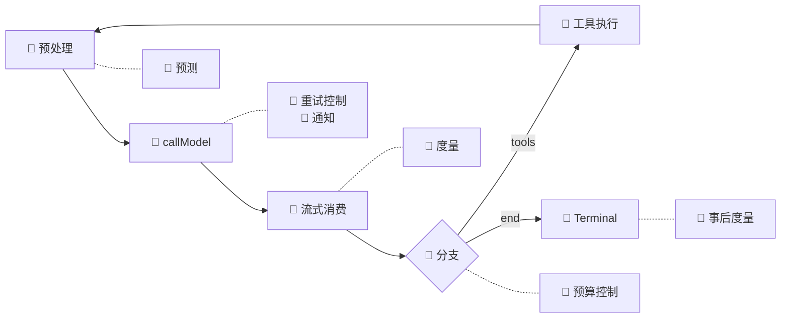
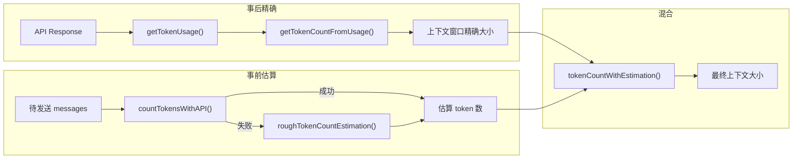
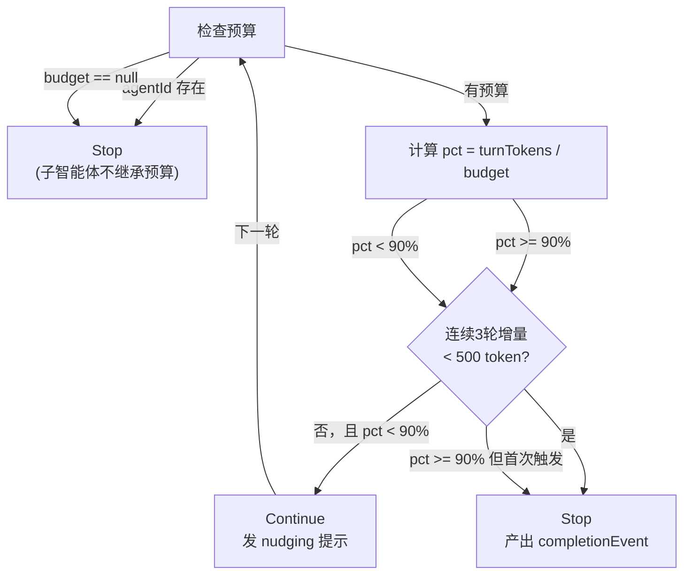

# 07. Token 与成本管理

本章回答 Part 2 核心循环的第三个问题：05 讲架构全貌（WHERE），06 讲循环怎么转（HOW），本章讲循环中流淌的"血液"——Token——如何计量和控制（HOW MUCH）。全文围绕 **度量 → 预测 → 控制 → 通知** 四个环节展开，覆盖 9 个核心文件约 2,900 行源码。

## 1. 背景介绍

Token 是双重身份的载体：它既是**上下文容量的度量单位**（上下文窗口能装多少 token），也是 **API 调用的计费依据**（按 input / output token 计费）。Token 与成本管理系统要回答的核心问题是：

> **每个字都有成本，如何让用户在"够用"和"不超支"之间找到平衡？**

### 1.1 一次性计费 vs 累积计费

理解 Agent 系统的成本挑战，最直观的方式是将它与传统 API 调用做对比：

```
传统 API 调用（一次性计费）：
  发请求 → 收响应 → 付一次钱
  成本 = input_tokens + output_tokens，一次算清

Agent 系统（累积计费）：
  发请求 → 收响应 → 调工具 → 回流结果 → 再发请求 → ...
  成本 = Σ(每轮 input + output)
  且上一轮的 output + tool_result 变成下一轮的 input
```

关键差异一句话说清：**传统 API 的计费单元是"一次调用"，Agent 的计费单元是"一次任务"——而任务长度不可预知。** 一次复杂的重构可能跑 20 轮 loop，每轮都把上一轮的工具结果（可能包含数万行代码）重新塞回 input。成本不是线性增长，而是**叠加式膨胀**。

### 1.2 极端假设法框定问题空间

| 极端 | 方案 | 问题 |
|------|------|------|
| 硬限制 | 设死 max_tokens，用完即停 | 任务可能半途而废，用户体验毁灭性 |
| 无限放任 | 不限量，让模型跑到自然结束 | 成本失控风险，一次对话可能消耗数美元甚至数十美元 |

两种极端的折衷方案是 **分级预警 + 收益递减检测 + 可配置硬上限**：让模型在预算内"尽力跑"，但在接近限制时给出提示，在明显空转时果断刹车。这就是本章要讲的完整闭环。

### 1.3 正交分解：四个子问题

将"Token 与成本管理"正交分解为四个独立维度:

```
                     "每个 token 都有成本"

     度量 (MEASURE)                    控制 (CONTROL)
 ┌──────────────────────┐      ┌──────────────────────────┐
 │ 实际用了多少 token？    │      │ 什么时候该停？               │
 │ · API usage 精确提取    │      │ · max_budget_usd 硬上限      │
 │ · 上下文窗口实时大小     │      │ · BudgetTracker 收益递减检测  │
 │ · 并行 tool 调用去重估算  │      │ · max_turns 回合限制          │
 └──────────────────────┘      └──────────────────────────┘

     预测 (PREDICT)                    通知 (INFORM)
 ┌──────────────────────┐      ┌──────────────────────────┐
 │ 调用 API 前用多少？     │      │ 什么时候告诉用户？           │
 │ · 跨提供商 token 估算   │      │ · 5h / 7d / overage 三层配额 │
 │ · rough estimation 兜底 │      │ · 提前预警阈值              │
 │ · thinking block 感知  │      │ · 成本显示权限控制           │
 └──────────────────────┘      └──────────────────────────┘
```

这四个模块互相独立又环环相扣：度量提供数据基础，预测填补 API 调用前的时间窗口，控制基于度量结果做决策，通知把控制决策翻译成用户可理解的语言。具体每个模块如何嵌入 Agent Loop 的迭代体、各自面临什么设计约束，是第 2 节要回答的问题。

---

## 2. 核心逻辑

### 2.1 总览：四维在 queryLoop 中的挂载点

在深入各维度的设计之前，先将四个子系统标注到[第 6 章](../part2/06-Agent-Loop机制)建立的 `queryLoop` 迭代体上。🔵 表示 06 已建立的循环结构，🔴 表示本章子系统的触发位置：



具体映射关系：

- **预测** 在预处理流水线入口触发（每次调 API 之前），判断是否需要压缩，消费方是 06 §3.4 的 5 步减法流水线。
- **度量** 在 `callModel` 返回后触发，从 `message.usage` 提取精确数据，合并新消息的粗略估算，供 `tokenCountWithEstimation()` 的所有调用点使用。
- **重试控制** 在 `withRetry` 内部触发（529/429/网络错误），决定是否重试以及何种策略，消费方是 06 §3.7 的重试层。
- **预算控制** 在 `!needsFollowUp` 分支触发（模型无工具调用、准备终止时），判定 Continue 还是 Stop，消费方是 06 §3.5 的 Continue/Terminal 状态机。
- **通知** 在 `callModel` 返回后触发，解析速率限制响应头，更新 `currentLimits` 状态，输出到 UI 渲染和 status line 脚本。
- **事后度量** 在循环结束后触发，汇总全部 usage 匹配定价计算 USD，展示给具有 billing 权限的用户。

::: tip 关键洞察
Token 管理的四个子系统不改变 `while(true)` 的结构——它们作为**观察者和守卫**嵌入在循环相位中。预测是"进门守卫"（进去之前看一眼），度量是"账房"（每笔交易后记账），控制是"刹车"（条件满足时终止循环），通知是"仪表盘"（实时显示当前状态）。
:::

### 2.2 度量层：为什么需要"精确计数 + 粗略估算"双轨制？

先从最朴素的问题开始：**当前上下文用了多少 token？**

这个问题的答案有两个获取路径：

1. **事后精确路径**：API 每次调用返回 `usage` 对象（`input_tokens`、`output_tokens`、`cache_*_tokens`），这是标准答案
2. **事前估算路径**：在 API 调用之前（如压缩决策时），对尚未发送的消息估算 token 数

为什么需要第二条路径？因为[第 6 章](../part2/06-Agent-Loop机制#_3-4-5-步预处理流水线的顺序设计)的 5 步预处理流水线中，步骤 ②-⑤ 每一步的执行判断都依赖于一个 token 估算值：**当前消息历史有没有超过压缩阈值**。这个判断必须在调用 API **之前**做出——一旦 API 返回 `model_context_window_exceeded` 错误，上下文已经溢出了，用户等了几秒只等来一个错误。

两条路径各自适用不同场景，这就是 Claude Code 度量层的核心设计：



`tokenCountWithEstimation()` 的注释中有一行非常醒目：

> This is the CANONICAL function for measuring context size when checking thresholds (autocompact, session memory init, etc.)

为什么需要一个"权威"函数？因为上下文大小的计算方式不只一种——只算 `output_tokens`？算上 cache？要不要加新消息的估算？如果每个调用点都自己选一种算法，就会出现"压缩阈值在模块 A 是 85%，在模块 B 却是 90%"的混乱。**单点权威 = 行为一致性**。

::: tip 关键洞察
在 Token 管理的设计空间中，"一致性"比"精确性"更重要。上下文窗口是否真的 199k token 不重要，重要的是**每次判断用的都是同一把尺子**。否则会出现"压缩判断认为没到阈值，实际 API 调用却报溢出"的不一致。
:::

### 2.3 预测层：为什么是四层 Fallback？

度量层的"事前估算"路径，本质是一个跨提供商的 token 估算管线：

```
Anthropic countTokens API  →  Bedrock countTokens  →  Vertex countTokens  →  rough estimation (字符数/4)
```

为什么需要这么多层？因为 token 计数 API 的可用性取决于用户使用的云提供商：

| 提供商 | countTokens 可用性 | 备注 |
|--------|-------------------|------|
| Anthropic 直连 | ✅ 完全支持 | 最精确，标准 API |
| Bedrock | ⚠️ SDK 不支持 `countTokens` | 需用 `@aws-sdk/client-bedrock-runtime` 原生调用 |
| Vertex | ⚠️ 限制 beta 头 | 需过滤不被 Vertex 支持的 beta 头 |

当所有 API 路径都不可用时，最后的兜底是 `roughTokenCountEstimation()`——**字符数除以 4**。

为什么是 4 而不是更精确的算法？这里有三个权衡：

1. **精度 vs 包体积**：`tiktoken` 精确但增加 ~2MB 包体积，且需要为每个模型维护 tokenizer 版本
2. **精度 vs 延迟**：本地 tokenizer 仍需加载模型文件，首次调用延迟不可忽略
3. **误差可容忍**：在压缩决策场景中，±20% 误差不致命——因为压缩阈值（如 85%）本身就留了 buffer

更有趣的是 `bytesPerTokenForFileType()`——它针对 JSON 文件使用了 `字符数/2` 而非 `字符数/4`：

```typescript
// src/services/tokenEstimation.ts:215-223
export function bytesPerTokenForFileType(fileExtension: string): number {
  switch (fileExtension) {
    case 'json':
    case 'jsonl':
    case 'jsonc':
      return 2  // Dense JSON: many single-char tokens ({, }, [, ], :, ,)
    default:
      return 4
  }
}
```

为什么 JSON 文件要特殊处理？因为 JSON 中有大量单字符 token（`{`、`}`、`[`、`]`、`:`、`,`、`"`），每个只占 1 字节。用 `/4` 会严重低估真实的 token 数，导致过大的工具结果被误认为"足够小"而跳过截断。

::: tip 关键洞察
`bytesPerTokenForFileType` 的设计说明了一个原则：**粗略估算不等于"随便估"。** 在关键决策点（工具结果截断判断），即使 2 行 switch-case，也能把误差从 50% 降到 25%。
:::

### 2.4 控制层：BudgetTracker 的"收益递减"哲学

如果用户设置了预算（如 `+500k`），Agent Loop 的每一轮都需要回答：**模型还在"有效工作"还是"已经空转"？**

Claude Code 的答案封装在 `BudgetTracker` 状态机中：



这个状态机有两个精妙之处：

**为什么用 90% 阈值而非 100%？** 给模型留"最后一句话"的余量。如果刚好 100% 才停，模型可能在生成一段文字的中途被截断，用户体验极差。90% 的阈值意味着：看到预算快到了就该准备收尾了。

**为什么连续 3 轮增量 < 500 token 判定为 diminishing？** 这背后是对 LLM 行为模式的洞察：
- 第 1 轮低产出：可能正在读一个大文件（Bash/Read 工具调用不产生 token 增量）
- 第 2 轮低产出：可能在思考如何修改（thinking block 较长但实际 text 增量小）
- 第 3 轮还在低产出：大概率是"卡住了"——在同一个问题上反复徘徊

`continuationCount >= 3` 这个条件确保不是"一时卡顿"而是"持续性空转"。

此外，`continuationCount` 计的不是"总共继续了几轮"，而是"预算预警后继续了几轮"。这个区别很重要：正常消耗和超预算消耗是不同的语义。一个 5 轮完成的任务有 `continuationCount = 0`，而一个触达预算又继续 3 轮的任务有 `continuationCount = 3`。

### 2.5 速率限制：为什么分成 5h / 7d / overage 三层？

速率限制（Rate Limiting）和预算控制是两回事：预算是"用户层面的成本控制"，速率限制是"服务端的资源保护"。但两者共享同一个信息通道——API 响应头。

Claude Code 将服务端速率限制映射为三层结构：

| 层级 | 窗口 | 作用 | 预警策略 |
|------|------|------|---------|
| five_hour | 5 小时 | 短期突发保护 | 用量 ≥ 90% 且时间经过 ≥ 72% → 预警 |
| seven_day | 7 天 | 中期平滑限制 | 三级预警：75%+60%、50%+35%、25%+15% |
| overage | 按月 | 超额使用兜底 | 独立判断，与 5h/7d 互不干扰 |

为什么预警不是简单的"用量 > 80% 就警告"？关键洞察在 `EarlyWarningThreshold` 的数据结构：

```typescript
// src/services/claudeAiLimits.ts:38-41
type EarlyWarningThreshold = {
  utilization: number // 0-1 scale: trigger warning when usage >= this
  timePct: number     // 0-1 scale: trigger warning when time elapsed <= this
}
```

这是一个二维判定：**用量和时间必须同时满足条件才触发预警。** 用量 75% 但时间已经过了 90% → 不预警（消耗速度实际上偏慢）。用量 25% 但时间只过了 15% → 预警（消耗速度偏快，按此趋势会提前耗尽）。

这是对传统"80% 就告警"的一次升级：将静态阈值变成了**动态速率感知**。同样的用量百分比，在不同的时间进度下，意味着完全不同的风险级别。

seven_day 的三级预警更细腻——它在 75%、50%、25% 三个水位各设置了一个时间-用量交叉点，形成一条"预警曲线"。用户不会在 74% 时什么都不知道、75% 时突然收到严重警告，而是随着消耗加速逐步收到越来越紧迫的提示。

---

## 3. 源码解读

### 3.1 核心文件清单

| 文件 | 行数 | 职责 | 所属层次 |
|------|------|------|---------|
| [`src/utils/tokens.ts`](../../src/utils/tokens.ts) | 261 | Usage 提取、上下文窗口计算、并行 tool 去重、content 长度估算 | 度量 |
| [`src/services/tokenEstimation.ts`](../../src/services/tokenEstimation.ts) | 495 | 跨提供商 token 计数 API、rough estimation 兜底、文件类型感知 | 预测 |
| [`src/utils/modelCost.ts`](../../src/utils/modelCost.ts) | 231 | 定价阶梯（6 个 tier）、usage → USD 转换、未知模型兜底 | 度量 |
| [`src/services/api/usage.ts`](../../src/services/api/usage.ts) | 63 | 从 OAuth API 拉取配额使用率（5h/7d/overage） | 通知 |
| [`src/utils/tokenBudget.ts`](../../src/utils/tokenBudget.ts) | 73 | 用户预算指令解析（`+500k`、`use 2M tokens`）、续命提示文案 | 控制 |
| [`src/query/tokenBudget.ts`](../../src/query/tokenBudget.ts) | 93 | BudgetTracker 状态机：Continue/Stop 判定、收益递减检测 | 控制 |
| [`src/services/api/withRetry.ts`](../../src/services/api/withRetry.ts) | 822 | 重试引擎：529/429/网络错误分层策略、fast mode fallback | 控制 |
| [`src/services/claudeAiLimits.ts`](../../src/services/claudeAiLimits.ts) | 515 | 速率限制检测：header 解析、提前预警、三层配额、配额检查 API | 通知 |
| [`src/services/rateLimitMessages.ts`](../../src/services/rateLimitMessages.ts) | 344 | 用户可见速率限制消息生成，严重度分级 error/warning | 通知 |

### 3.2 完整调用链

以一次用户输入 `"+500k"` 为起点，贯穿整条 Token 管理链路的完整流程。每条 Token 子系统的触发标注了它在 [06 §3.2](../part2/06-Agent-Loop机制#_3-2-完整调用链路) `queryLoop` 迭代体中的对应相位：

```
用户输入 "+500k"
  │
  ├─ 启动阶段（06 queryLoop 入口之前）
  │   └─ tokenBudget.parseTokenBudget("+500k")
  │       → 解析为 500,000 token 的 budget 值
  │       → 传入 queryLoop，BudgetTracker 初始化
  │
  └─ 每轮循环
      ├─ [预测] tokenEstimation.countMessagesTokensWithAPI()
      │   【相位：06 [预处理] 5步流水线入口】
      │   → 压缩决策需要"事前"上下文大小
      │   → Anthropic → Bedrock → Vertex → rough 四层 fallback
      │
      ├─ [重试控制] deps.callModel() → withRetry() 包裹
      │   【相位：06 [★ 核心] deps.callModel() 内部】
      │   ├─ 529 → 最多 3 次，超限触发 fallback model
      │   ├─ 429 → 等待 Retry-After
      │   └─ 非交互场景 → 529 直接放弃（成本保护）
      │   └─ API response 返回
      │       ├─ message.usage（事后精确数据）
      │       └─ response headers（速率限制状态）
      │
      ├─ [通知] claudeAiLimits.extractQuotaStatusFromHeaders(headers)
      │   【相位：06 流式消费完成后】
      │   → 解析 rate limit 响应头，更新 currentLimits 状态
      │   → emitStatusChange() 通知所有 listener
      │
      ├─ [度量] tokens.getTokenUsage(message) + tokenCountWithEstimation(messages)
      │   【相位：06 流式消费完成后】
      │   → 从最后一条 API response 的 usage 出发
      │   → 并行 tool 场景：向前回溯到第一个 split sibling（§3.3）
      │
      ├─ [控制] tokenBudget.checkTokenBudget(tracker, agentId, budget, turnTokens)
      │   【相位：06 [!needsFollowUp] 分支 → Token Budget 判定（出口⑤）】
      │   → agentId 存在 → 跳过（子智能体不继承预算）
      │   → 判定 Continue（发 nudging）或 Stop（产出 completionEvent）

      └─ [通知] rateLimitMessages.getRateLimitMessage(limits, model)
          【相位：06 循环内任意时刻，由 emitStatusChange 事件驱动】
          → 根据 limits.status 生成用户可见消息

循环结束（06 Terminal 出口）
  │
  └─ [度量(事后)] modelCost.calculateUSDCost(model, usage)
      【相位：06 queryLoop return 之后，回到外层 QueryEngine】
      → getModelCosts(model, usage) → 匹配定价阶梯
      └─ tokensToUSDCost(costs, usage) → USD 金额
      └─ 显示给具有 billing 权限的用户
```

### 3.3 并行工具调用的 Token 去重算法

上下文窗口计算中最微妙的场景是并行工具调用。当模型在一个 response 中发出多个 `tool_use` block 时，流式代码会为每个 content block 生成**独立的 assistant 消息记录**——但它们共享同一个 `message.id` 和 `usage`。如果直接从 messages 数组末尾向前找最后一个有 usage 的 assistant，会遗漏前面的 interleaved tool_results：

```
messages = [
  ...,                                  // 更早的消息
  assistant(id="A", tool_use="bash"),   // ← 第一个 tool_use (usage 在这)
  user(tool_result: "..."),             // ← interleaved result
  assistant(id="A", tool_use="read"),   // ← 第二个 tool_use (同一个 API response)
  user(tool_result: "..."),             // ← 最后一个消息
]
// 如果只从最后一个 assistant 开始估算，会遗漏第一个 tool_result
```

`tokenCountWithEstimation()` 的解决方案是从最后一个 assistant 向前回溯，找到**同一个 API response 中的第一个 split sibling**：

```typescript
// src/utils/tokens.ts:226-261
export function tokenCountWithEstimation(messages: readonly Message[]): number {
  let i = messages.length - 1
  while (i >= 0) {
    const message = messages[i]
    const usage = message ? getTokenUsage(message) : undefined
    if (message && usage) {
      // Walk back past any earlier sibling records split from the same API
      // response (same message.id) so interleaved tool_results between them
      // are included in the estimation slice.
      const responseId = getAssistantMessageId(message)
      if (responseId) {
        let j = i - 1
        while (j >= 0) {
          const prior = messages[j]
          const priorId = prior ? getAssistantMessageId(prior) : undefined
          if (priorId === responseId) {
            // Earlier split of the same API response — anchor here instead.
            i = j
          } else if (priorId !== undefined) {
            // Hit a different API response — stop walking.
            break
          }
          // priorId === undefined: a user/tool_result/attachment message,
          // possibly interleaved between splits — keep walking.
          j--
        }
      }
      return (
        getTokenCountFromUsage(usage) +
        roughTokenCountEstimationForMessages(messages.slice(i + 1))
      )
    }
    i--
  }
  return roughTokenCountEstimationForMessages(messages)
}
```

**设计要点：**

- **回溯而非扫描**：不遍历整个数组，而是从后往前找到第一个有 usage 的记录再回溯，大多数场景（无并行 tool）只需 O(1)
- **`message.id` 作为分组键**：利用 API response 的天然唯一 ID，无需引入新的分组数据结构
- **三种情况的分支清晰**：同 ID 继续回溯、不同 ID 停止、无 ID（user message）跳过——三个分支覆盖了 messages 数组的所有消息类型
- **对"精度"的诚实态度**：回溯后用 `roughTokenCountEstimationForMessages` 而非精确计数——承认估算部分的误差，但保证不漏算

### 3.4 BudgetTracker：Continue / Stop 决策

预算控制的决策逻辑集中在一个 50 行的函数中。先看数据结构：

```typescript
// src/query/tokenBudget.ts:1-11
const COMPLETION_THRESHOLD = 0.9
const DIMINISHING_THRESHOLD = 500

export type BudgetTracker = {
  continuationCount: number    // 预算预警后已继续的轮数
  lastDeltaTokens: number      // 上一轮的 token 增量
  lastGlobalTurnTokens: number // 上一轮结束时的累计 token 数
  startedAt: number            // 预算追踪开始时间戳
}
```

决策函数的完整流程：

```typescript
// src/query/tokenBudget.ts:45-93
export function checkTokenBudget(
  tracker: BudgetTracker,
  agentId: string | undefined,
  budget: number | null,
  globalTurnTokens: number,
): TokenBudgetDecision {
  if (agentId || budget === null || budget <= 0) {
    return { action: 'stop', completionEvent: null }
  }
  // ① 计算本轮消耗
  const turnTokens = globalTurnTokens
  const pct = Math.round((turnTokens / budget) * 100)
  const deltaSinceLastCheck = globalTurnTokens - tracker.lastGlobalTurnTokens

  // ② 收益递减检测：连续 3 轮且两轮增量都 < 500 token
  const isDiminishing =
    tracker.continuationCount >= 3 &&
    deltaSinceLastCheck < DIMINISHING_THRESHOLD &&
    tracker.lastDeltaTokens < DIMINISHING_THRESHOLD

  // ③ 未递减 + 未超 90% → Continue
  if (!isDiminishing && turnTokens < budget * COMPLETION_THRESHOLD) {
    tracker.continuationCount++
    tracker.lastDeltaTokens = deltaSinceLastCheck
    tracker.lastGlobalTurnTokens = globalTurnTokens
    return {
      action: 'continue',
      nudgeMessage: getBudgetContinuationMessage(pct, turnTokens, budget),
      // ...
    }
  }

  // ④ 递减 或 已有继续记录 → Stop（产出 completionEvent）
  if (isDiminishing || tracker.continuationCount > 0) {
    return {
      action: 'stop',
      completionEvent: {
        continuationCount: tracker.continuationCount,
        pct, turnTokens, budget,
        diminishingReturns: isDiminishing,
        durationMs: Date.now() - tracker.startedAt,
      },
    }
  }

  // ⑤ 首次触发就超 90% 且无继续记录 → 静默 Stop（无 completionEvent）
  return { action: 'stop', completionEvent: null }
}
```

**设计要点：**

- **子智能体不继承预算**：`agentId` 存在时直接 `stop` 且 `completionEvent: null`——子任务使用的是父任务预分配的预算，不应独立触发父级预算的终止事件
- **`continuationCount >= 3` + 两轮 `lastDeltaTokens` 检查**：防止单轮异常（如刚好读了小文件）误触发；requiring 两轮连续的低于 500 增量确保"模式"而非"偶然"
- **④ 和 ⑤ 的区分**：`continuationCount > 0` 时始终产出 `completionEvent`（包含 `diminishingReturns` 和 `durationMs`），用于遥测分析——"用户设了预算，模型多跑了 N 轮还是停了"是可观测性的关键指标
- **三个常量一块整体调参**：`0.9`（阈值）、`500`（递减感知）、`3`（连续轮数）相互耦合——改任何一个都会改变"激进 vs 保守"的平衡点

### 3.5 成本计算：定价阶梯与 unknown model 兜底

将 `usage` 转成美元，需要两步：匹配定价阶梯 → 逐项计算。

定价阶梯以 `$X per Mtok` 为单位，覆盖 6 个 tier：

```typescript
// src/utils/modelCost.ts:36-87
// Standard: $3 in / $15 out per Mtok（Sonnet 全系列）
export const COST_TIER_3_15 = {
  inputTokens: 3, outputTokens: 15, promptCacheWriteTokens: 3.75,
  promptCacheReadTokens: 0.3, webSearchRequests: 0.01,
} as const satisfies ModelCosts

// Opus 4/4.1: $15 in / $75 out per Mtok
export const COST_TIER_15_75 = { /* ... */ }

// Opus 4.5: $5 in / $25 out per Mtok
export const COST_TIER_5_25 = { /* ... */ }

// Opus 4.6 fast mode: $30 in / $150 out per Mtok
export const COST_TIER_30_150 = { /* ... */ }

// Haiku 3.5 / 4.5 独立定价
export const COST_HAIKU_35 = { inputTokens: 0.8, outputTokens: 4, /* ... */ }
export const COST_HAIKU_45 = { inputTokens: 1, outputTokens: 5, /* ... */ }
```

`MODEL_COSTS` 映射使用 `ModelShortName` 作为 key，通过 `firstPartyNameToCanonical()` 将每个模型的内部名称转换后挂载。当模型不在映射表中时（例如第三方自定义模型、新增模型尚未更新配置），使用**两种兜底**：

```typescript
// src/utils/modelCost.ts:144-163
export function getModelCosts(model: string, usage: Usage): ModelCosts {
  const shortName = getCanonicalName(model)
  // Opus 4.6 动态判断 fast mode 决定定价
  if (shortName === firstPartyNameToCanonical(CLAUDE_OPUS_4_6_CONFIG.firstParty)) {
    const isFastMode = usage.speed === 'fast'
    return getOpus46CostTier(isFastMode)
  }
  const costs = MODEL_COSTS[shortName]
  if (!costs) {
    trackUnknownModelCost(model, shortName)           // 打点遥测
    return (
      MODEL_COSTS[getCanonicalName(getDefaultMainLoopModelSetting())]  // 回到默认模型定价
      ?? DEFAULT_UNKNOWN_MODEL_COST                                   // 最终兜底: 5_25
    )
  }
  return costs
}
```

**设计要点：**

- **`usage.speed === 'fast'` 动态定价**：Opus 4.6 的 fast mode 和标准模式是同一个 canonical name，但定价差 6 倍（$30/$150 vs $5/$25）——不能静态映射，只能看 API response 里的实际速度
- **两级兜底**：`默认模型定价 → DEFAULT_UNKNOWN_MODEL_COST`——确保始终能算出一个近似值，同时打点 `tengu_unknown_model_cost` 让团队知道有未知模型
- **`trackUnknownModelCost()` 的打点设计**：只打点一次（通过 `setHasUnknownModelCost()` 设置全局标记），避免每条消息都打一次——这是遥测成本控制的一个细节

### 3.6 速率限制的"双通道"检测

速率限制状态有两个检测通道，来源不同但写入同一个 `currentLimits` 全局状态：

```typescript
// src/services/claudeAiLimits.ts
// 通道一：API 响应头（claude.ts 每次 API 调用后调用）
//   extractQuotaStatusFromHeaders(headers)
//     检查: unified-status → status (allowed/warning/rejected)
//     检查: surpassed-threshold 头 → 提前预警
//     检查: 时间-用量二维预警 → fallback 预警
//     更新: rawUtilization（供 status line 脚本查询）

// 通道二：API 错误响应
//   extractQuotaStatusFromError(error)
//     当 API 返回 429 时，从 error headers 中提取状态

// 通道三（可选）：主动配额检查
//   checkQuotaStatus()
//     在交互会话中发送最小请求（1 token）探测配额状态
//     非交互模式 (-p) 跳过：正式查询会在 claude.ts 中完成头解析
```

三层配额通过 `EARLY_WARNING_CONFIGS` 的优先级顺序检测：先检查服务端主动推送的 `surpassed-threshold` header，如果服务端未发送，再使用时间-用量二维计算作为 fallback。两种路径产出相同结构的 `ClaudeAILimits` 对象，通过 `emitStatusChange()` 统一通知所有 listener（包括 UI 组件和 status line 脚本）。

---

## 4. 总结

1. **Token 管理是 Agent 系统的"经济学"**——不同于传统 API 的一次性计费，Agent Loop 的累积成本需要**事前估算 + 事中控制 + 事后统计**三层闭环，分别对应压缩决策、BudgetTracker 判定、成本显示三个场景
2. **"精确 + 估算"双轨制度量的核心价值是决策一致性**：精确数据用于事后统计和成本显示（错误零容忍），估算数据用于事前决策（误差可容忍但必须统一算法），`tokenCountWithEstimation()` 作为唯一权威入口确保所有调用点用同一把尺子
3. **BudgetTracker 的收益递减检测是"软着陆"机制**：不是一刀切停掉，而是通过 `continuationCount >= 3` + `lastDeltaTokens < 500` 的双条件检测"模型在空转"状态，0.9 的阈值留下安全余量让模型自然收尾
4. **速率限制的三层结构**（5h / 7d / overage）对应不同时间尺度的保护策略，预警阈值引入时间-用量双维度判断——同样 50% 的用量，时间过了 60% 就预警，时间过了 80% 就不预警，这是对传统静态阈值的本质性升级
5. **重试策略分层**是容量保护的"博弈论"：529 最多 3 次（防止 retry storm 加剧过载），非交互场景直接放弃（用户不等待、重试是纯浪费），fast mode 429 优先保 cache 而非立即降级
6. **`message.id` 作为并行工具的分组键**是一个简洁且正确的设计——利用 API response 自身的唯一标识进行回溯去重，避免了引入新的分组数据结构的复杂性和错误可能性
7. **定价兜底的两级 fallback**（默认模型 → `COST_TIER_5_25`）保证用户始终能看到一个近似成本，同时通过 `trackUnknownModelCost()` 打点让团队感知到配置缺失

**覆盖边界：**
- 本文聚焦 QueryEngine 循环内的 token 与成本管理机制
- `promptCacheBreakDetection.ts`（727 行）——prompt cache 失效检测与调试，延后到 Part 6（上下文管理）
- `policyLimits/index.ts`（663 行）——组织级策略限制的拉取与执行，延后到 Part 8（权限系统）
- `mockRateLimits.ts`（882 行）——ANT-ONLY 测试基础设施，不纳入分析范围
- 用户预算指令的 UI 交互（`+500k` 高亮、彩虹色渲染）属于终端 UI 体系，见 Part 9

---

## 5. 参考文献

- [Anthropic API — Rate Limits](https://docs.anthropic.com/en/docs/build-with-claude/rate-limits)
- [Anthropic API — Token Counting](https://docs.anthropic.com/en/docs/build-with-claude/token-counting)  
- [Anthropic Platform — Pricing](https://platform.claude.com/docs/en/about-claude/pricing)
- Claude Code 源码：
  - `src/utils/tokens.ts` — Usage 提取与上下文窗口计算
  - `src/services/tokenEstimation.ts` — 跨提供商 token 估算
  - `src/utils/modelCost.ts` — 模型定价与成本计算
  - `src/query/tokenBudget.ts` — 预算跟踪状态机
  - `src/services/api/withRetry.ts` — 分层重试引擎
  - `src/services/claudeAiLimits.ts` — 速率限制检测与预警
