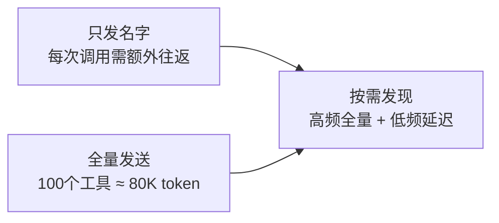

# 08. 工具注册与发现

工具注册与发现回答一个根本问题：**模型如何知道它能做什么**。"注册"把能力打包为工具并声明完整的行为契约，"发现"让模型在恰当的时机知晓恰当的工具子集。两者合在一起，构成了 Agent 行动能力的"目录系统"。

## 1. 为什么需要工具系统？

理解 Claude Code 工具系统的设计思路，最直接的方式是与主流方案做对比：

| 对比对象 | 工具模型 | 差异 |
|----------|---------|------|
| OpenAI Function Calling | `{name, description, parameters}` | 纯 JSON Schema 声明，无行为属性——系统不知道哪个函数有副作用、哪个能并行执行 |
| Claude Code `Tool` | 40+ 方法的接口，按关注面分层 | 不是"函数包装器"，而是工具与系统之间的**完整契约**——它回答的不是"这个函数怎么调"，而是"这个能力在 Agent 循环中怎么安全、高效地被使用" |

Claude Code 的工具系统不是在 OpenAI Function Calling 上加了几个字段，而是从"Agent 循环需要知道工具的哪些元信息才能做出正确决策"这个根本问题出发，重新定义了工具的完整契约。

如果说工具接口的设计回答了"单个工具怎么定义"，那下一个问题就是"模型该看到哪些工具"。MCP 可能带来上百个外部工具，两个极端方案都无法接受：



两个极端的折衷方案是：**高频核心工具全量发送（缓存友好），低频扩展工具按需发现（延迟加载），已发现的工具被追踪记忆（不重复付费）**。这就是 2.3 节 ToolSearch 机制要展开的核心逻辑。

---

## 2. 核心逻辑

### 2.1 Tool 接口的设计

Tool 接口有 40+ 个方法，可分为五份契约。理解这个分化逻辑，比记住每个方法的名字重要得多。

#### 2.1.1 五份契约

至少五个不同的系统组件需要向同一个工具提问——每个组件关注的信息维度完全不同：

| 契约 | 消费者 | 关心的问题 | 核心方法 |
|------|--------|-----------|---------|
| 执行契约 | 工具调度器 | 怎么执行？ | `call()`、`inputSchema`、`validateInput()`、`description` |
| 安全契约 | 权限系统 | 安全吗？ | `isReadOnly()`、`isDestructive()`、`checkPermissions()`、`requiresUserInteraction()` |
| 调度契约 | runTools 编排器 | 能并行吗？ | `isConcurrencySafe()`、`interruptBehavior()` |
| 渲染契约 | UI 层 | 长什么样？ | `userFacingName()`、`renderToolUse*`（8 个方法） |
| 发现契约 | System Prompt 组装器 | 什么时候让模型知道？ | `shouldDefer`、`alwaysLoad`、`searchHint`、`isMcp` |

**每份契约对应一位明确的消费者。** 这不是过度设计——关键在于每个消费者都在问不同的关于这个工具的问题。把答案全塞进 `call()` 里比分散到各自的方法中更混乱：`call()` 的调用者不需要知道工具怎么渲染，UI 层不需要知道工具的执行逻辑。

举个例子：当 `runTools` 准备调度一批工具调用时，它需要知道哪些能并行、哪些必须串行。这个决策应该由工具自己声明（`isConcurrencySafe`），而不是让调度器去猜测——调度器不可能理解所有工具的实现细节。

#### 2.1.2 fail-closed：从不假设工具安全

`buildTool()` 创建工具时，`isConcurrencySafe`、`isReadOnly` 等安全属性默认 `false`。核心原则只有一条：**系统不知道的事情，按最危险的假设对待。**

以 `isReadOnly` 为例。如果默认 `true`，忘记标记的工具可能绕过权限静默执行危险操作——用户根本不知道发生了什么。默认 `false`，忘记标记的结果只是每次多弹一次权限确认——用户体验略差，但安全。让开发者用代码**主动证明**工具安全，忘记声明的代价是性能（串行），不是事故。

### 2.2 从全量注册到会话视图

代码仓库里注册了 60+ 个内置工具，加上 MCP 可能带来的上百个外部工具。模型不能全看到。从"全量"到"当前可用子集"的收敛路径是一条三层漏斗。

#### 2.2.1 三层漏斗：各自独立决策

```
getAllBaseTools()            全量注册："代码仓库里有哪些工具？"
     │                       feature flag 条件注册在此落地：
     │                       · hasEmbeddedSearchTools? → 跳过 Glob/Grep
     │                       · isWorktreeModeEnabled? → 加入 EnterWorktree
     │                       · isToolSearchEnabledOptimistic? → 加入 ToolSearch
     │
     ▼
filterToolsByDenyRules()     第1层："管理员禁用了哪些？"
     │                       发生在模型看到之前——不让模型知道不可用工具的存在
     │                       一条 mcp__dangerous_server 规则封禁整个 MCP 服务器
     │
     ▼
getTools() 模式裁剪          第2层："当前模式需要哪些？"
     │                      · Simple → 只留 Bash + Read + Edit（3 个）
     │                      · REPL → 隐藏 Shell 原语，由 REPL VM 内部代理
     │                      · 正常 → 跳过合成工具和特殊工具标记
     │
     ▼
isEnabled()                 第3层："工具自身是否就绪？"
                             Feature flag 的运行时判断在此落地
                             ToolSearch 工具只在 isToolSearchEnabledOptimistic() 时才启用
     │
     ▼
assembleToolPool()          合并 MCP → 去重（内置优先）→ 排序 → 产出最终工具池
```

**为什么分层而不是一个大函数？** 三层决策依据来自三个独立系统——deny 规则来自权限系统，模式裁剪来自用户设置和环境变量，`isEnabled` 来自各工具的 feature flag。揉在一起意味着改一个 feature flag 的行为可能意外影响 deny 规则的逻辑。分层让每个系统独立决策，组合结果即可。

#### 2.2.2 排序为什么关乎成本？

`assembleToolPool` 中最微妙的设计决策不是关于功能正确性，而是关于**缓存成本**。

Anthropic API 的 prompt cache 按前缀匹配。System Prompt 中工具列表的顺序变化会导致缓存前缀变化——即使只是新增了一个 MCP 工具。如果内置工具和 MCP 工具混合排序，一个以字母 "a" 开头的 MCP 工具可能排到内置工具中间，打乱整个缓存前缀，导致**所有用户缓存雪崩**。

实际采用的方案：

```
[...builtInTools].sort(byName).concat(allowedMcpTools.sort(byName))
```

内置工具排序后构成稳定前缀，MCP 工具排序后追加在后。全局缓存断点设在最后一个内置工具之后——内置工具集是固定的，这个断点永远不变。MCP 工具的增删只影响后缀部分的缓存，不影响前缀。

去重时 `uniqBy` 保留首次出现（即内置优先）：不能让一个名为 `Bash` 的 MCP 工具覆盖核心的 BashTool。

#### 2.2.3 子Agent 的工具集：再次裁剪

经过三层漏斗产出的工具集是主线程的视图。子Agent 的工具集需要在这个基础上再次裁剪，核心约束只有一个：**不能让子Agent 不受控地扩展权限。**

三条裁剪规则：

| 规则 | 被屏蔽的工具 | 设计意图 |
|------|------------|---------|
| 禁止递归派生子 Agent | `AgentTool`（ant 用户例外） | 防止无限递归——子Agent 再派生孙Agent 再派生…… |
| 禁止主线程专属操作 | `ExitPlanMode`、`TaskStop`、`AskUserQuestion`、`EnterPlanMode` | 这些工具改变主线程状态，子Agent 没有权限操作 |
| 异步 Agent 不能弹对话框 | 只保留 `ASYNC_AGENT_ALLOWED_TOOLS`（文件读写、Bash、搜索等 15 个） | 异步 Agent 在后台运行，没有人在看它的权限弹窗 |

注意一个细节：主线程调用 `resolveAgentTools` 时 `isMainThread=true`，**跳过裁剪**——主线程的工具集本就是完整组装好的视图，不需要被子Agent 的规则限制。

### 2.3 ToolSearch 延迟加载

MCP 可能带来上百个工具。每个工具的完整描述（name + description + input_schema）约 500-2000 字符。全发给模型，几十万 token 被工具描述吃掉。但模型又必须知道有哪些工具可用——不给工具定义等于蒙住它的眼睛。

**核心思路**：区分"高频核心能力"和"低频外部扩展"。前者全量发送（不差这点 token，但差那一轮往返延迟），后者延迟加载（用一次付一次往返开销，不用不付费）。已发现的不再重复付费。

#### 2.3.1 什么决定"延迟哪些"？

`isDeferredTool()` 的决策树核心逻辑：

```
alwaysLoad === true?           → 不延迟  MCP 工具声明"我必须第一轮可见"
isMcp === true?                → 延迟    MCP 工具默认延迟
ToolSearch 自身?                → 不延迟  "加载其他工具的钥匙，自己不能锁在门里"
AgentTool (fork 模式下)?        → 不延迟  子Agent 是第一轮就可能需要的核心能力
Brief / SendUserFile (Kairos)? → 不延迟  主通信通道，不能绕路
shouldDefer === true?           → 延迟    内置工具主动声明降级
otherwise                       → 不延迟  内置工具默认不延迟
```

两个"反向声明"值得注意：

- **`alwaysLoad`**：MCP 工具的"提升优先级"。一个高频 MCP 服务（如公司内部的知识库搜索）可以通过 `_meta['anthropic/alwaysLoad']` 声明自己不延迟——不差那点 token，但差每次 ToolSearch 的往返。
- **`shouldDefer`**：内置工具的"降级"。一些低频内置工具（如 OverflowTestTool、ConfigTool）主动声明延迟——用不着的时候别占上下文空间。

最关键的安全约束：**ToolSearch 自身永不延迟。** 它是加载其他工具的唯一入口——如果它自己也被延迟了，模型就没有任何途径获取它的 schema。钥匙不能锁在门里。

#### 2.3.2 发现状态追踪：为什么"记住"能省钱？

不追踪发现状态 → 每次 API 调用时被延迟的工具都只发名字 → 模型每次用到 MCP 工具前都要先调 ToolSearch → 往返次数 O(k×n)（k = 工具数，n = 轮次）。

追踪发现状态 → 已发现的工具在后续轮次携带完整 schema → 每个工具一辈子只付一次发现成本 → 往返次数 O(k)。

**怎么记？** 扫描消息历史中的 `tool_reference` 块——这是 API 在 ToolSearch 展开后返回的标记，携带被展开的工具名。每条 tool_reference 都是一个"这个工具已被发现"的信号。

**压缩时怎么不丢失？** 对话压缩会丢弃旧消息，其中可能包含 `tool_reference`。解决方案是：压缩边界标记消息中保存 `preCompactDiscoveredTools`——"发现状态属于会话，不属于消息"。压缩只丢弃消息文本，不丢弃"模型已经知道这些工具存在"的元知识。

**工具断连时怎么通知？** MCP 服务器断开后，之前已发现的该服务器工具变成"幽灵工具"——模型以为可用，实际已断连。`getDeferredToolsDelta` 对比当前差分池与历史公告列表，产出 `removedNames`，通过 `deferred_tools_delta` 附件注入 System Prompt，模型实时感知到"这些工具没了"。

---

## 3. 源码解读

### 3.1 源码地图

全文涉及的六个核心文件与一条调用链：

| 文件                                      | 职责                                                                  |
| --------------------------------------- | ------------------------------------------------------------------- |
| `src/Tool.ts`                           | Tool 类型定义 + `buildTool()` 工厂函数，封装五份契约的默认值                           |
| `src/tools.ts`                          | 全量注册（`getAllBaseTools`）→ 三层过滤（`getTools`）→ 合并排序（`assembleToolPool`） |
| `src/tools/ToolSearchTool/prompt.ts`    | `isDeferredTool()` 决策树，判断哪些工具延迟加载                                   |
| `src/utils/toolSearch.ts`               | ToolSearch 模式判定、阈值计算、发现状态追踪、delta 差分                                |
| `src/tools/AgentTool/agentToolUtils.ts` | `filterToolsForAgent()` 子 Agent 工具裁剪逻辑                              |

工具池的完整生命周期：
```
REPL.tsx: getToolUseContext()
  └─ computeTools() → assembleToolPool() → options.tools
       │
       ▼
query.ts: deps.callModel({ tools })
       │
       ▼
claude.ts: queryModel(tools)
  ├─ isToolSearchEnabled(tools)     ← 决定是否启用延迟
  └─ isDeferredTool(逐个tool)        ← 收集延迟名单
```

其中 `assembleToolPool()` 的内部结构是本文重点，后续 3.2-3.8 逐节展开其调用链上的每个函数：
```
# 工具池的组装（每次请求触发一次，嵌套调用）
assembleToolPool()                 ← 唯一入口：产出最终工具池
├─ getTools()                      ← 内置工具的三层漏斗
│  ├─ getAllBaseTools()            ← 全量注册（feature flag 条件展开）
│  ├─ filterToolsByDenyRules()     ← deny 规则过滤
│  └─ isEnabled() 过滤              ← 模式裁剪 + 工具自检
├─ filterToolsByDenyRules(mcpTools)  ← MCP 同样过 deny
└─ sort + concat → uniqBy            ← 合并排序，内置优先

# 工具发送（tools 全部工具，含 MCP）
claude.ts: queryModel(tools)
├─ isDeferredTool()      ← deferredToolNames延迟工具
├─ extractDiscoveredToolNames(messages) ← 从历史中恢复已知工具
│        ← filteredTools = 非延迟工具 + ToolSearch + 已发现延迟工具
└─ toolToAPISchema(tool, { deferLoading })
   ├─ deferLoading=true  → API 收到 { name, defer_loading: true }（无 schema）
   └─ deferLoading=false → API 收到完整 { name, description, input_schema }
```

### 3.2 `buildTool()`：五份契约的工程落地

`buildTool` 是所有 60+ 个内置工具的出厂函数。它的核心职责不是"创建工具"，而是**替开发者填写所有安全属性的默认值**。

[Tool.ts:757-792](https://github.com/binarylei/claudecode/blob/main/src/Tool.ts#L757-L792)

```typescript
const TOOL_DEFAULTS = {
  isEnabled: () => true,
  isConcurrencySafe: (_input?: unknown) => false,
  isReadOnly: (_input?: unknown) => false,
  isDestructive: (_input?: unknown) => false,
  checkPermissions: (
    input: { [key: string]: unknown },
    _ctx?: ToolUseContext,
  ): Promise<PermissionResult> =>
    Promise.resolve({ behavior: 'allow', updatedInput: input }),
  toAutoClassifierInput: (_input?: unknown) => '',
  userFacingName: (_input?: unknown) => '',
}

export function buildTool<D extends AnyToolDef>(def: D): BuiltTool<D> {
  return {
    ...TOOL_DEFAULTS,
    userFacingName: () => def.name,
    ...def,
  } as BuiltTool<D>
}
```

设计要点：

- **展开顺序隐含优先级**：`TOOL_DEFAULTS` → `userFacingName` → `def`。`def` 最后展开可以覆盖任何默认值，但开发者必须**主动提供**——不提供就继承 fail-closed 的默认行为。
- **`userFacingName` 被写了两次**：先由 `TOOL_DEFAULTS` 设为空字符串，再由 `def.name` 覆盖。这个"冗余"消除了一种边界 case——如果 `def` 不提供 `userFacingName`，至少工具名可读，不会在 UI 出现空串。
- **`checkPermissions` 默认 `allow`**：允许≠危险。默认放行的是权限判断本身——工具不提供自定义权限逻辑时，系统回退到通用权限框架。这不是安全漏洞，是责任分离。

### 3.3 `getAllBaseTools()`：feature flag 驱动的条件注册

`getAllBaseTools()` 的本质是一个**条件展开的数组字面量**。它不是从配置文件读出来的，也不是反射扫描的——就是一个巨大的 `[...condition ? [ToolA] : [], ...]`，把所有条件编译决策摊平在一处。

[tools.ts:193-251](https://github.com/binarylei/claudecode/blob/main/src/tools.ts#L193-L251)

```typescript
export function getAllBaseTools(): Tools {
  return [
    AgentTool,
    TaskOutputTool,
    BashTool,
    ...(hasEmbeddedSearchTools() ? [] : [GlobTool, GrepTool]),
    ExitPlanModeV2Tool,
    FileReadTool,
    FileEditTool,
    FileWriteTool,
    NotebookEditTool,
    WebFetchTool,
    TodoWriteTool,
    WebSearchTool,
    TaskStopTool,
    AskUserQuestionTool,
    SkillTool,
    EnterPlanModeTool,
    // ... 省略约 40 行条件注册 ...
    ...(isToolSearchEnabledOptimistic() ? [ToolSearchTool] : []),
  ]
}
```

设计要点：

- **用数组字面量而非注册函数**：每个工具的 import 都在文件顶部有明确的 `require`，JS bundler 可以在构建时做 dead code elimination——`feature('KAIROS')` 为 false 时，`SendUserFileTool` 的整个模块都不会被打包。如果用 `register('name', Factory)` 的动态注册模式，bundle 体积无法裁剪。
- **`ToolSearchTool` 总是排在最后**：不是因为功能性需求，而是它是最新加入的工具，排在数组末尾是自然结果。但它在 `assembleToolPool` 中会被 `sort(byName)` 重新排序——这个末尾位置不产生任何语义。

### 3.4 `assembleToolPool()`：去重与排序的缓存策略

`assembleToolPool` 是工具池组装的最后一步，也是全文最"贵"的几行代码——错误的设计会让全球用户的 prompt cache 雪崩。

[tools.ts:345-367](https://github.com/binarylei/claudecode/blob/main/src/tools.ts#L345-L367)

```typescript
export function assembleToolPool(
  permissionContext: ToolPermissionContext,
  mcpTools: Tools,
): Tools {
  const builtInTools = getTools(permissionContext)
  const allowedMcpTools = filterToolsByDenyRules(mcpTools, permissionContext)

  // Sort each partition for prompt-cache stability, keeping built-ins as a
  // contiguous prefix. The server's claude_code_system_cache_policy places a
  // global cache breakpoint after the last prefix-matched built-in tool; a flat
  // sort would interleave MCP tools into built-ins and invalidate all downstream
  // cache keys whenever an MCP tool sorts between existing built-ins.
  const byName = (a: Tool, b: Tool) => a.name.localeCompare(b.name)
  return uniqBy(
    [...builtInTools].sort(byName).concat(allowedMcpTools.sort(byName)),
    'name',
  )
}
```

设计要点：

- **先 `sort` 再 `concat`，而非先合并再排序**：这是全文最关键的 20 个字符。如果 `[...builtInTools, ...mcpTools].sort(byName)`，MCP 工具如果按字母序排在某个内置工具之前，整个 System Prompt 的工具列表前缀就会变化，缓存全部失效。分离排序后拼接，内置工具构成稳定前缀，MCP 工具构成可变后缀——缓存断点在两者的交界处。
- **`uniqBy` 保留首次出现**：lodash 的 `uniqBy` 遇到重复 key 时保留第一个。内置工具在前，所以同名 MCP 工具被自动丢弃——不能让外部工具覆盖 `Bash` 或 `Read`。
- **注释比代码长是故意的**：这 15 行代码的注释解释了为什么缓存会雪崩、为什么服务器侧的 `cache_policy` 依赖这个排序约定。因为下一个维护者改这行代码时，测试不会报错——功能完全正确，但全世界的缓存会在一分钟内全部蒸发。

### 3.5 `filterToolsForAgent()`：子 Agent 的工具裁剪

`filterToolsForAgent` 的输入是主线程已经组装好的工具池，输出是子 Agent 能看到的子集。核心约束只有一个：**子 Agent 不能拥有超出主线程的权限**。

[agentToolUtils.ts:70-109](https://github.com/binarylei/claudecode/blob/main/src/tools/AgentTool/agentToolUtils.ts#L70-L109)

```typescript
export function filterToolsForAgent({
  tools, isBuiltIn, isAsync = false, permissionMode,
}: {
  tools: Tools; isBuiltIn: boolean; isAsync?: boolean; permissionMode?: PermissionMode
}): Tools {
  return tools.filter(tool => {
    // Allow MCP tools for all agents
    if (tool.name.startsWith('mcp__')) return true
    // Allow ExitPlanMode for agents in plan mode
    if (toolMatchesName(tool, EXIT_PLAN_MODE_V2_TOOL_NAME) && permissionMode === 'plan')
      return true
    if (ALL_AGENT_DISALLOWED_TOOLS.has(tool.name)) return false
    if (!isBuiltIn && CUSTOM_AGENT_DISALLOWED_TOOLS.has(tool.name)) return false
    if (isAsync && !ASYNC_AGENT_ALLOWED_TOOLS.has(tool.name)) {
      // ... teammate context check ...
      return false
    }
    return true
  })
}
```

设计要点：

- **MCP 工具全部放行**：不是因为 MCP 工具天生安全，而是 MCP 工具在注册时就已经经过了 `filterToolsByDenyRules` 的筛选。子 Agent 层不做二次判断——权限的单一职责在 deny 规则层。
- **三层过滤按"拒绝力度"从宽到严排列**：先判断放行规则（MCP、plan mode），再判断全量禁止（`ALL_AGENT_DISALLOWED_TOOLS`），再判断自定义禁止（`CUSTOM_AGENT_DISALLOWED_TOOLS`），最后判断异步收紧（`ASYNC_AGENT_ALLOWED_TOOLS`）。这个顺序确保"放行"总是先于"禁止"被评估。
- **`isMainThread=true` 时跳过此函数**：主线程的工具集本身就是完整视图，不需要裁剪。这个设计让 `filterToolsForAgent` 成为一个纯"减法"函数——只在非主线程场景中生效，不需要在主线程路径上增加无意义的开销。

### 3.6 决定延迟哪些工具 —— `isDeferredTool` 的决策逻辑

`isDeferredTool` 回答的问题是"这个工具要不要延迟"——它用 7 个判断条件实现了 2.3 节描述的发现策略。

[prompt.ts:62-108](https://github.com/binarylei/claudecode/blob/main/src/tools/ToolSearchTool/prompt.ts#L62-L108)

```typescript
export function isDeferredTool(tool: Tool): boolean {
  // Explicit opt-out via _meta['anthropic/alwaysLoad']
  if (tool.alwaysLoad === true) return false

  // MCP tools are always deferred
  if (tool.isMcp === true) return true

  // Never defer ToolSearch itself
  if (tool.name === TOOL_SEARCH_TOOL_NAME) return false

  // Fork-first: Agent must be available turn 1
  if (feature('FORK_SUBAGENT') && tool.name === AGENT_TOOL_NAME) {
    if (m.isForkSubagentEnabled()) return false
  }

  // Brief is the primary communication channel
  if (feature('KAIROS') && tool.name === BRIEF_TOOL_NAME) return false

  // SendUserFile: file-delivery sibling of Brief
  if (feature('KAIROS') && tool.name === SEND_USER_FILE_TOOL_NAME) return false

  return tool.shouldDefer === true
}
```

设计要点：

- **"不延迟"的判断优先于"延迟"**：前 6 个条件全部是 `return false`，只有最后一行是 `return true`。这不是巧合——它确保"必须加载"的工具（ToolSearch 自身、通信通道）永远不会被延迟，即使有人错误地给它设置了 `shouldDefer=true`。
- **`shouldDefer` 是内置工具的"主动降级"**：MCP 工具和 `shouldDefer` 工具的延迟机制是两条路径——前者因为来自外部而默认延迟，后者因为开发者声明而主动退让。两者在 `isDeferredTool` 中被统一处理。
- **MCP 的 `alwaysLoad` 是反向优先级**：MCP 工具默认延迟，但服务器可以通过 `_meta['anthropic/alwaysLoad']` 声明自己不可延迟。这给高频 MCP 服务一个"逃生通道"——不用每次都走 ToolSearch 的往返。

### 3.7 搜索被延迟的工具 —— ToolSearch 的双模式查询

`isDeferredTool()` 回答了"哪些工具被延迟"，但模型真正使用这些工具前，必须先通过 ToolSearch 获取完整 schema。`call()` 提供了两种查询路径，对应模型两种不同的"知道程度"。

[ToolSearchTool.ts:328-433](https://github.com/binarylei/claudecode/blob/main/src/tools/ToolSearchTool/ToolSearchTool.ts#L328-L433)

**精确选择：当模型明确知道工具名**

`select:ToolA,ToolB`——逗号分隔，一次往返加载多个工具：

```typescript
const selectMatch = query.match(/^select:(.+)$/i)
if (selectMatch) {
  const requested = selectMatch[1].split(',').map(s => s.trim())
  for (const toolName of requested) {
    const tool =
      findToolByName(deferredTools, toolName) ??
      findToolByName(tools, toolName) // 全量 tools 也查
  }
}
```

select 一个不在延迟池中的工具**不报错**——如果工具已在全量 tools 中，select 是空操作。模型在不确定工具是否延迟时可以直接 select，不会因"找不到"而触发重试循环。

**关键词搜索：当模型只知道大致功能**

关键词搜索的核心是**分层评分**——同一查询词命中不同位置，信号强度不同：

- **工具名的精确 part**（MCP server 名、CamelCase 分词）——信号最强：模型最常按 server 名搜索（"github"、"slack"）
- **searchHint** ——中高：开发者精选的能力短语，比自动描述更精准
- **工具描述全文** ——最低兜底：文本最长、最易误匹配

设计要点：

- **双模式对应两种认知状态**：`select:` 用于"我知道名"，关键词搜索用于"我只知道功能"。前者不需要评分，后者不需要精确匹配——两条路径不应混用。
- **分层评分的本质是信号源可靠性排序**：名字 > hint > 描述。假设很简单——开发者命名的精准度高于他们写的描述，描述又高于自动生成的内容。
- **select 的幂等性消除了一类错误模式**：模型在选择已加载工具时不会陷入"找不到→重试→还是找不到"的死循环。

### 3.8 记住已发现的工具 —— 发现状态的跨轮次持久化

延迟加载的优化有一个前提——**已发现的工具不应该在下一次 API 调用中再次"不完整"**。`toolSearch.ts` 的后半部分负责这个状态的"记账"工作，通过三个机制保证发现状态不会丢失。

#### 3.8.1 怎么记住？—— `extractDiscoveredToolNames()`

`extractDiscoveredToolNames()` 从消息历史中**重建模型已经知道哪些延迟工具**——扫描 ToolSearch 返回的 `tool_reference` 块和 compact boundary 中携带的跨压缩发现状态，**避免模型重复发现已加载的工具，节省一次 ToolSearch 往返**。

[toolSearch.ts:545-592](https://github.com/binarylei/claudecode/blob/main/src/utils/toolSearch.ts#L545-L592)

```typescript
export function extractDiscoveredToolNames(messages: Message[]): Set<string> {
  const discoveredTools = new Set<string>()

  for (const msg of messages) {
    // Compact boundary carries the pre-compact discovered set
    if (msg.type === 'system' && msg.subtype === 'compact_boundary') {
      const carried = msg.compactMetadata?.preCompactDiscoveredTools
      if (carried) {
        for (const name of carried) discoveredTools.add(name)
      }
      continue
    }

    if (msg.type !== 'user') continue
    const content = msg.message?.content
    if (!Array.isArray(content)) continue

    for (const block of content) {
      if (isToolResultBlockWithContent(block)) {
        for (const item of block.content) {
          if (isToolReferenceWithName(item)) {
            discoveredTools.add(item.tool_name)
          }
        }
      }
    }
  }
  return discoveredTools
}
```

扫描消息历史中的 `tool_reference` 块——这是 API 在 ToolSearch 展开后返回的标记。关键细节：**同时扫描 `compact_boundary` 消息中的 `preCompactDiscoveredTools`**——被压缩掉的旧消息中的发现状态，通过这个字段"穿越"到了新消息中。

#### 3.8.2 断连时怎么通知？—— `getDeferredToolsDelta()`

`getDeferredToolsDelta()` 对比当前可延迟工具池与历史已公告列表，**产出新增和移除的工具名**——让模型实时感知"哪些 MCP 服务器断连了"，**避免调用幽灵工具导致的执行失败**。

[toolSearch.ts:646-659](https://github.com/binarylei/claudecode/blob/main/src/utils/toolSearch.ts#L646-L659)

```typescript
export function getDeferredToolsDelta(
  tools: Tools,             // 当前所有工具（实时工具列表）
  messages: Message[],      // 从历史消息中提取已公告工具（模型已感知的工具）
): DeferredToolsDelta | null {
  const announced = new Set<string>()
  // scan attachment messages for prior deferred_tools_delta
  for (const msg of messages) {
    if (msg.attachment?.type !== 'deferred_tools_delta') continue
    for (const line of msg.attachment.lines) {
      // reconstruct tool name from formatted line
      // ...
    }
  }
  // diff current deferred pool vs announced set
  // added = in current but not in announced
  // removed = in announced but not in current AND not in non-deferred pool
}
```

MCP 服务器断开后，之前已发现的工具变成"幽灵工具"——模型以为可用，实际已断连。`getDeferredToolsDelta` 对比当前可延迟工具池与历史公告列表，产出 `removedNames`，通过 System Prompt 附件注入，模型实时感知到"这些工具没了"。

设计要点：

- **"发现状态属于会话，不属于消息"**：这是贯穿三个子机制的核心抽象。压缩只丢弃消息文本，不丢弃 `preCompactDiscoveredTools`。断连检测只对比工具池的快照变化，不依赖消息中的工具调用历史。发现状态是会话级别的元数据，消息只是它的载体。
- **`removedNames` 只包含"已公告且不再可延迟"的工具**：如果一个工具不再在可延迟池中但还在全量工具池中（被提升为不延迟），它不会被报告为"移除"——它只是换了一种暴露方式，模型仍然看得到。只有真正不可用的工具才会进入 `removedNames`。

---

## 4. 总结

1. **工具不是函数包装器，而是行为契约的集合。** Tool 接口的 40+ 个方法被五类系统消费者（调度器、权限系统、编排器、UI 层、Prompt 组装器）驱动分化，每个方法回答一个特定消费者关心的特定问题。
2. **安全假设走 fail-closed 原则。** `isConcurrencySafe` 和 `isReadOnly` 默认 `false`，系统从不假设工具安全——它要求工具作者用代码显式证明。忘记声明只影响性能（串行而非并行），不影响安全性。
3. **工具视图是动态收敛的，不是静态列表。** 从全量注册到模型实际看到的子集经历了三层漏斗——deny 规则过滤 → 模式裁剪 → isEnabled 自检——每层由独立的系统组件决策，组合即可。
4. **排序不是美学问题，是成本问题。** built-in 工具排序后置前、MCP 排序后追加——确保缓存前缀稳定，MCP 的增删不影响全体用户的缓存命中率。
5. **高频能力不延迟，低频扩展按需取。** ToolSearch 将延迟加载的 O(n×m) 成本降为 O(k)，每个工具一生只付一次发现成本。已发现状态的追踪和压缩持久化确保了这一优化在长期会话中持续生效。
6. **下一章**将进入工具执行管线——工具调用如何被分发、权限如何判定、结果如何截断和持久化。

---

## 参考文献

- Claude Code 源码：
  - [`src/Tool.ts`](https://github.com/binarylei/claudecode/blob/main/src/Tool.ts) — Tool 类型定义与 `buildTool` 工厂函数
  - [`src/tools.ts`](https://github.com/binarylei/claudecode/blob/main/src/tools.ts) — 工具注册（`getAllBaseTools`）、过滤（`getTools`）、合并（`assembleToolPool`）
  - [`src/utils/toolSearch.ts`](https://github.com/binarylei/claudecode/blob/main/src/utils/toolSearch.ts) — ToolSearch 模式判定、阈值计算、发现状态追踪、delta 差分
  - [`src/tools/ToolSearchTool/prompt.ts`](https://github.com/binarylei/claudecode/blob/main/src/tools/ToolSearchTool/prompt.ts) — `isDeferredTool` 决策树与 ToolSearch 工具描述
  - [`src/constants/tools.ts`](https://github.com/binarylei/claudecode/blob/main/src/constants/tools.ts) — 子Agent 工具限制列表
  - [`src/tools/AgentTool/agentToolUtils.ts`](https://github.com/binarylei/claudecode/blob/main/src/tools/AgentTool/agentToolUtils.ts) — `filterToolsForAgent` 子Agent 工具裁剪
