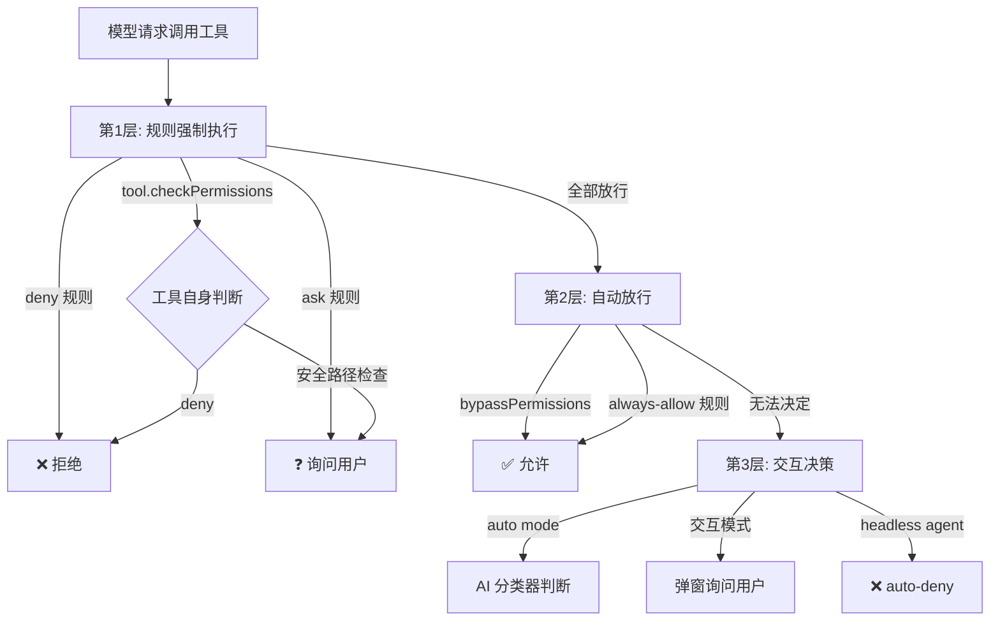
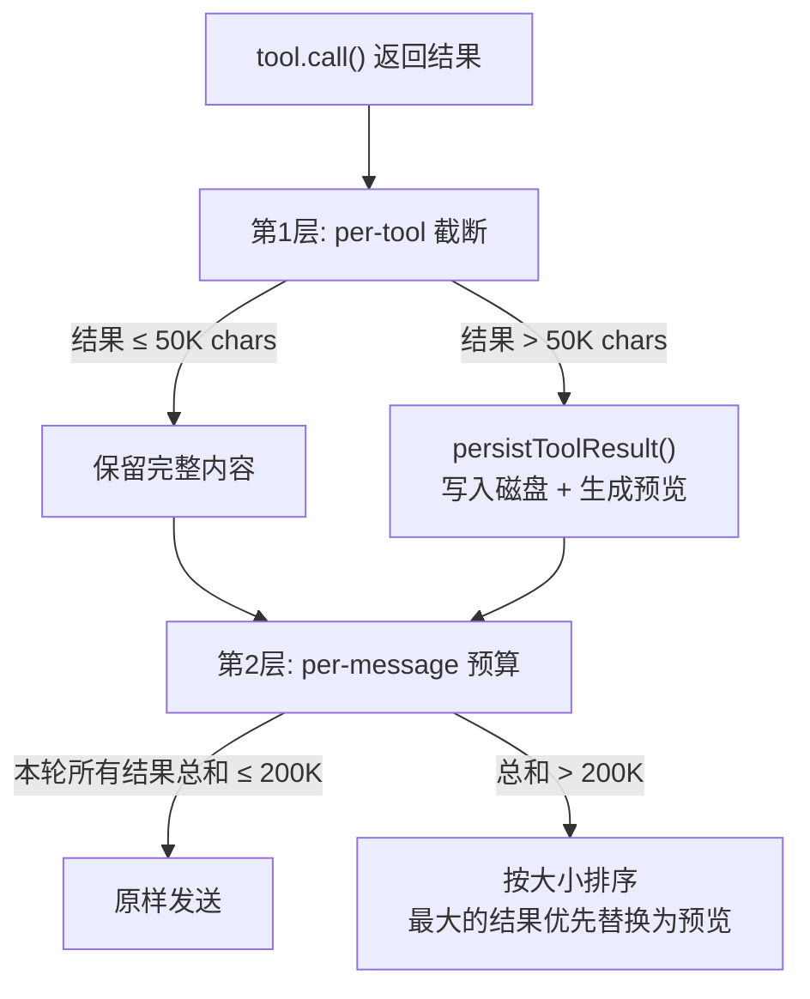

# 09. 工具执行管线

[08 篇](./08-工具注册与发现) 回答了"系统有哪些工具、模型怎么知道这些工具"——工具的注册与发现。这一章回答下一个问题：**模型选中工具之后，系统怎么安全、高效地执行它，并把结果喂回去？**

从模型的 `tool_use` 指令到最终的 `tool_result`，中间要经过六个阶段：**校验、调度、hook 拦截、权限判定、执行、截断**。每个阶段都有自己的设计约束和取舍。

## 1. 从 tool_use 到 tool_result，中间还缺什么？

模型说"我要读这个文件"，系统真的去读了——看起来就是一次函数调用。但函数调用不关心"这个文件我能读吗""返回 500K 会不会撑爆上下文""同时还有 5 个工具在跑，顺序有没有影响"。这些才是执行管线要解决的问题。

理解管线要补的"缺"，最直接的方式是看三种执行模型的差异：

| 执行模型 | 流程 | 问题 |
|----------|------|------|
| 普通函数调用 | `result = await fn(args)` | 无权限、无截断、无 hook。给模型一把"万能钥匙"——它能调用任何函数，结果多大都塞进上下文 |
| OpenAI Function Calling | `validate → call → return` | 有基础校验，但权限判断是二元的（允许/拒绝），没有分级决策、没有 hook 拦截点 |
| Claude Code 工具管线 | `validate → hook → permission → execute → hook → truncate → return` | 六个阶段各有独立职责，每个阶段的"否决"不影响其他阶段的正确性 |

Claude Code 的工具管线不是在函数调用上加了几个检查点——它是从"Agent 循环需要什么样的安全保障和资源管理"这个根本问题出发，重新定义了工具执行的完整生命周期。

三个核心问题：

- **怎么调度？** 模型一次可能返回多个 `tool_use`，哪些能并行、哪些必须串行？串行浪费等待时间，并行可能产生竞态。
- **安不安全？** 权限来源多样——管理员禁令、用户规则、AI 分类器、hook 脚本——它们之间的否决权怎么分配？
- **结果太大怎么办？** 单个工具可能输出 500K，并行 10 个工具可能输出 5M。直接截断让模型看不到关键信息，全量发送让 token 爆炸。

---

## 2. 核心逻辑

### 2.1 并行还是串行？—— 分区调度的取舍

模型一次可能返回 5 个 `tool_use` 块。最激进的方案是全部并行——省时间，但有的工具会修改全局状态（如 Agent 工具派生子任务、Task 工具更新任务列表），并行执行会导致竞态。最保守的方案是全部串行——安全，但用户要多等 3-5 倍时间。

**怎么折衷？让工具自己声明。**

`partitionToolCalls()` 遍历模型返回的工具调用列表，逐个询问工具的 `isConcurrencySafe()` 方法。核心规则只有一条：**连续的并发安全工具合并为一个 batch，遇到不安全的工具就另起一个 batch。**

```
模型返回: [Read(a), Read(b), Bash(c), Glob(d), Write(e)]
           │            │         │        │         │
           ▼            ▼         ▼        ▼         ▼
isConcurrencySafe:  ✓   ✓         ✗        ✓         ✗
           │            │         │        │         │
           └── Batch1 ──┘         │        │         │
                          Batch2 ─┘        │         │
                                   Batch3 ─┘         │
                                              Batch4 ─┘
```

每个 batch 要么是一个单独的非安全工具（串行执行），要么是多个连续的安全工具（并行执行）。Batch 之间严格串行——Batch1 全部完成后才开始 Batch2。

- **"连续"合并，不止按属性分类**：不是把所有安全工具放一个池子、所有不安全工具放另一个。`[Read, Bash, Read]` 会分成三个 batch：`[Read]` → `[Bash]` → `[Read]`。中间的 Bash 可能改变文件系统，后面的 Read 必须在 Bash 完成后才能读到正确内容。如果强行把两个 Read 合并，就破坏了因果顺序。
- **异常时按不安全对待**：`isConcurrencySafe()` 抛异常时返回 `false`——fail-closed。不知道能不能并行，就当不能。代价是性能（多等一轮），不是正确性。

**并行 batch 内的 context modifier 怎么处理？**

并行执行有一个微妙的问题：每个工具返回时可能带一个 `contextModifier`——一个修改 `ToolUseContext` 的函数（比如 Agent 工具更新任务列表）。如果并行工具 A 和 B 同时修改 context，谁先生效？

实际方案是：**并行执行期间不立即应用 modifier，而是排队到 batch 全部完成后统一应用。** 顺序按工具在原列表中的位置——保证确定性，不依赖执行完成的时序。

#### 流式执行：不等模型说完就开跑

传统方案是等模型完整响应后，收集所有 `tool_use` 块，再执行。`StreamingToolExecutor` 改变了这个时间模型：模型每输出一个 `tool_use` 块，就立即加入执行队列。

这带来的不只是"用户更快看到进度"——还有一个重要的故障隔离能力：**兄弟工具级联取消。**

Bash 命令间常有隐式依赖链——`mkdir a` 失败了，后续的 `cd a` 和 `touch a/file` 已经没有意义。`StreamingToolExecutor` 在 Bash 工具报错时，通过 `siblingAbortController` 立即取消其他并行工具。但 Read、WebFetch 等独立工具不受影响——只取消 Bash 的兄弟。

这个设计背后是一个务实的假设：**独立工具（读文件、搜索）的失败互不影响，但 shell 命令的失败意味着整个命令组的语义已经失效。**

---

### 2.2 谁在替用户把关？—— 权限管线的层级设计

权限判断不是"一个 if-else"能解决的问题。不同来源的权限策略有不同优先级——管理员的全局 deny 规则不应该被用户的本地 allow 覆盖，hook 的 allow 不应该绕过安全规则。

**核心约束：权限决策有层级，上级否决不可被下级推翻。**

`hasPermissionsToUseTool` 的完整管线可以归并为三层，每层有独立的"否决权"设计：



**第 1 层：规则强制执行**。这一层的决策不可被任何后续层级推翻，包括 deny 规则（管理员禁令）、ask 规则（用户要求确认）、工具自身的 `checkPermissions`（如 Bash 的子命令规则）、安全路径检查（`.git/`、`.claude/` 等敏感路径）。其中，deny 和 safetyCheck 的优先级最高——即使是 `bypassPermissions` 模式也不能绕过安全路径检查。

**第 2 层：自动放行**。只有第 1 层全部放行后才生效。包括 `bypassPermissions` 模式（超级管理员态，全量放行）和用户明确的 always-allow 规则（如 `Bash(git:*)`）。

**第 3 层：交互决策**。前两层都无法决定时，进入这一层。根据运行模式选择：auto mode 用 AI 分类器判断（调用 Haiku 模型评估风险），交互模式弹窗询问用户，headless agent（后台运行的子 Agent）直接 auto-deny——没人在看弹窗。

---

### 2.3 结果太大怎么办？—— 双层预算体系

#### 2.3.1 为什么需要双层？

单个 Bash 命令的输出可能几百K。直接截断到 50K——模型看不到截断的内容，可能错过关键信息。更好的方案是**持久化到磁盘 + 预览**——模型看到摘要，需要时可以 Read 完整内容。

但单层限制只看单个工具。并行 10 个工具时：每个控制在 40K，总和 400K——仍然可能撑爆上下文。

**解决方案：双层预算。** 第 1 层按单个工具限制（per-tool），第 2 层按同一轮消息限制（per-message aggregate）。



#### 2.3.2 第 1 层：per-tool 截断

每个工具声明自己的 `maxResultSizeChars`，但被系统上限 `DEFAULT_MAX_RESULT_SIZE_CHARS`（50K chars）clamp。一个例外：Read 工具声明 `Infinity`——读文件的结果模型应该直接用，不需要绕路读自己。

当结果超过阈值时，`persistToolResult()` 将完整内容写入 `projectDir/sessionId/tool-results/{toolUseId}.txt`，然后 `buildLargeToolResultMessage()` 生成一段带 `<persisted-output>` 标签的摘要：文件路径 + 原大小 + 首 2000 字节预览。模型通过 Read 工具可以直接拿到完整内容。

#### 2.3.3 第 2 层：per-message 预算

`enforceToolResultBudget()` 将同一轮的所有 tool_result 按 API 级别分组（`normalizeMessagesForAPI` 会把连续的 user message 合并为一条）。如果某组的总大小超过 `MAX_TOOL_RESULTS_PER_MESSAGE_CHARS`（200K chars），按大小排序，将最大的结果替换为持久化预览。

**但这里有一个比"怎么截"更重要的问题：截断决策必须全程稳定。**

假设第 3 轮时结果 A 超限被替换为预览，第 5 轮时结果 A（现在在历史消息中）因为上下文压缩而不再超标——如果这时"恢复"完整内容，prompt cache 前缀就会变化，缓存命中率下降。

所以 `enforceToolResultBudget` 维护两个集合：

- `seenIds`：所有被"考虑过"的工具结果 ID。一旦一个结果进入这个集合，它的命运就冻结了。
- `replacements`：被替换的结果及其替换内容。后续所有轮次都用相同的预览字符串替换（纯 Map 查找，零 I/O，字节级一致）。

---

## 3. 源码解读

### 3.1 源码地图

| 文件 | 职责 |
|------|------|
| `src/services/tools/toolExecution.ts` | `runToolUse` 单工具执行主逻辑：校验 → 权限 → 执行 → 结果处理 |
| `src/services/tools/toolOrchestration.ts` | `runTools` 批处理调度入口 + `partitionToolCalls` 分区逻辑 |
| `src/utils/toolResultStorage.ts` | 双层截断 + 持久化 + `enforceToolResultBudget` 预算管理 |
| `src/utils/permissions/permissions.ts` | `hasPermissionsToUseTool` 三层权限管线 |
| `src/services/tools/toolHooks.ts` | Pre/PostToolUse hook + `resolveHookPermissionDecision` 权限决策解析 |

完整执行链路分为两层：

**调度分发**——`query.ts` 主循环中工具执行的集成点，根据是否流式分叉：

```
query.ts: deps.callModel({ tools })
  │
  ├─ (streaming) StreamingToolExecutor
  │     └─ 边接收 tool_use 边执行，含兄弟工具级联取消
  │
  └─ (non-streaming) runTools()
        └─ 下图展开
```

**非流式执行**——非流式路径下 `runTools` 的完整调用链：

```
runTools()
  ├─ partitionToolCalls()           ← 按并发安全性拆分为 batch
  ├─ runToolsConcurrently()
  └─ runToolsSerially()
     └─ for each toolUse:
          runToolUse()
          ├─ inputSchema.safeParse()
          ├─ tool.validateInput()
          ├─ runPreToolUseHooks()
          ├─ resolveHookPermissionDecision()  ← hook vs 规则优先级判定
          │  ├─ checkRuleBasedPermissions()
          │  └─ hasPermissionsToUseTool()    ← 三层权限管线
          ├─ tool.call()
          ├─ maybePersistLargeToolResult()    ← per-tool 截断 + 持久化
          ├─ runPostToolUseHooks()
          └─ enforceToolResultBudget()        ← per-message 预算管理
```

### 3.2 `partitionToolCalls`：一个 reduce 的调度哲学

`partitionToolCalls` 的核心逻辑只有一条：**连续的并发安全工具合并为一个 batch，遇到不安全的就另起一个 batch。** 一次 `reduce` 遍历完成全部决策。

[`toolOrchestration.ts:91-116`](https://github.com/binarylei/claudecode/blob/main/src/services/tools/toolOrchestration.ts#L91-L116)

```typescript
function partitionToolCalls(
  toolUseMessages: ToolUseBlock[],
  toolUseContext: ToolUseContext,
): Batch[] {
  return toolUseMessages.reduce((acc: Batch[], toolUse) => {
    const tool = findToolByName(toolUseContext.options.tools, toolUse.name)
    const parsedInput = tool?.inputSchema.safeParse(toolUse.input)
    const isConcurrencySafe = parsedInput?.success
      ? (() => {
          try {
            return Boolean(tool?.isConcurrencySafe(parsedInput.data))
          } catch {
            return false  // 解析失败 → 按不安全对待，fail-closed
          }
        })()
      : false
    if (isConcurrencySafe && acc[acc.length - 1]?.isConcurrencySafe) {
      acc[acc.length - 1]!.blocks.push(toolUse)  // 合并到上一个 batch
    } else {
      acc.push({ isConcurrencySafe, blocks: [toolUse] })  // 新开 batch
    }
    return acc
  }, [])
}
```

设计要点：

- **"连续"而非"分类"**：不是把所有安全工具放一个池子。`[Read, Bash, Read]` 分成三个 batch——中间的 Bash 可能改变文件系统，后面的 Read 必须在 Bash 之后执行。这是对模型指定因果顺序的尊重。
- **异常时按不安全对待**：`isConcurrencySafe()` 抛异常时返回 `false`——不知道能不能并行，就当不能。代价是性能（多等一轮），不是正确性。

### 3.3 `resolveHookPermissionDecision`：为什么 hook allow 不能一锤定音

这个函数是权限管线中"规则与 hook 交互"的唯一入口。它的核心职责可以用一个 if-else 概括：hook allow → 再查一遍 deny/ask 规则 → 规则说不行就覆盖 hook；hook deny → 直接结束，不用再问别人。

[`toolHooks.ts:332-397`](https://github.com/binarylei/claudecode/blob/main/src/services/tools/toolHooks.ts#L332-L397)

```typescript
export async function resolveHookPermissionDecision(
  hookPermissionResult, tool, input, toolUseContext, canUseTool,
  assistantMessage, toolUseID,
) {
  if (hookPermissionResult?.behavior === 'allow') {
    const hookInput = hookPermissionResult.updatedInput ?? input
    // 交互类工具即使 hook allow，仍需要 canUseTool
    const requiresInteraction = tool.requiresUserInteraction?.()
    if ((requiresInteraction && !interactionSatisfied) || requireCanUseTool) {
      return { decision: await canUseTool(tool, hookInput, ...), input: hookInput }
    }
    // Hook allow 绕过交互弹窗，但 deny/ask 规则仍然生效
    const ruleCheck = await checkRuleBasedPermissions(tool, hookInput, toolUseContext)
    if (ruleCheck === null) {
      return { decision: hookPermissionResult, input: hookInput }
    }
    if (ruleCheck.behavior === 'deny') {
      return { decision: ruleCheck, input: hookInput }  // deny 规则覆盖 hook
    }
    // ask 规则 → 需要弹窗
    return { decision: await canUseTool(tool, hookInput, ...), input: hookInput }
  }
  if (hookPermissionResult?.behavior === 'deny') {
    return { decision: hookPermissionResult, input }  // deny 是终点
  }
  // 无 hook 决策或 ask → 正常权限流程
  return { decision: await canUseTool(tool, askInput, ...), input: askInput }
}
```

设计要点：

- **Hook allow 绕过的是交互弹窗，不绕过 deny/ask 规则**：三层优先级从"最不可绕过"到"最可灵活处理"：**规则 > hook > 用户交互**。hook 可以替用户做"我觉得可以"的决定，但不能替管理员做"这个工具谁都不许用"的决定。
- **Hook deny 不需要再查规则**：deny 是终点——hook 说不行，那就不行。只有 allow 需要二次确认"规则有没有说不行"。
- **`checkRuleBasedPermissions` 是"规则子集检查"**：它只跑管线的第 1 层（deny/ask/safetyCheck），不跑 bypass 和 always-allow。因为 hook 已经在第 2 层之前拦截了——已经进入"需要决策"的阶段，bypass 模式不应该再自动放行。

### 3.4 `hasPermissionsToUseToolInner`：权限判定

权限管线的 10 个步骤（1a→1b→1c→1d→1e→1f→1g→2a→2b→3）不是教科书式的整齐分类，而是需求迭代的自然沉积。每加一个新需求（沙箱自动放行、安全路径检查），就在现有步骤之间"挤"一个新编号。

[`permissions.ts:1158-1260`](https://github.com/binarylei/claudecode/blob/main/src/utils/permissions/permissions.ts#L1158-L1260)

```typescript
async function hasPermissionsToUseToolInner(
  tool: Tool, input: { [key: string]: unknown }, context: ToolUseContext,
): Promise<PermissionDecision> {
  // 1a. Entire tool denied by rule
  const denyRule = getDenyRuleForTool(...)
  if (denyRule) return { behavior: 'deny', ... }

  // 1b. Entire tool has an ask rule
  const askRule = getAskRuleForTool(...)
  if (askRule && !canSandboxAutoAllow) return { behavior: 'ask', ... }

  // 1c. Tool-specific permission check (e.g. bash subcommand rules)
  const toolPermissionResult = await tool.checkPermissions(...)
  // 1d. Tool implementation denied
  if (toolPermissionResult?.behavior === 'deny') return toolPermissionResult
  // 1e. Requires user interaction even in bypass mode
  if (tool.requiresUserInteraction?.() && ...) return toolPermissionResult
  // 1f. Content-specific ask rules override bypassPermissions
  // 1g. Safety checks bypass-immune

  // 2a. bypassPermissions / plan with bypass → auto-allow
  if (shouldBypassPermissions) return { behavior: 'allow', ... }
  // 2b. Entire tool in always-allow rules
  const alwaysAllowedRule = toolAlwaysAllowedRule(...)
  if (alwaysAllowedRule) return { behavior: 'allow', ... }

  // 3. Convert passthrough → ask, enter interactive decision
  return { ...toolPermissionResult, behavior: 'ask' }
}
```

设计要点：

- **1e 和 1f 之间插了 1g 是为什么？** 按编号顺序，1g（safetyCheck）应该在 1f 之后。但实际代码中 1g 紧跟 1d——因为安全路径检查是从 `tool.checkPermissions` 返回的，不是独立规则。编号反映的是"功能被加入的时机"，不是"代码的执行顺序"。
- **`behavior: 'passthrough'` 是"沉默的中间立场"**：工具返回 passthrough 意味着"我检查了，没问题，但不替用户做决定"。管线把它转成 `ask` 继续往下走——这和直接返回 `allow` 有本质区别。三态（allow/deny/passthrough）比二态多了一种"沉默"，让工具避免在"允许"和"拒绝"之间被迫选边。

---

### 3.5 `maybePersistLargeToolResult`：单个结果超限

这个函数面对的不是"截断 vs 不截断"的二选一，而是四选一：空结果、图片、不超限、超限。

[`toolResultStorage.ts:272-334`](https://github.com/binarylei/claudecode/blob/main/src/utils/toolResultStorage.ts#L272-L334)

```typescript
async function maybePersistLargeToolResult(
  toolResultBlock, toolName, persistenceThreshold?,
): Promise<ToolResultBlockParam> {
  // 空结果 → 注入占位符
  if (isToolResultContentEmpty(content)) {
    return { ...toolResultBlock, content: `(${toolName} completed with no output)` }
  }
  // 图片块 → 不持久化
  if (hasImageBlock(content)) return toolResultBlock

  const size = contentSize(content)
  const threshold = persistenceThreshold ?? MAX_TOOL_RESULT_BYTES
  if (size <= threshold) return toolResultBlock

  // 超限 → 持久化 + 预览
  const result = await persistToolResult(content, toolResultBlock.tool_use_id)
  if (isPersistError(result)) return toolResultBlock  // 持久化失败 → 原样返回
  return { ...toolResultBlock, content: buildLargeToolResultMessage(result) }
}
```

设计要点：

- **空结果注入是最便宜的防御**：`(ToolName completed with no output)` 不携带任何语义信息，唯一目的是防止空 `tool_result` 被模型误识别为停止序列。这个 bug 极难复现（取决于具体模型和上下文），但修复只花了一行代码——典型的"不确定会不会触发，但修了肯定更安全"。
- **持久化失败时原样返回**：如果磁盘满或权限不足，不阻塞工具执行——原样把大结果塞进上下文。用户体验会差（token 消耗暴增），但至少不丢数据。

### 3.6 `enforceToolResultBudget`：一轮所有结果超限--贪心选择

这个函数是双层预算中"第 2 层"的实现，也是全文最复杂的函数之一。核心逻辑分三步：先把候选结果按历史决策分区，再贪心选出本轮需要替换的结果，最后对消息数组做原地替换。

[`toolResultStorage.ts:769-856`](https://github.com/binarylei/claudecode/blob/main/src/utils/toolResultStorage.ts#L769-L856)

```typescript
export async function enforceToolResultBudget(
  messages: Message[], state: ContentReplacementState,
  skipToolNames: ReadonlySet<string> = new Set(),
) {
  const candidatesByMessage = collectCandidatesByMessage(messages)

  for (const candidates of candidatesByMessage) {
    // 第一步：按历史决策三分区
    const { mustReapply, frozen, fresh } = partitionByPriorDecision(candidates, state)

    // 已替换过的 → 零 I/O 纯 Map 查找重新应用
    mustReapply.forEach(c => replacementMap.set(c.toolUseId, c.replacement))

    // 本轮新结果 → 检查预算
    if (fresh.length > 0) {
      // Read(Infinity) 等工具跳过，标记 seen 但不参与预算
      const skipped = fresh.filter(c => shouldSkip(c.toolUseId))
      const eligible = fresh.filter(c => !shouldSkip(c.toolUseId))

      // 第二步：贪心选择（从最大的开始替换直到降到预算以下）
      const selected = (frozenSize + freshSize > limit)
        ? selectFreshToReplace(eligible, frozenSize, limit) : []

      // 第三步：不替换的立即冻结，选中的 → 持久化 + 记录替换
      const selectedIds = new Set(selected.map(c => c.toolUseId))
      candidates.filter(c => !selectedIds.has(c.toolUseId))
        .forEach(c => state.seenIds.add(c.toolUseId))  // 冻结命运
    }
  }
  // 并发持久化所有选中的结果
  const freshReplacements = await Promise.all(
    toPersist.map(async c => [c, await buildReplacement(c)] as const),
  )
  // 原子记录：seenIds.add + replacements.set 同时完成
  for (const [candidate, replacement] of freshReplacements) {
    state.seenIds.add(candidate.toolUseId)
    if (replacement) state.replacements.set(candidate.toolUseId, replacement.content)
  }
  return { messages: replaceToolResultContents(messages, replacementMap), newlyReplaced }
}
```

设计要点：

- **三分区是代码复杂度的根源**：`partitionByPriorDecision` 把候选结果分为 `mustReapply`（已替换→复用缓存）、`frozen`（已见未替换→不可改）、`fresh`（新结果→可决策）。三类对应三种不同的处理路径，这是全文最难测试的函数。
- **`seenIds` 和 `replacements` 必须原子更新**：如果 `seenIds` 先标记但 `replacements` 写入失败，下一轮会把这个结果当 frozen 发完整内容——而主线程发的是预览，前缀不同 → 缓存 miss。

## 4. 总结

1. **分区调度的核心不是"并行"而是"连续"**：`partitionToolCalls` 用"遇到不安全就断"的规则，天然尊重了模型指定的 tool_use 顺序中的因果依赖——连续的安全工具并行，不安全工具打断连续性、创建新的串行屏障。

2. **权限管线是三层否决权分配**：第 1 层规则强制执行（不可绕过），第 2 层自动放行（规则无意见时），第 3 层交互决策（前两层无法决定时）。三层之间只能"向上否决"——下层不能推翻上层的拒绝，上层的允许可以被下层收紧。

3. **Hook 是用户的代理，规则是用户的意志**：Hook allow 绕过交互弹窗（代理替用户点了"允许"），但不绕过 deny/ask 规则（代理不能推翻委托人的明确指令）。Hook deny 是终点——代理说"不行"，不需要再问别人。

4. **结果截断不是"丢掉"，是"换一种方式让模型能读到"**：持久化到磁盘 + 预览的方案，让模型在需要时通过 Read 工具获取完整内容。这是"节省上下文空间"和"信息不丢失"之间的折衷。

5. **双层预算的代价是状态管理**：per-tool 截断只影响单次执行，但 per-message 预算需要跨轮次稳定——替换状态一旦决定就冻结，即便是"现在看起来不太合理的决定"也不能反悔。这个约束是为了保护 prompt cache 前缀，但引入了"早期决策可能不是最优"的张力。

6. **下一章**将进入 Agent 工具的派生子 Agent 机制——Fork 和 Worktree 的隔离模型、子 Agent 如何复用主线程的 prompt cache。

---

## 参考文献

- Claude Code 源码：
  - [`src/services/tools/toolExecution.ts`](https://github.com/binarylei/claudecode/blob/main/src/services/tools/toolExecution.ts) — `runToolUse` 单工具执行主逻辑
  - [`src/services/tools/toolOrchestration.ts`](https://github.com/binarylei/claudecode/blob/main/src/services/tools/toolOrchestration.ts) — `runTools` 批处理调度 + `partitionToolCalls` 分区逻辑
  - [`src/utils/toolResultStorage.ts`](https://github.com/binarylei/claudecode/blob/main/src/utils/toolResultStorage.ts) — 双层截断 + `enforceToolResultBudget` 预算管理
  - [`src/utils/permissions/permissions.ts`](https://github.com/binarylei/claudecode/blob/main/src/utils/permissions/permissions.ts) — `hasPermissionsToUseTool` 三层权限管线
  - [`src/services/tools/toolHooks.ts`](https://github.com/binarylei/claudecode/blob/main/src/services/tools/toolHooks.ts) — Pre/PostToolUse hook + `resolveHookPermissionDecision`
  - [`src/query.ts`](https://github.com/binarylei/claudecode/blob/main/src/query.ts) — 主循环中工具执行的集成点
