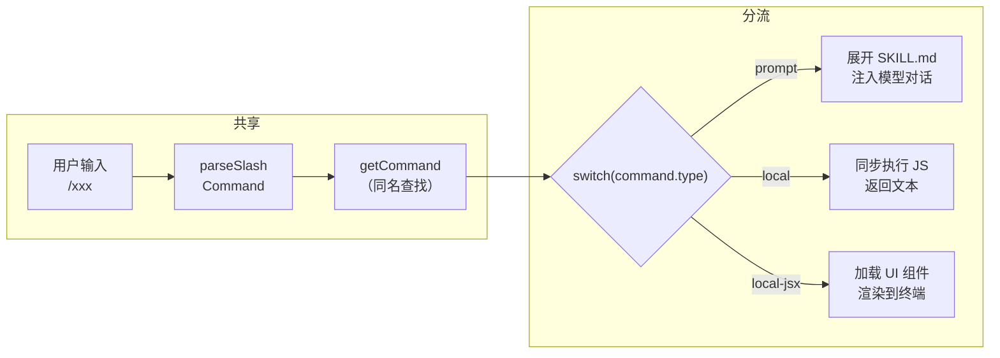

# 15. 命令系统的统一框架：当 `/clear` 和 `/review-pr` 共享同一个路由

你有没有想过：输入 `/clear` 清理屏幕和输入 `/review-pr` 启动代码审查，背后一个在宿主进程中执行 JS，一个展开 Markdown 注入模型对话。但它们共享同一个斜杠入口 `/`，共享同一个路由表。这 80+ 个指令是如何被统一管理的？

## 1. Command 背景介绍

从用户侧看，「命令」是所有以 `/` 开头可调用的指令；从系统侧看，`Command` 是一个联合类型，覆盖三种执行模型：

| 类型标签 | 输出目的地 | 典型示例 | 本质 |
|---|---|---|---|
| `'prompt'` | 模型（ContentBlockParam[]） | `/review-pr`、`/commit` | 展开 SKILL.md 注入对话 |
| `'local'` | 用户终端（文本） | `/clear`、`/session` | 宿主进程执行 JS |
| `'local-jsx'` | 终端 UI（React 组件） | `/config`、`/help` | 渲染交互面板 |

这些命令来源多元——有编译时内置的、有文件系统扫描的、有插件分发的——但用户入口只有一个 `/`，路由表只有一个 `Command[]`。

**三种执行模型差异巨大，** Claude Code 的选择 **用一个联合类型兜住所有差异，在最后一个点做一次 `switch`，在此之前所有逻辑共享。**



## 2. 核心逻辑与源码解读

### 2.1 `Command` 联合类型

这三种类型差异巨大，联合类型 `CommandBase` 只描述共享身份，执行合约交给联合成员各自定义。`PromptCommand` 返回 `ContentBlockParam[]` 供模型消费，`LocalCommand` 返回 `LocalCommandResult` 供终端渲染，`LocalJSXCommand` 什么都不返回（通过 `onDone` 回调通信）。

[`src/types/command.ts:175-206`](https://github.com/binarylei/claudecode/blob/main/src/types/command.ts#L175-L206)：

```typescript
type Command = CommandBase & (PromptCommand | LocalCommand | LocalJSXCommand)

type CommandBase = {
  name: string                    // 命令名称
  description: string             // 命令描述
  isEnabled?: () => boolean       // 条件启用
  isHidden?: boolean              // 对用户隐藏
  userInvocable?: boolean         // 用户可调用
  disableModelInvocation?: boolean // 对模型隐藏
  // ...
}
```

每个联合成员定义自己的执行合约：

```typescript
type PromptCommand = {
  type: 'prompt'
  getPromptForCommand(args, context): Promise<ContentBlockParam[]>  // 生成提示
  context?: 'inline' | 'fork'    // 执行模式
  allowedTools?: string[]        // 允许的工具
  // ...
}

type LocalCommand = {
  type: 'local'
  supportsNonInteractive: boolean  // 支持非交互
  load(): Promise<{ call(args, context): LocalCommandResult }>  // 加载模块
}

type LocalJSXCommand = {
  type: 'local-jsx'
  load(): Promise<{ call(onDone, context, args): ReactNode }>  // 加载 UI
}
```

**设计要点。**

- **共享形状与执行模型分离**：`CommandBase` 描述「是什么」（身份、可见性、别名、条件启用），联合成员描述「怎么执行」。调度方只看 `CommandBase` 就能做可见性决策，不需要知道执行细节——这对过滤函数（如 `getSkillToolCommands`）至关重要，它们遍历 `Command[]` 时只关心 `type === 'prompt'`，不需要 `import` 每个命令模块。

- **联合类型 vs 继承体系**：继承的基类 `abstract run()` 要求所有子类实现同一个签名，但 PromptCommand 返回 `ContentBlockParam[]`、LocalCommand 返回 `LocalCommandResult`、LocalJSXCommand 什么都不返回（通过 `onDone` 回调）。强行统一的结果是 `any` 或 `unknown` 加运行时类型检查——联合类型把这些差异写进类型系统，让编译器帮忙验证 switch 的穷尽性。

### 2.2 统一注册

`loadAllCommands` 将七个来源的命令合并到一个 `Command[]` 数组中。

[`src/commands.ts:449-468`](https://github.com/binarylei/claudecode/blob/main/src/commands.ts#L449-L468)：

```typescript
const loadAllCommands = memoize(async (cwd): Promise<Command[]> => {
  const [skillDirCommands, pluginCommands, workflowCommands] = await Promise.all([
    getSkills(cwd),       // 技能来源：磁盘 + 内置 + 插件
    getPluginCommands(),
    getWorkflowCommands?.(cwd),
  ])
  return [
    ...bundledSkills,       // 内置技能
    ...builtinPluginSkills, // 内置插件技能
    ...skillDirCommands,    // 磁盘技能文件
    ...workflowCommands,    // 编排脚本命令
    ...pluginCommands,      // 插件普通命令
    ...pluginSkills,        // 插件注册技能
    ...COMMANDS(),          // 内置硬编码命令
  ]
})
```

合并后不直接使用，而是提供两个出口，各自按需裁剪：

- **`getCommands()`**：全量命令。通过 `meetsAvailabilityRequirement` + `isCommandEnabled` 过滤后暴露给用户 `/cmd` 路由。
- **`getSkillToolCommands()`** ：对 Skill Tool 可见。进一步过滤，仅保留 `type: 'prompt'` 且 `!disableModelInvocation` 且来源不是 `'builtin'` 的命令，暴露给模型的 Skill Tool。

### 2.3 执行分流：`switch(type)`

最后看下执行阶段

[`processSlashCommand.tsx:550-760`](https://github.com/binarylei/claudecode/blob/main/src/utils/processUserInput/processSlashCommand.tsx#L550-L760)：

```typescript
switch (command.type) {
  case 'local-jsx':
    // 加载 UI 渲染到终端
    // 通过 onDone 写回对话
    void command.load().then(mod =>
      mod.call(onDone, { ...context, canUseTool }, args)
    )
    return {shouldQuery: false, ...}

  case 'local':
    // 加载模块同步执行
    const mod = await command.load()
    const result = await mod.call(args, context)
    // 结果：text | compact | skip
    return {shouldQuery: false, ...}
    
  case 'prompt':
    // 判断 context 选执行模式
    if (command.context === 'fork')
      return executeForkedSlashCommand(command, ...)
    // Inline：展开 SKILL.md
    return getMessagesForPromptSlashCommand(command, ...)
}
```

双入口在这里汇合。用户通过 `/cmd` 输入走的是这个 `switch`，模型通过 Skill Tool 调用技能时，`SkillTool.ts` 的 inline 分支也调用 `processPromptSlashCommand()`，复用 `case 'prompt'` 的同一套展开逻辑。

## 参考文献

- Claude Code 源码：
  - [`src/types/command.ts`](https://github.com/binarylei/claudecode/blob/main/src/types/command.ts) — `Command` 联合类型
  - [`src/commands.ts`](https://github.com/binarylei/claudecode/blob/main/src/commands.ts) — 注册
  - [`src/utils/processUserInput/processSlashCommand.tsx`](https://github.com/binarylei/claudecode/blob/main/src/utils/processUserInput/processSlashCommand.tsx) — 路由分发
  - [`src/tools/SkillTool/SkillTool.ts`](https://github.com/binarylei/claudecode/blob/main/src/tools/SkillTool/SkillTool.ts) — 模型入口 Skill Tool
