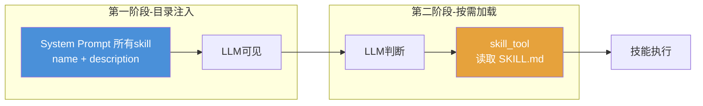
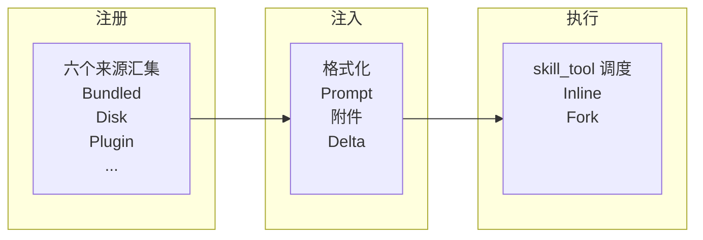

# 18. SKILLS 渐进式披露——技能的注册、执行与注入

SKILL 是 Claude Code 的扩展机制，允许用户通过 `.claude/skills/` 自定义能力。

## 1. SKILL 背景介绍

在 SKILL 系统出现之前，Claude Code 的能力完全由硬编码的工具集和 System Prompt 决定。所有的 slash command、tool 定义都写在源码中，每次新增能力都需要修改源码、提 PR、发版。用户没有任何扩展入口，也无法在项目中定义属于自己的工作流指令。


SKILL 系统正是为解决这个封闭性问题而生——它把注册新指令的权力从开发者下放给用户。用户可以在 `.claude/skills/<skill-name>` 目录中创建 SKILL.md 文件，用 Markdown 定义自己的技能描述和执行逻辑，不需要改一行 CLI 源码。社区可以共享技能包，插件可以分发技能集合，企业可以用独立的目录管理内部工作流。这让 Claude Code 从一个封闭的 CLI 工具走向开放式平台。

#### 三种方案对比

如何把这些注册的技能呈现给模型？业界经历了一条逐渐收敛的发展路线：


**全量注入** 把所有技能的描述一次性塞进 System Prompt——模型视野完整，但技能数量膨胀时上下文预算被急剧压缩。

**RAG 按需检索** 走向另一个极端——System Prompt 中只留检索入口，模型不知道有哪些可用，只能在黑暗中猜测。主要用于**知识库检索**场景（如企业文档问答）

**渐进式披露** 走中间路线：先给目录保有可见性，再按需给详情控制预算。这套思路并非 Claude Code 独创，业界主流产品多采用此方案。Claude Code 的差异体现在三个关键设计上——目录展示做预算控制、内容发送增量而非全量、注册和披露两阶段分离。

#### 渐进式披露

**两个阶段：先注册目录，再按需加载详情。**

**第一阶段：目录注入。** 所有技能在 System Prompt 中以 `name: description` 的形式发布，description 说明技能的作用和使用场景。模型启动时就"知道"有哪些技能可用，但只看到摘要——名称和一句话描述。这一步解决**可见性**问题：模型知道工具箱里有什么。

**第二阶段：详情按需加载。** 当模型根据目录判断某个技能可能适用时，调用专门的 `skill_tool`工具读取该技能完整的 SKILL.md。工具返回完整的技能定义，包括详细的执行逻辑、参数说明、使用示例。这一步解决**详细度**问题：只有被选中的技能才占用上下文预算。



**skill_tool 的双重角色：**

- **读取器**：接收技能名称，返回对应 SKILL.md 的完整内容
- **执行闸门**：验证技能是否存在、上下文是否允许，然后调度执行

渐进式披露核心思想，不给模型喂 LLM 不需要的东西。目录是轻量级的，详情是惰性加载的。相比全量注入，它节省了大部分技能的上下文预算；相比 RAG 检索，它保留了可见性，模型不需要在黑暗中猜测。

---

## 2. Claude Code 的 SKILL 方案

### 2.1 整体架构概览

Claude Code 的 SKILL 系统可以抽象为三条管线：**注册 → 注入 → 执行**。



- **注册**：从六个来源（Bundled、Disk、Plugin、MCP、Dynamic、Conditional）汇集所有技能，解析元数据、去重合并，输出结构化的技能注册表。回答的是：*系统有哪些技能可用？*

- **注入**：把格式化文本通过三层管线递送到模型上下文：System Prompt 分段承载稳定部分、附件通道承载变化部分、Delta 通道只发送差异部分。回答的是：*怎么注入上下文？*

- **执行**：由 Skill Tool 统一调度——模型选中技能后，Skill Tool 先验证再决策（是否存在、权限是否满足），决定 inline 注入还是 fork 隔离。回答的是：*选中的技能怎么跑？*

Skill Tool 横跨展示和执行两个阶段：作为**目录展示**，它通过 `formatCommandsWithinBudget()` 动态生成可用列表；作为**调用闸门**，它验证并调度执行。

### 2.2 与通用方案的差异与优化

#### 预算控制：从"完整展示"到"预算内最优展示"

模型需要知道有哪些技能可用。最简单的方式是把全部技能的名称和描述塞进 System Prompt 或附件里——这也是主流方案的常见做法。但当技能数量增长到几十上百个时，这份清单会占据大量上下文预算。

Claude Code 的 `formatCommandsWithinBudget()` 函数直接回答了"给模型展示多少技能信息"这个问题。它的预算计算逻辑是：`contextWindow × 4 (chars/token) × 1%`。以 200K 窗口为例，约 8,000 字符。在这个预算内，分配遵循三重优先级：

1. **Bundled（内置）技能始终完整展示**——它们是会话的基础能力，不受预算波动影响
2. **非 Bundled 技能优先尝试完整展示**——如果预算充裕，描述和用法一并呈现
3. **预算不足时逐级降级**：先裁减描述到均分长度（不超过 250 字符），仍超预算则降级为仅保留技能名称

这套机制的实质是：**用预算上限替代"完整展示"作为默认行为。** 主流方案倾向于让模型"知道所有选项"，Claude 的方案倾向于让模型"在预算内看到最关键的选项"。背后是对上下文窗口的不同态度——前者把它当作信息载体，后者把它当作稀缺资源。

#### 增量注入：从"全量重发"到"只发变化"

即使做了预算控制，如果每次对话都重新发送完整的技能列表，变化的部分（比如用户新增了一个技能）会导致整个列表的缓存失效。增量策略的出发点很简单：**只发送变化的部分，不发送不变的部分。**

这个思路在实现层面演化出了三层注入管线，每层都在进一步缩小单次变化的范围：

**第一层：System Prompt 分层组装。** `getSystemPrompt()` 将输出分为静态前缀和动态后缀，中间用边界标记分隔。动态段内的技能用法提示通过 section 注册表管理——`systemPromptSection()` 负责可缓存段，一次计算后缓存直到 `/clear` 才失效。技能目录格式化结果在注册表不变时直接返回缓存，无需重算。

但技能列表会随会话推进增长（如新插件注册技能），每次变化都会打穿整个动态段的缓存。于是需要第二层。

**第二层：附件通道。** 变化频繁的内容从 System Prompt 中移出，通过 `<system-reminder>` 附件独立注入。附件不是 System Prompt 的一部分，不参与缓存计算——这意味着附件内容的增减完全不影响 System Prompt 的缓存前缀。对于技能系统，三个核心附件类型分别是：会话启动时的 `skill_listing`、文件操作发现新技能时的 `dynamic_skill`、以及压缩后的 `invoked_skills`。

附件通道也不是每轮全量重发。系统维护了一个"已发送技能集合"，新生成的 `skill_listing` 先和已发送列表做差集——只发送新增的。如果没有任何变化，附件就不会被生成。

**第三层：Delta 增量。** 对于变化特别频繁的信息，连"增量发送"都不够——因为每次变化仍可能导致后缀缓存失效。Delta 通道只发送 diff：第一轮发全部，后续只发新增或变化的技能；MCP 服务器连接或断开时只发指令差异；Agent 类型变化时只发差异。

三层的演进关系：

```
变化量 ↓                   缓存命中率 ↑
─────────────────────────────────────────→
System Prompt 静态+动态段
         → 附件通道承载变化内容
                 → Delta 最小化单次变化
```

每前进一步，单次注入的变化量就缩小一个量级。并不是所有内容都需要走到第三层——大部分内容停在第一层或第二层就足够了。只有变化特别频繁的内容才值得付出额外的管理成本进入 Delta 通道。

> **设计意图：** 从"每轮全量重发"到"只发增量"，本质是把技能列表当作一个**有版本的状态**而非**每轮重组的字符串**来管理。三层管线不是预先设计出来的，而是在"缓存又失效了"这个反馈循环中逐步演化出来的——每一层都在回答同一个问题：怎么让这次的变化比上次更小？

#### 注册披露分离：从"注册即披露"到"两阶段拆分"

主流方案中，一个技能被注册的同时也就进入了模型的可见范围，即"注册即披露"。Claude Code 将这两个阶段拆开：**注册是注册，披露是披露，两者之间隔着条件和时机。**

**注册阶段——六个来源汇集。** 技能可以来自编译时内置（Bundled）、文件系统扫描（Disk）、插件分发（Plugin）、远程 MCP 服务器（MCP）、文件操作时的目录遍历（Dynamic）、以及声明了路径条件的条件技能（Conditional）。多源并行必然带来重复，去重基准是 `realpath` 解析后的真实路径。

**披露阶段——条件技能是最彻底的实践。** 条件技能注册了但不在激活状态，不占用注入管线的任何预算。用户 clone 了一个包含 Python 技能的项目，但直到他编辑第一个 `.py` 文件，系统才知道需要激活这个技能。在那之前，这个技能不存在于模型的视野中。

> **设计意图：** 注册和披露分离意味着系统的"知道"和"展示"之间有显式的控制层。这个控制层让技能可以按来源、按条件、按预算、按时机被精细管理——而不必在注册时决定"要不要让模型看到"。

### 2.3 如何创建和使用 SKILL

### 2.4 执行模式：Inline vs Fork

执行模式的选择是"渐进"从信息注入向资源控制的延伸。轻量技能 **inline** 注入——内容经过参数插值、目录变量替换、Shell 展开三个预处理步骤后直接进入对话上下文，只在使用时才扣预算，是"分期付款"。重型技能 **fork** 隔离——在子 Agent 中执行，不冲击主对话上下文预算，是"转移支付"。

---

## 3. 源码分析

### 3.1 源码地图

### 3.2 注册管线

### 3.3 展示管线

### 3.4 注入管线

### 3.5 执行管线
