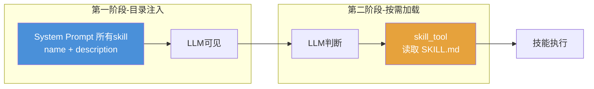
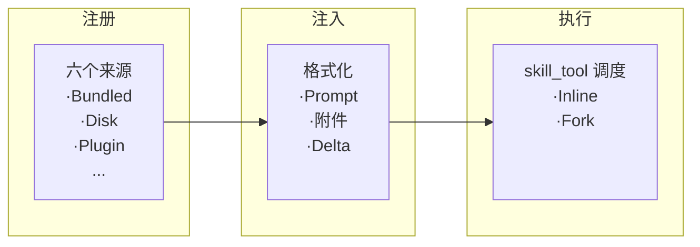
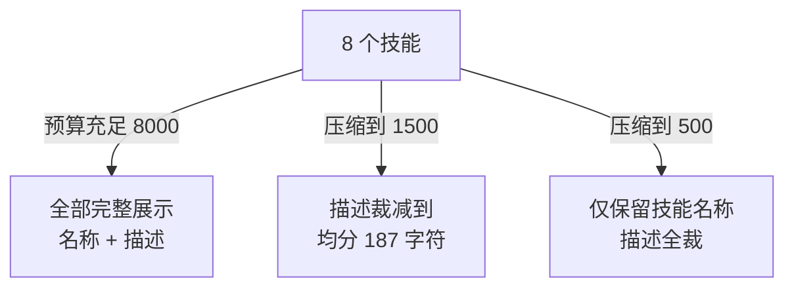

# 18. SKILLS 渐进式披露：技能太多塞不进上下文

你有没有过这种念头：「要是跟 Claude Code 说一句 `/review-pr` 就能跑完整个流程就好了」？在 SKILL 出现之前，这只能等官方发版。SKILL 把扩展权力下放给了用户——放一个 Markdown 文件，就是一个新技能。
## 1. SKILL 背景介绍

在 SKILL 系统出现之前，Claude Code 的能力完全由硬编码的工具集和 System Prompt 决定。所有的 slash command、tool 定义都写在源码中，每次新增能力都需要修改源码。用户没有任何扩展入口，也无法在项目中定义属于自己的工作流指令。


SKILL 系统正是为解决这个封闭性问题而生——它把注册新指令的权力从开发者下放给用户。用户可以在 `.claude/skills/<skill-name>` 目录中创建 SKILL.md 文件，用 Markdown 定义自己的技能描述和执行逻辑，不需要改一行 CLI 源码。社区可以共享技能包，插件可以分发技能集合，企业可以用独立的目录管理内部工作流。这让 Claude Code 从一个封闭的 CLI 工具走向开放式平台。

#### 三种方案对比

SKILL 权限下放给用户后，可能有几十个 SKILL，如何把这些技能呈现给模型？如果把所有技能的描述一次性塞给模型，就像把所有书带在身上，全但重。渐进式披露的做法很简单：只带一份目录，看到感兴趣的再翻书。业界经历了一条逐渐收敛的发展路线：


**全量注入** 把所有技能的描述一次性塞进 System Prompt——模型视野完整，但技能数量膨胀时上下文预算被急剧压缩。

**RAG 按需检索** 走向另一个极端——System Prompt 中只留检索入口，模型不知道有哪些可用，只能在黑暗中猜测。主要用于**知识库检索**场景（如企业文档问答）

**渐进式披露** 走中间路线：先给目录保有可见性，再按需给详情控制预算。这套思路并非 Claude Code 独创，业界主流产品多采用此方案。

#### 渐进式披露

**两个阶段：先注册目录，再按需加载详情。**

**第一阶段：目录注入。** 所有技能在 System Prompt 中以 `name: description` 的形式发布，description 说明技能的作用和使用场景。模型启动时就"知道"有哪些技能可用，但只看到摘要——名称和一句话描述。这一步解决**可见性**问题：模型知道工具箱里有什么。

**第二阶段：详情按需加载。** 当模型根据目录判断某个技能可能适用时，调用专门的 `skill_tool`工具读取该技能完整的 SKILL.md。工具返回完整的技能定义，包括详细的执行逻辑、参数说明、使用示例。这一步解决**详细度**问题：只有被选中的技能才占用上下文预算。



**skill_tool 的双重角色：**

- **读取器**：接收技能名称，返回对应 SKILL.md 的完整内容
- **执行闸门**：验证技能是否存在、上下文是否允许，然后调度执行

渐进式披露核心思想，不给模型喂 LLM 不需要的东西。目录是轻量级的，详情是惰性加载的。
相比全量注入，它节省了大部分技能的上下文预算；相比 RAG 检索，它保留了可见性，
模型不需要在黑暗中猜测。

但渐进式披露的工程挑战在于：技能越多，目录越长，展示完整性和上下文预算之间的
矛盾就越尖锐。Claude Code 用三个设计来应对——**预算内择优展示、增量注入只发变化、
注册与披露分离控制可见性**。

---

## 2. Claude Code 的 SKILL 方案

### 2.1 整体架构概览

Claude Code 的 SKILL 系统可以抽象为三条管线：**注册 → 注入 → 执行**。



- **注册**：从六个来源（Bundled、Disk、Plugin、MCP、Dynamic、Conditional）汇集所有技能，解析元数据、去重合并，输出结构化的技能注册表。回答的是：*系统有哪些技能可用？*

- **注入**：按上下文预算限额格式化目录 prompt，并注入到模型上下文：System Prompt 分段承载稳定部分、附件通道承载变化部分、Delta 通道只发送差异部分。回答的是：*怎么注入上下文？*

- **执行**：由 Skill Tool 统一调度——模型选中技能后，Skill Tool 先验证再决策（是否存在、权限是否满足），决定 inline 注入还是 fork 隔离。回答的是：*选中的技能怎么跑？*

### 2.2 预算控制：从"完整展示"到"预算内最优展示"

模型需要知道有哪些技能可用。最简单的方式是把全部技能的名称和描述塞进 System Prompt 或附件里——这也是主流方案的常见做法。但当技能数量增长到几十上百个时，这份清单会占据大量上下文预算。

Claude Code 的 `formatCommandsWithinBudget()` 函数直接回答了"给模型展示多少技能信息"这个问题。它的预算计算逻辑是：`contextWindow × 4 (chars/token) × 1%`。以 200K 窗口为例，约 8,000 字符。在这个预算内，分配遵循三重优先级：

1. **Bundled（内置）技能始终完整展示**——它们是会话的基础能力，不受预算波动影响
2. **非 Bundled 技能优先尝试完整展示**——如果预算充裕，描述和用法一并呈现
3. **预算不足时逐级降级**：先裁减描述到均分长度（不超过 250 字符），仍超预算则降级为仅保留技能名称

**举一个具体的例子**。项目中有 1 个内置技能和 7 个自定义技能（每个技能150字描述），预算压缩时列表逐级降级：




这套机制的实质是：**用预算上限替代"完整展示"作为默认行为。** 主流方案倾向于让模型"知道所有选项"，Claude 的方案倾向于让模型"在预算内看到最关键的选项"。背后是对上下文窗口的不同态度——前者把它当作信息载体，后者把它当作稀缺资源。

### 2.3 增量注入：从"全量重发"到"只发变化"

即使做了预算控制，如果每次对话都重新发送完整的技能列表，变化的部分（比如用户新增了一个技能）会导致整个列表的缓存失效。增量策略的出发点很简单：**只发送变化的部分，不发送不变的部分。**

这个思路在实现层面演化出了两段注入管线，其设计关键是：元知识稳定可缓存，SKILL 目录随会话动态变化，两种性质的内容走不同的路径。

```
System Prompt（用法提示，稳定可缓存）
    → 附件通道（技能列表，sentSkillNames 差集实现增量）
```

**第一段：System Prompt 中的用法提示。** 这部分是**稳定的元知识**，只说明 `/<skill-name>` 快捷方式和 Skill 工具的调用约束，不包含具体的技能列表。通过 `systemPromptSection('session_guidance', ...)` 注册表管理缓存，一次注入后直到 `/clear` 才失效。[prompts.ts:382-383](https://github.com/binarylei/claudecode/blob/main/src/constants/prompts.ts#L382-L383)：

```text
/<skill-name> (e.g., /commit) is shorthand for users to invoke a user-invocable skill.
When executed, the skill gets expanded to a full prompt.
Use the Skill tool to execute them.
IMPORTANT: Only use Skill for skills listed in its user-invocable skills section - do not guess or use built-in CLI commands.
```

**第二段：附件通道。** 实际的技能列表以 `skill_listing` 附件类型通过 `<system-reminder>` 注入。附件不是 System Prompt 的一部分，不参与缓存计算——增删技能完全不影响 System Prompt 的缓存前缀。三种附件类型覆盖不同场景：

- **`skill_listing`**：技能目录，会话启动时注入初始列表，后续只发送新增
- **`dynamic_skill`** ：文件操作时发现的新技能（如编辑 `.py` 文件触发的 Python 技能）
- **`invoked_skills`** —— 压缩后的已调用技能内容，保存在对话摘要中不丢失

附件通道内建了增量机制。系统维护一个 `sentSkillNames` 集合（[attachments.ts:2607](https://github.com/binarylei/claudecode/blob/main/src/utils/attachments.ts#L2607)），`getSkillListingAttachments()` 每次生成附件时先过滤已发送的技能，只返回新增的（[attachments.ts:2718](https://github.com/binarylei/claudecode/blob/main/src/utils/attachments.ts#L2718)）：

```
全量技能列表 → 过滤 sentSkillNames → 只发新增（无新增则不生成）
```

当磁盘上的技能文件被修改或新增时，`skillChangeDetector`（[skillChangeDetector.ts](https://github.com/binarylei/claudecode/blob/main/src/utils/skills/skillChangeDetector.ts)）调用 `resetSentSkillNames()` 清空已发送记录，下一轮附件自动重新发送完整列表。

**举个例子**。会话启动前已经存在 A、B 两个技能，C 是运行期间动态增加的技能。

```
1.会话启动    → 发送 A、B             sentSkillNames = [A、B]
2.新建技能 C  → 仅发送 C（增量）       sentSkillNames = [A、B、C]
3.修改技能 C  → 发送 A、B、C（全量）   sentSkillNames 被复位
4.重启会话    → 发送 A、B、C（全量）   sentSkillNames 重新计算
```

### 2.4 注册披露分离：从"注册即披露"到"两阶段拆分"

主流方案中，一个技能被注册的同时也就进入了模型的可见范围，即"注册即披露"。Claude Code 将这两个阶段拆开：**注册是注册，披露是披露，两者之间隔着条件和时机。**

**注册阶段——六个来源汇集。** 技能可以来自编译时内置（Bundled）、文件系统扫描（Disk）、插件分发（Plugin）、远程 MCP 服务器（MCP）、文件操作时的目录遍历（Dynamic）、以及声明了路径条件的条件技能（Conditional）。多源并行必然带来重复，去重基准是 `realpath` 解析后的真实路径。

**披露阶段——条件技能是最彻底的实践。** 条件技能注册了但不在激活状态，不占用注入管线的任何预算。用户 clone 了一个包含 Python 技能的项目，但直到他编辑第一个 `.py` 文件，系统才知道需要激活这个技能。在那之前，这个技能不存在于模型的视野中。

### 2.5 执行模式：Inline vs Fork

模型选好技能后，调用 SKILL 工具执行，问题是上下文预算从哪出？Claude Code 支持两种模式：

- Inline：占主线上下文。
- Fork：子 Agent 运行，只让主线看到**结果**。不占用主线上下文，不污染主线。

比如，以 `/deploy` 部署技能为例——同样执行一次部署，两种模式的行为完全不同：

```
Inline 模式 → 主线执行
  构建日志、环境变量检查、部署结果 → 全部进入主线上下文
  失败 → 错误信息混合在对话中，后续推理受干扰

Fork 模式 → 子 Agent 隔离执行
  构建日志、环境变量检查 → 在子 Agent 中完成，不占主线预算
  部署结果 → 只返回 "部署成功/失败 + 摘要" 到主线
  失败 → 子 Agent 生命周期结束，主线状态不受影响
```

**声明式决策，而非运行时智能判断。** 执行模式由技能作者在 SKILL.md 中通过 `context: fork` 声明，系统不猜测不分析。轻量技能默认内联，重型工具声明 fork，决策权下放给最了解技能的人。

**双入口统一执行。** 模型通过 Skill 工具调用、用户通过 `/command-name` 调用，两种入口走同一套执行逻辑，触发方式透明，行为一致。

**Fork 的隔离实质是「结果契约」。** 子 Agent 与主线之间只有结果一条通信渠道，技能成功返回文本，失败不污染主线对话。上下文、状态、生命周期完全隔离，不因重型技能的执行冲击主线。


---

## 3. 源码分析

### 3.1 源码地图

| 文件 | 职责 |
|---|---|
| [`loadSkillsDir.ts`](https://github.com/binarylei/claudecode/blob/main/src/skills/loadSkillsDir.ts) | **注册管线核心**：六源并行加载、realpath 去重、条件技能惰性激活、动态发现 |
| [`commands.ts`](https://github.com/binarylei/claudecode/blob/main/src/commands.ts) | **注册表聚合出口**：`getCommands()` 合并所有来源，`getSkillToolCommands()` 筛选模型可见技能 |
| [`attachments.ts`](https://github.com/binarylei/claudecode/blob/main/src/utils/attachments.ts) | **注入管线核心**：附件通道管理、`sentSkillNames` 差量注入、三种附件类型、变更触发重发 |
| [`SkillTool.ts`](https://github.com/binarylei/claudecode/blob/main/src/tools/SkillTool/SkillTool.ts) | **执行管线核心**：验证→权限→调度三层、Inline/Fork 双模式、contextModifier 链 |
| [`prompt.ts`](https://github.com/binarylei/claudecode/blob/main/src/tools/SkillTool/prompt.ts) · [`prompts.ts`](https://github.com/binarylei/claudecode/blob/main/src/constants/prompts.ts) | **预算约束 + 元知识注入**：`formatCommandsWithinBudget()` 三级降级、session_guidance 段 |
| [`processSlashCommand.tsx`](https://github.com/binarylei/claudecode/blob/main/src/utils/processUserInput/processSlashCommand.tsx) | **用户 `/cmd` 入口**：fork 模式异步执行 + inline 模式内容展开，与 SkillTool 共享调度 |

**全流程定位：**

```
QueryEngine.ts: queryLoop
  ├── fetchSystemPromptParts                  ← 技能元知识注入 System Prompt
  │   └── prompts.ts: systemPromptSection('session_guidance', ...)
  │
  └── processUserInput()
      └── "/cmd" → processSlashCommand.tsx    ← 用户触发
      │     ├── processSlashCommand()
      └── 普通文本
            └── getAttachmentMessages()       ← ② 注入SKILL初始目录
              │
              ▼
query.ts: query() 主循环
  │
  ├── LLM API 工具执行
  │     └── SkillTool.call()                 ← ③ 执行SKILL
  └── getAttachmentMessages()                ← 每轮增量注入SKILL
```

**调用链：**

```
╔══════════════════════════════════════════════════════════════════╗
║  ① 注册管线（系统启动 / 缓存过期时执行）                          ║
║  ────────────────────────────────────────────────────────────── ║
║  loadAllCommands() → getCommands() → getSkillToolCommands()     ║
║    ├── 六个来源并行加载（Bundled / Disk / Plugin / MCP / ...）   ║
║    └── realpath 去重 + 条件技能惰性激活                           ║
╚══════════════════════════════════════════════════════════════════╝
                              │ 注册表就绪
                              ▼
╔══════════════════════════════════════════════════════════════════╗
║  ② 注入管线（每次 LLM 轮次前执行）                                ║
║  ────────────────────────────────────────────────────────────── ║
║  getSkillListingAttachments()                                    ║
║    ├── getSkillToolCommands()  ← 读取已就绪的注册表               ║
║    │    筛选可见技能：Bundled/Disk 始终可见，Plugin/MCP 需描述    ║
║    ├── formatCommandsWithinBudget()  ← 预算约束三级降级           ║
║    └── sentSkillNames 差量过滤 → 附件注入 $system-reminder       ║
╚══════════════════════════════════════════════════════════════════╝
                              │ 模型「看到」技能目录
                              ▼
╔══════════════════════════════════════════════════════════════════╗
║  ③ 执行管线（模型或用户选中技能时触发）                            ║
║  ────────────────────────────────────────────────────────────── ║
║  SkillTool.call()                                                ║
║    ├── validateInput()       → 6 种错误码                        ║
║    ├── checkPermissions()    → deny / allow / ask                ║
║    └── 调度（按 context 字段）                                    ║
║          ├── Inline → processPromptSlashCommand()                ║
║          │            变量替换 → 展开内容 → 注入主线对话           ║
║          └── Fork   → runAgent() 子 Agent 隔离执行               ║
║                       结果契约：只返回摘要，不占主线预算            ║
╚══════════════════════════════════════════════════════════════════╝
```

### 3.2 注册：多源汇聚与条件披露

`getCommands()` 是注册阶段的出口，它调用 `loadAllCommands()` 加载所有硬编码命令，再合并动态技能和条件技能，输出统一的注册表。但技能类命令的真正入口是 `getSkillDirCommands()`——它管理六个来源的并行加载。

**六个来源的并行加载。** [`getSkillDirCommands()`](https://github.com/binarylei/claudecode/blob/main/src/skills/loadSkillsDir.ts#L638-L804) 以 `Promise.all` 同时加载 managed、user、project 等 SKILL 目录，外加 bundled 技能（独立注册通道）。所有来源输出 `SkillWithPath` 结构，包含技能命令对象及其文件路径。

```typescript
// loadSkillsDir.ts:679-714（简化）
const [managedSkills, userSkills, projectSkillsNested, additionalSkillsNested, legacyCommands] =
  await Promise.all([
    loadSkillsFromSkillsDir(managedSkillsDir, 'policySettings'),
    loadSkillsFromSkillsDir(userSkillsDir, 'userSettings'),
    /* project dirs... */,
    /* additional dirs... */,
    loadSkillsFromCommandsDir(cwd),
  ])
```

并行加载后进入**去重阶段**。[`getFileIdentity()`](https://github.com/binarylei/claudecode/blob/main/src/skills/loadSkillsDir.ts#L118-L124) 用 `realpath` 解析文件真实路径，`Map<string, Source>` 以 first-wins 策略保留首次出现的来源。

```typescript
// loadSkillsDir.ts:736-752（简化）
const seenFileIds = new Map<string, SettingSource>()
for (const entry of allSkillsWithPaths) {
  const fileId = await realpath(entry.filePath)
  if (seenFileIds.has(fileId)) continue  // 重复，跳过
  seenFileIds.set(fileId, entry.skill.source)
  deduplicatedSkills.push(entry.skill)
}
```

**条件技能的惰性激活**是"注册披露分离"最彻底的实践。[`activateConditionalSkillsForPaths()`](https://github.com/binarylei/claudecode/blob/main/src/skills/loadSkillsDir.ts#L997-L1058) 在文件操作时被调用：它遍历所有条件技能，用 `ignore` 库（gitignore 风格匹配）检查操作的文件路径是否匹配技能声明的 `paths` 模式。匹配到的技能从 `conditionalSkills` Map 移至 `dynamicSkills` Map，并发送信号通知下游清缓存。

```typescript
// loadSkillsDir.ts:1012-1039（核心逻辑）
const skillIgnore = ignore().add(skill.paths)
for (const filePath of filePaths) {
  if (skillIgnore.ignores(relativePath)) {
    dynamicSkills.set(name, skill)    // 激活：进入模型视野
    conditionalSkills.delete(name)    // 从待激活队列移除
    break
  }
}
```

#### 设计要点

- **并行加载 + realpath 去重**解决了多源注册的核心问题：性能（并行）和正确性（符号链导致重复）。`realpath` 替代 inode 的选择体现了跨平台意识
- **条件技能是"注册即披露"的反模式实践**：技能注册了但不进入注入管线，直到文件操作匹配路径才激活。模型启动时不知道它的存在，这正是"不给模型不需要的东西"的极致版本

### 3.3 注入：预算约束与差量更新

注册表就绪后，下一步是让模型"看到"技能。注入管线由两个机制协同工作：System Prompt 中的元知识提示（稳定、可缓存）和附件通道中的技能列表（动态、增量）。

**System Prompt 承载用法提示。** [`prompts.ts`](https://github.com/binarylei/claudecode/blob/main/src/constants/prompts.ts#L492-L493) 中 `systemPromptSection('session_guidance', ...)` 注入 `<skill-name>` 快捷方式和 Skill 工具的调用约束。这部分是**元知识**——告诉模型如何使用技能工具，不包含具体技能列表。通过 section 注册表管理缓存，一次注入后直到 `/clear` 才失效。

**附件通道承载技能列表。** [`getSkillListingAttachments()`](https://github.com/binarylei/claudecode/blob/main/src/utils/attachments.ts#L2661-L2751) 每次对话轮次被调用，输出 `skill_listing` 类型的附件注入到 `<system-reminder>` 中。

增量注入的核心是 `sentSkillNames` 集合。这是一个 `Map<agentId, Set<string>>`——按 agentId 隔离，确保子 Agent 和主线互不干扰：

```typescript
// attachments.ts:2607、2717-2729（简化）
const sentSkillNames = new Map<string, Set<string>>()
// ...
const newSkills = allCommands.filter(cmd => !sent.has(cmd.name))
if (newSkills.length === 0) return []  // 无新增，跳过本轮注入
for (const cmd of newSkills) { sent.add(cmd.name) }
```

当磁盘上的技能文件被修改时，[`skillChangeDetector`](https://github.com/binarylei/claudecode/blob/main/src/utils/skills/skillChangeDetector.ts) 调用 `resetSentSkillNames()` 清空记录，下一轮自动全量重发。`--resume` 场景另有 `suppressNextSkillListing()` 屏蔽重复注入。

**预算约束格式化。** `formatCommandsWithinBudget()` 以 `contextWindow × 4 × 1%`（默认约 8,000 字符）为预算上限，实施三级降级策略：

1. **Bundled 技能始终完整展示**（名称 + 描述），不受预算波动影响
2. **非 Bundled 技能优先尝试完整展示**，预算不足时裁剪描述到均分长度（不超过 250 字符）
3. **极端预算不足时，非 Bundled 降级为仅保留名称**

```typescript
// prompt.ts:163-170（简化）
return commands.map((cmd, i) => {
  if (bundledIndices.has(i)) return fullEntries[i].full  // bundled 完整展示
  const description = getCommandDescription(cmd)
  return `- ${cmd.name}: ${truncate(description, maxDescLen)}`  // 非 bundled 裁剪
})
```

#### 设计要点

- **`sentSkillNames` 按 agentId 隔离**解决了子 Agent 被主线已发送状态污染的问题——每个 Agent 独立追踪"哪些技能已通知过"，确保 fork 模式的子 Agent 也能获得初始列表
- **三级降级的优先级设计**隐含了一个判断：Bundled 技能是会话基础能力，优先级高于自定义技能。这与 2.4 节的"注册即披露"形成对照——Bundled 是"始终披露"

### 3.4 执行：Skill Tool 的双模式调度

模型选中技能后，Skill Tool 接管执行。`SkillTool.call()` 走三层流程：**验证 → 权限 → 调度**。

**验证层。** [`validateInput()`](https://github.com/binarylei/claudecode/blob/main/src/tools/SkillTool/SkillTool.ts#L354-L430) 按序检查 6 种错误码：空名称 → 未知技能 → disableModelInvocation 拦截 → 非 prompt 类型。每个错误码有明确的语义，模型可以根据错误信息修正调用。

**权限层。** [`checkPermissions()`](https://github.com/binarylei/claudecode/blob/main/src/tools/SkillTool/SkillTool.ts#L432-L578) 按 deny → auto-allow → ask 顺序裁决：deny 规则优先，匹配前缀模式（`skill:*`）；auto-allow 通过 `skillHasOnlySafeProperties()` 判断技能是否只使用安全的属性集合；其余情况弹用户确认框。

**调度层**判断技能声明的 `context` 字段决定执行模式：

**Inline 模式。** 调用 [`processPromptSlashCommand()`](https://github.com/binarylei/claudecode/blob/main/src/utils/processUserInput/processSlashCommand.tsx) 展开 SKILL.md：完成 `${ARGUMENTS}` 变量替换和 `!command` 内联命令执行，输出一组 `newMessages` 注入主线对话。同时通过 `contextModifier` 修改工具权限（`allowedTools`）和模型覆盖（`model`），让技能展开后的内容在主线上下文中运行：

```typescript
// SkillTool.ts:775-803（contextModifier 核心逻辑）
contextModifier(ctx) {
  if (allowedTools.length > 0) {
    // 将技能的 allowedTools 合并到主线的 alwaysAllowRules
    modifiedContext.getAppState = () => ({
      ...appState,
      toolPermissionContext: {
        alwaysAllowRules: { command: [...allowedTools] }
      }
    })
  }
  if (model) {
    // 携带 [1m] 后缀，避免 model 覆盖丢失缓存前缀
    modifiedContext.options.mainLoopModel = resolveSkillModelOverride(model, ...)
  }
}
```

**Fork 模式。** [`executeForkedSkill()`](https://github.com/binarylei/claudecode/blob/main/src/tools/SkillTool/SkillTool.ts#L122-L289) 通过 `runAgent()` 启动子 Agent。父子之间的契约只有一条通信渠道——**结果文本**。子 Agent 的生命周期、上下文 token 预算、状态完全独立：

```typescript
// SkillTool.ts:223-286（简化）
for await (const message of runAgent({
  agentDefinition,
  promptMessages,
  toolUseContext: { ...context, getAppState: modifiedGetAppState },
  model: command.model,
})) {
  agentMessages.push(message)
}
const resultText = extractResultText(agentMessages, 'Skill execution completed')
return { data: { success: true, status: 'forked', result: resultText } }
```

Fork 的执行需要与主线共享缓存前缀。[`prepareForkedCommandContext()`](https://github.com/binarylei/claudecode/blob/main/src/utils/forkedAgent.ts) 提取主线的 `CacheSafeParams`——system prompt、tools、model、messages 前缀——确保子 Agent 的 API 请求复用父级的缓存计算结果，避免重型技能执行时从头计算的开销。

**双入口统一调度。** 模型通过 Skill Tool 工具调用和用户通过 `/cmd` 输入最终走同一条执行路径。两者的 fork 实现都调用 `runAgent()`，inline 实现都调用 `processPromptSlashCommand()`——触发方式透明，行为一致。

#### 设计要点

- **三层分离（验证→权限→调度）** 让 Skill Tool 的职责边界清晰：验证回答"技能是否存在"，权限回答"能否执行"，调度回答"怎么执行"。每层可独立测试和扩展
- **Fork 模式的结果契约** 本质上是"只公开输出，不公开过程"。子 Agent 内部的所有中间状态、失败重试、环境检查都被隔离，主线只看到一个成功/失败 + 摘要。这与微服务架构中的服务边界设计同构
- **`contextModifier` 的链式设计**允许 inline 模式在展开技能的同时修改工具权限和模型配置，且多个 modifier 可以叠加——每个 modifier 捕获前一个的 `getAppState` 形成调用链

## 4. 总结

1. **注册先于注入，目录先于详情。** 渐进式披露的核心洞见是：模型不需要在启动时知道所有技能的全部细节，但需要知道「有什么可用」。六个注册源统一成目录，使可见性成为第一优先级。

2. **按Token预算注入。** System Prompt 通道保障稳定可见性（长期缓存友好），Attachment 通道保障按需详细度（Delta 增量）。成本在预算约束层收敛，从不超支，保证基本目录可见。

3. **执行入口透明，但执行模式隔离。** 模型调用 Skill Tool 和用户输入 `/cmd` 走同一条路径。Inline 模式共享主线上下文，Fork 模式启动独立子 Agent，两种模式不是功能差异，而是隔离深度与执行成本的权衡。

4. **权限裁决用否定优先原则。** 先 deny 再 allow。默认不信任任何技能——技能作者必须用 `allowedTools` 和 `model` 等属性显式声明自己的能力边界。忘记声明只影响能力，不影响安全性。

---

## 参考文献

- Claude Code 源码：
  - [`src/tools/SkillTool/SkillTool.ts`](https://github.com/binarylei/claudecode/blob/main/src/tools/SkillTool/SkillTool.ts) — Skill Tool 执行
  - [`src/skills/loadSkillsDir.ts`](https://github.com/binarylei/claudecode/blob/main/src/skills/loadSkillsDir.ts) — SKILL 注册
  - [`src/utils/processUserInput/processSlashCommand.tsx`](https://github.com/binarylei/claudecode/blob/main/src/utils/processUserInput/processSlashCommand.tsx) — Slash Command 路由与 skill 内容注入对话
  - [`src/constants/prompts.ts`](https://github.com/binarylei/claudecode/blob/main/src/constants/prompts.ts) — System Prompt 组装入口，systemPromptSection 注册
  - [`src/utils/processUserInput/processUserInput.ts`](https://github.com/binarylei/claudecode/blob/main/src/utils/processUserInput/processUserInput.ts) — 用户输入处理主流程
  - [`src/utils/attachments.ts`](https://github.com/binarylei/claudecode/blob/main/src/utils/attachments.ts) — Attachment 通道管理与 sentSkillNames 增量追踪
